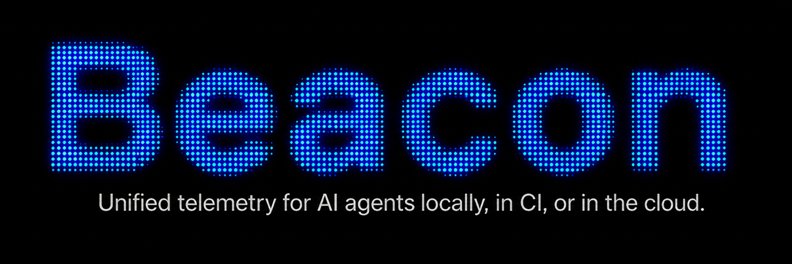

<p align="center">
  
</p>

<h1 align="center">Asymptote Lab's Agent Beacon</h1>

<p align="center">
  <a href="https://github.com/asymptote-labs/agent-beacon/releases"></a>
  <a href="https://github.com/asymptote-labs/homebrew-tap"></a>
  <a href="https://github.com/asymptote-labs/agent-beacon/actions/workflows/ci.yml"></a>
  <a href="https://github.com/asymptote-labs/agent-beacon/blob/main/LICENSE"></a>
  <a href="https://docs.asymptotelabs.ai"></a>
  <a href="https://discord.gg/zdNChS2fBu"></a>
</p>

<p align="center">
  <strong>Unified telemetry for AI agents, wherever they run.</strong>
</p>

<p align="center">
  <a href="https://docs.asymptotelabs.ai">Docs</a>
  ·
  <a href="https://discord.gg/zdNChS2fBu">Discord</a>
  ·
  <a href="https://docs.asymptotelabs.ai/cli/installation">Install</a>
  ·
  <a href="https://docs.asymptotelabs.ai/cli/security-it-teams">For Security & IT Teams</a>
  ·
  <a href="https://docs.asymptotelabs.ai/cli/dashboard">Dashboard</a>
  ·
  <a href="https://docs.asymptotelabs.ai/cli/command-reference">Commands</a>
</p>

## What is Agent Beacon

Agent Beacon is the world's first [open-source telemetry layer](https://justindsouza.substack.com/p/introducing-beacon-endpoint-telemetry) for AI agents wherever they run: locally, in CI, or in the cloud.

The problem is that AI agent activity is fragmented across runtimes, leaving teams without a consistent way to get visibility into what agents are doing. Agent Beacon solves this by extending the OpenTelemetry GenAI standard and normalizing runtime events into a unified data model.

Beacon is built to be easy to deploy for Security and IT teams through
[MDM deployment](#mdm-deployment), CI workflows, and cloud-agent setup paths, and to
emit agent harness telemetry logs to
all the [major enterprise-grade SIEMs](https://github.com/Asymptote-Labs/agent-beacon#output-destinations).

Learn more in the [Agent Beacon Documentation](https://docs.asymptotelabs.ai).

## High-Level Architecture

Beacon keeps endpoint collection, processing, and inspection local by default,
while extending the same normalized event model to CI and cloud-agent telemetry
paths under customer control.

<p align="center">
  
</p>

- **Agent runtime layer:** Hooks, OpenTelemetry sources, CI wrappers, and SDKs
  capture supported activity from AI agent harnesses wherever they run.
- **Beacon endpoint layer:** Local processing normalizes events, applies
  retention and redaction settings, and writes durable endpoint telemetry.
- **Output layer:** Teams inspect events in the local dashboard, retain JSONL,
  or forward records into all the [major enterprise-grade SIEMs](https://github.com/Asymptote-Labs/agent-beacon#output-destinations).

## Supported Surfaces

Beacon captures supported agent harness activity across local endpoints, CI
jobs, and cloud-agent surfaces, then writes normalized events that teams can
inspect in place or forward into customer-managed security pipelines.

### Agent Runtimes

Agent Beacon supports the most popular enterprise agent harnesses across local,
CI, and cloud surfaces.

#### Local Agents

##### Coding Agent Harnesses

| Agent harness | Collection path | Telemetry coverage |
| --- | --- | --- |
| [Antigravity CLI](https://docs.asymptotelabs.ai/cli/supported-runtimes-antigravity-cli) | Native hooks | Prompt, pre-tool, post-tool, stop, invocation, command, and file telemetry where Antigravity exposes hook payloads |
| [Claude Code](https://docs.asymptotelabs.ai/cli/supported-runtimes-claude-code) | Local OTLP export plus optional hooks | Prompt, command, tool, file, lifecycle, subagent, and permission telemetry where emitted through OTLP or hooks |
| [Codex CLI](https://docs.asymptotelabs.ai/cli/supported-runtimes-codex-cli) | Local OTLP logs | Session, prompt, approval, and tool-result activity from Codex semantic logs |
| [Cursor](https://docs.asymptotelabs.ai/cli/supported-runtimes-cursor) | Native hooks | Prompt, tool, shell command, MCP-like, approval, and file edit telemetry |
| [Devin CLI](https://docs.asymptotelabs.ai/cli/supported-runtimes-devin) | Native hooks | Session, prompt, pre-tool, post-tool, permission request, stop, session-end, approval, and file telemetry |
| [Devin Desktop](https://docs.asymptotelabs.ai/cli/supported-runtimes-devin-desktop) | Cascade/Windsurf hooks | Prompt, command, MCP tool, file read, and file write telemetry where Desktop exposes Cascade hook payloads |
| [Factory Droid](https://docs.asymptotelabs.ai/cli/supported-runtimes-factory-droid) | OTLP HTTP plus optional hooks | Session, prompt, write/edit/create tool use, stop, session-end, and available OTLP telemetry |
| [Gemini CLI](https://docs.asymptotelabs.ai/cli/supported-runtimes-gemini-cli) | Opt-in local OTLP | Prompts, tool calls, MCP activity, file operations, and approval-related events emitted through OTLP |
| [GitHub Copilot CLI](https://docs.asymptotelabs.ai/cli/supported-runtimes-github-copilot-cli) | MDM-managed OTLP HTTP | Prompt, session, tool, and approval-like activity emitted through Copilot CLI spans |
| [Grok Build](https://docs.asymptotelabs.ai/cli/supported-runtimes-grok-build) | Native hooks | Session, prompt, pre-tool, post-tool, failed tool, stop, session-end, command, and file telemetry |
| [OpenCode](https://docs.asymptotelabs.ai/cli/supported-runtimes-opencode) | Managed plugin hooks | Chat messages, session events, command execution, permission activity, diffs, and errors |
| [VS Code](https://docs.asymptotelabs.ai/cli/supported-runtimes-vscode) | Copilot Chat OTel plus optional preview hooks | Copilot session, prompt, model, and tool activity through OTel; optional hooks for extra lifecycle and cross-agent detail |

##### Knowledge Worker Agent Harnesses

| Agent harness | Collection path | Telemetry coverage |
| --- | --- | --- |
| [Claude Cowork](https://docs.asymptotelabs.ai/cli/supported-runtimes-claude-cowork) | Admin-configured OTLP | Prompt, command, tool, and file telemetry when emitted through Claude Cowork OTLP |
| [Hermes Agent](https://docs.asymptotelabs.ai/cli/supported-runtimes-hermes-agent) | Shell hooks | Prompt, observed tool, command, file, approval request and response, session lifecycle, and subagent stop telemetry |
| [OpenClaw Gateway](https://docs.asymptotelabs.ai/cli/supported-runtimes-openclaw-gateway) | Gateway-configured OTLP/HTTP | OTLP logs, traces, and metrics from the Gateway diagnostics plugin |

#### CI Agents

| Harness | Collection path | Telemetry coverage |
| --- | --- | --- |
| [CI agent telemetry](https://docs.asymptotelabs.ai/supported-runtimes-claude-code-ci) | Temporary local collector through `beacon ci exec` or `beacon ci start` / `beacon ci finish` | Supported agent prompt, tool, command, file, and run context where emitted during the job |

#### Cloud Agents

| Cloud surface | Collection path | Telemetry coverage |
| --- | --- | --- |
| [Anthropic](https://docs.asymptotelabs.ai/sdk/integrations-anthropic) | OpenLLMetry instrumentation through `@asymptote/sdk` | Supported Anthropic model call spans, errors, and OpenTelemetry attributes |
| [Claude Agent SDK](https://docs.asymptotelabs.ai/sdk/integrations-claude-agent-sdk) | Query wrapper through `Observe.wrapClaudeAgentQuery()` | Query root spans with Beacon-compatible prompt attributes |
| [Claude Code Cloud Agents](https://docs.asymptotelabs.ai/claude-code-cloud-agents) | Cloud sandbox hooks with GCS upload | Session, prompt, tool, command, file, and lifecycle telemetry where Claude Code cloud hook payloads expose it |
| [Cursor Cloud Agents](https://docs.asymptotelabs.ai/cursor-cloud-agents) | Cloud sandbox hooks with GCS upload | Tool, shell command, file, subagent, and compaction telemetry where Cursor cloud hook payloads expose it |
| [Devin Cloud Agents](https://docs.asymptotelabs.ai/devin-cloud-agents) | Org-wide API poll via `beacon cloud devin pull`, with GCS upload | Session, prompt, agent message, status, pull request, and ACU usage telemetry the Devin sessions API exposes (message-level; the autonomous agent runs no in-sandbox hooks) |
| [OpenAI](https://docs.asymptotelabs.ai/sdk/integrations-openai) | OpenLLMetry instrumentation through `@asymptote/sdk` | Supported OpenAI model call spans, errors, and OpenTelemetry attributes |
| [Vercel AI SDK](https://docs.asymptotelabs.ai/sdk/integrations-vercel-ai-sdk) | Tracer handoff through `experimental_telemetry` | AI SDK model call and tool spans where telemetry is enabled |

### Output Destinations

Agent Beacon writes endpoint telemetry to local JSONL by default and supports
customer-controlled forwarding into common security information and event
management (SIEM), log aggregation, and object storage destinations.

#### Security Information and Event Management (SIEM)

| Destination | Support path |
| --- | --- |
| [CrowdStrike Falcon LogScale HEC](https://docs.asymptotelabs.ai/cli/siem-forwarding-falcon) | Optional endpoint forwarding with LogScale ingest tokens during install or repair |
| [Microsoft Sentinel](https://docs.asymptotelabs.ai/cli/siem-forwarding-microsoft-sentinel) | Azure Monitor Agent and Data Collection Rule content pack over local JSONL |
| [Rapid7 InsightIDR](https://docs.asymptotelabs.ai/cli/siem-forwarding-rapid7) | Custom Logs webhook content pack over local JSONL |
| [Splunk HEC](https://docs.asymptotelabs.ai/cli/siem-forwarding-splunk) | Optional endpoint forwarding during install or repair |
| [Sumo Logic](https://docs.asymptotelabs.ai/cli/siem-forwarding-sumo) | HTTP Logs & Metrics Source content pack over local JSONL |
| [Wazuh](https://docs.asymptotelabs.ai/cli/siem-forwarding-wazuh) | Localfile configuration and Beacon Wazuh content pack |

#### Log Aggregation

| Destination | Support path |
| --- | --- |
| [AWS CloudWatch Logs](https://docs.asymptotelabs.ai/cli/siem-forwarding-cloudwatch) | Vector content pack over local JSONL using customer-managed AWS credentials |
| [Customer-managed log pipelines](https://docs.asymptotelabs.ai/cli/siem-forwarding) | Forwarding from local Beacon JSONL under customer control |
| [Datadog](https://docs.asymptotelabs.ai/cli/siem-forwarding-datadog) | Datadog Agent custom log collection over local JSONL |
| [Elastic](https://docs.asymptotelabs.ai/cli/siem-forwarding-elastic) | Filebeat or Elastic Agent content pack over local JSONL |

#### Object Storage

| Destination | Support path |
| --- | --- |
| [AWS S3](https://docs.asymptotelabs.ai/cli/siem-forwarding-s3) | Vector content pack over local runtime and inventory JSONL using customer-managed AWS credentials |
| [Google Cloud Storage](https://docs.asymptotelabs.ai/cli/siem-forwarding-gcs) | Vector content pack over local JSONL using customer-managed Google credentials |

#### Local

| Destination | Support path |
| --- | --- |
| [Local JSONL](https://docs.asymptotelabs.ai/cli/local-testing-logs) | Default endpoint log and local dashboard source |

### MDM Deployment

Agent Beacon is designed for Security and IT teams to deploy and validate
through standard MDM workflows.

| MDM platform | Support path |
| --- | --- |
| [Fleet](https://docs.asymptotelabs.ai/cli/fleet) | macOS package and user-context deployment helpers |
| [Jamf Pro](https://docs.asymptotelabs.ai/cli/jamf) | macOS package, policy scripts, validation, and Extension Attributes |

Once the macOS package is installed, Agent Beacon keeps itself current with a
built-in self-updater that is on by default — no MDM-driven update process is
required. A background `launchd` job checks for new releases and applies the
signed, notarized, and stapled package automatically, with binary rollback if an
update is unhealthy. Manage it with `beacon endpoint update status`,
`beacon endpoint update --check`, or `beacon endpoint update disable`. MDM/managed
profiles can force `check-only`/`off` or repoint the update source without
changing the binary.

## Dashboard and Local Detection

Beacon includes a local, read-only dashboard for validating endpoint activity
without a hosted backend. See the [dashboard docs](https://docs.asymptotelabs.ai/cli/dashboard)
for overview, log search, and runtime JSONL inspection.

Beacon writes endpoint activity to `runtime.jsonl` and periodic Cursor/Claude
Code configuration inventory metadata to the sibling `inventory_state.jsonl`.
Local log storage and retention behavior are summarized in the
[local testing and logs docs](https://docs.asymptotelabs.ai/cli/local-testing-logs).

For offline threat detection, `beacon scan` runs open threat rules over local
telemetry with no network access. See the
[Threat Rules spec](spec/threat-rules/SPEC.md) and generated
[rule field reference](spec/threat-rules/FIELDS.md) for rule format, CEL
matching, fixtures, and supported event fields.

## Start Here

- [Beacon CLI docs](https://docs.asymptotelabs.ai) — full documentation index.
- [Installation](https://docs.asymptotelabs.ai/cli/installation) — install Beacon locally.
- [For Security & IT Teams](https://docs.asymptotelabs.ai/cli/security-it-teams) — rollout, validation, and security workflows.
- [Security review](https://docs.asymptotelabs.ai/cli/security-review) — review Beacon's architecture, data handling, and local-only posture.
- [Endpoint agent](https://docs.asymptotelabs.ai/cli/endpoint) — install, status, repair, and uninstall.
- [Dashboard](https://docs.asymptotelabs.ai/cli/dashboard) — inspect local runtime logs.
- [Endpoint event schema](https://docs.asymptotelabs.ai/cli/event-schema) — normalized JSONL event model.
- [Supported surfaces](https://docs.asymptotelabs.ai/cli/supported-surfaces) — supported runtimes, destinations, and boundaries.
- [Command reference](https://docs.asymptotelabs.ai/cli/command-reference) — detailed CLI command docs.

## Quickstart

See the [Quickstart](https://docs.asymptotelabs.ai/cli/quickstart) docs for the
full setup paths.

### For Security & IT Teams

Start with the
[security and IT quickstart](https://docs.asymptotelabs.ai/cli/quickstart) and
[managed deployment guidance](https://docs.asymptotelabs.ai/cli/security-it-teams)
for rollout, validation, retention, and SIEM forwarding. For vendor review, see
the [security review](https://docs.asymptotelabs.ai/cli/security-review).

### For Developers

Install the released Beacon CLI locally with Homebrew:

```bash
brew tap asymptote-labs/tap
brew install beacon
beacon version
```

Or build from source:

```bash
cd cli/beacon
make build
```

For setup, deployment, integrations, and command details, see the
[Beacon CLI docs](https://docs.asymptotelabs.ai).

## Star Growth

<p align="center">
  <a href="https://www.star-history.com/#asymptote-labs/agent-beacon&Date">
    
  </a>
</p>

## License

[MIT](LICENSE)
