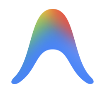
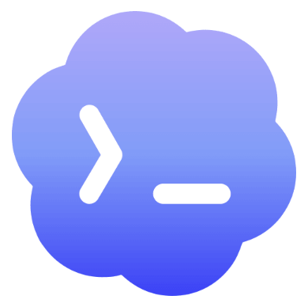
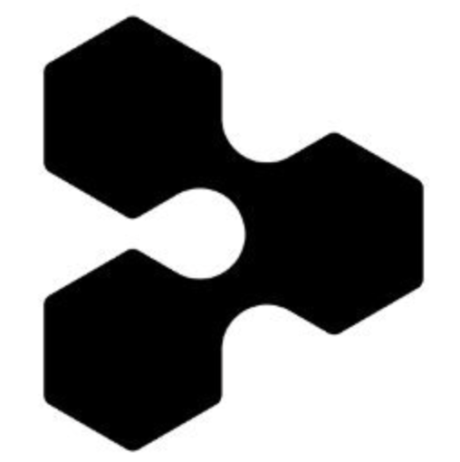
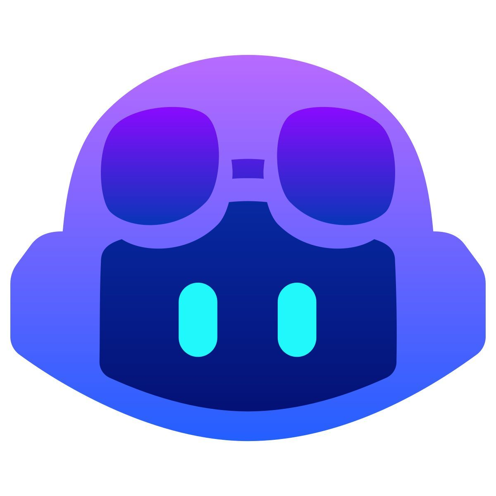
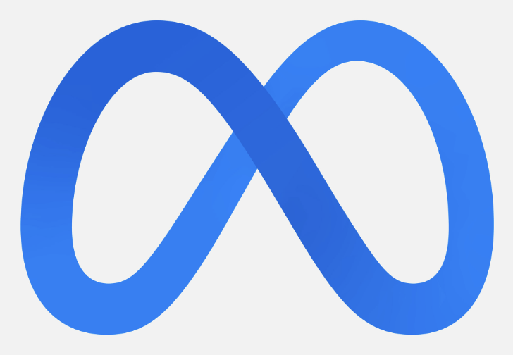
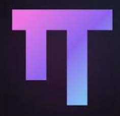
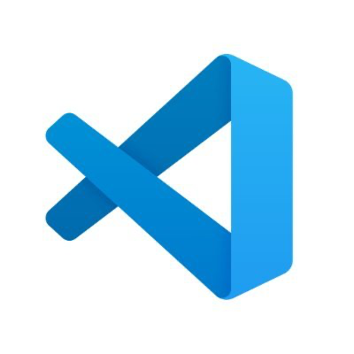

<p align="center">
  
</p>

<h1 align="center">Asymptote Lab's Agent Beacon</h1>

<p align="center">
  <a href="https://github.com/asymptote-labs/agent-beacon/releases"></a>
  <a href="https://github.com/asymptote-labs/homebrew-tap"></a>
  <a href="https://github.com/asymptote-labs/agent-beacon/actions/workflows/ci.yml"></a>
  <a href="https://github.com/asymptote-labs/agent-beacon/blob/main/LICENSE"></a>
  <a href="https://docs.asymptotelabs.ai"></a>
  <a href="https://discord.gg/zdNChS2fBu"></a>
</p>

<p align="center">
  <strong>Unified telemetry for AI agents, wherever they run.</strong>
</p>

<p align="center">
  <a href="https://docs.asymptotelabs.ai">Docs</a>
  ·
  <a href="https://discord.gg/zdNChS2fBu">Discord</a>
  ·
  <a href="https://docs.asymptotelabs.ai/cli/installation">Install</a>
  ·
  <a href="https://docs.asymptotelabs.ai/cli/security-it-teams">For Security & IT Teams</a>
  ·
  <a href="https://docs.asymptotelabs.ai/cli/dashboard">Dashboard</a>
  ·
  <a href="https://docs.asymptotelabs.ai/cli/command-reference">Commands</a>
</p>

## Beacon Overview

Beacon is the system of record for all your agent activity, wherever your agents run.

Agent activity is fragmented across harnesses and environments, leaving no consistent way
to see, reconstruct, or reason about what agents actually did.

Beacon solves this problem by capturing the full agent execution trace across every
[harness](#agent-runtimes) and [environment](#supported-surfaces), and normalizes that
activity into a [single, unified schema](https://docs.asymptotelabs.ai/cli/event-schema).

**Key Capabilities:**

| Capability | What it means |
| --- | --- |
| **Broad runtime coverage** | [24 local agent runtimes](#local-agents), plus [browser chat, CI, cloud agents, and SDKs](#supported-surfaces) |
| **One unified schema** | Every session, prompt, tool, command, edit, approval, and token in one event model |
| **Local-first by default** | Data stays on the machine: durable JSONL and a read-only [dashboard](https://docs.asymptotelabs.ai/cli/dashboard), no account |
| **Offline threat detection** | `beacon scan` runs open [Threat Rules](spec/threat-rules/SPEC.md) over your logs, with no network |
| **Forwards where you already work** | Stream the same log to [your SIEM, observability, or object storage](#output-destinations) |
| **Deploys in one command or fleet-wide** | [One command](https://docs.asymptotelabs.ai/cli/installation) on a laptop, [MDM](#mdm-deployment) across a fleet |

Read the [documentation](https://docs.asymptotelabs.ai) to learn more.

## Getting Started

**Prerequisites:**

- macOS, Linux, or Windows. Homebrew installs the CLI on macOS; Linux and Windows
  install from a [native package](#mdm-deployment) that registers the service itself
- At least one [supported agent runtime](#agent-runtimes) on the machine
- No account, no API key, and no network dependency. Forwarding to Asymptote Managed
  additionally needs [Vector](https://vector.dev) 0.50+, which the macOS package bundles

**Installation**

**[macOS](https://docs.asymptotelabs.ai/platforms/macos)** — Homebrew:

```bash
brew trust asymptote-labs/tap
brew tap asymptote-labs/tap
brew install beacon

# Install the endpoint agent and point local runtimes at it
beacon endpoint install
```

**[Linux](https://docs.asymptotelabs.ai/platforms/linux)** — `.deb` or `.rpm` from the
[latest release](https://github.com/asymptote-labs/agent-beacon/releases/latest) (amd64,
arm64). The package does the whole install, so there is no second command:

```bash
sudo apt install ./beacon_<version>_linux_amd64.deb   # Debian, Ubuntu
sudo dnf install ./beacon_<version>_linux_amd64.rpm   # Fedora, RHEL, Rocky, Alma
```

**[Windows](https://docs.asymptotelabs.ai/platforms/windows)** — the x64 `.msi` from the
[latest release](https://github.com/asymptote-labs/agent-beacon/releases/latest), from an
elevated prompt. It also does the whole install:

```powershell
msiexec /i BeaconEndpointAgent-<version>-x64.msi           # interactive
msiexec /i BeaconEndpointAgent-<version>-x64.msi /qn       # silent, for fleet deployment
```

Then watch what your agents are doing:

```bash
beacon endpoint dashboard
```

> **Note**
> The dashboard is local and read-only. Events land in
> `~/.beacon/endpoint/logs/runtime.jsonl` for a user-mode install,
> `/var/log/beacon-agent/runtime.jsonl` for a system-mode one, and
> `C:\ProgramData\Beacon\Endpoint\logs\runtime.jsonl` on Windows.

**Ways to Run Beacon:**

- **Open Source:** free, local-only, your machine and your logs.
  [Quickstart](https://docs.asymptotelabs.ai/cli/quickstart)
- **Asymptote Enterprise:** fleet rollout through MDM, managed ingest with per-device
  approval and revocation, and one dashboard across your organization.
  [Book a demo →](https://asymptotelabs.ai/contact)

### Asymptote Enterprise

Asymptote's enterprise platform builds on the open-source foundation and adds
real-time policy enforcement. It solves the engineering and infrastructure challenges
of analyzing fleet-wide agent activity in real time for detection, remediation, and
containment at petabyte scale.

**Enterprise Capabilities:**

| Capability | What it means |
| --- | --- |
| **Real-time policy enforcement** | Allow or deny agent actions as they happen, with identity mapping and approval workflows |
| **Real-time detection and response** | Detections run on the live event stream, surfacing risky agent behavior as it happens with the session timeline to act on it |
| **Fleet-wide inventory** | Every agent, harness, and device in the organization in one view, rolled out through [MDM](#mdm-deployment) |
| **Managed ingest and retention** | Hosted search and long-term retention across every endpoint, without running the pipeline yourself |
| **SSO and access control** | Single sign-on, role-based access control, and priority support and onboarding |

[Book a demo →](https://asymptotelabs.ai/contact)

## High-Level Architecture

Beacon captures activity where each agent actually runs, then normalizes it into a
single OpenTelemetry-based event model.

<p align="center">
  
</p>

See the [open-source architecture reference](https://docs.asymptotelabs.ai/architecture/architecture)
for the full breakdown by surface.

## Supported Surfaces

### Agent Runtimes

#### Local Agents

| Logo | Runtime | Collection | Session | Prompt | Tool | Command | File | Approval | MCP | Tokens |
| :-: | --- | --- | :-: | :-: | :-: | :-: | :-: | :-: | :-: | :-: |
|  | [Antigravity CLI](https://docs.asymptotelabs.ai/cli/supported-runtimes-antigravity-cli) | Hooks | ✅ | ✅ | ✅ | ✅ | ✅ | – | – | – |
|  | [Claude Code](https://docs.asymptotelabs.ai/cli/supported-runtimes-claude-code) | OTLP + hooks | ✅ | ✅ | ✅ | ✅ | ✅ | ✅ | ✅ | ✅ |
|  | [Claude Cowork](https://docs.asymptotelabs.ai/cli/supported-runtimes-claude-cowork) | OTLP | ✅ | ✅ | ✅ | ✅ | ✅ | ✅ | ✅ | ✅ |
|  | [Cline](https://docs.asymptotelabs.ai/cli/supported-runtimes-cline) | Plugin | ✅ | ✅ | ✅ | ✅ | ✅ | – | ✅ | ✅ |
|  | [Codex CLI](https://docs.asymptotelabs.ai/cli/supported-runtimes-codex-cli) | OTLP + hook | ✅ | ✅ | ✅ | ✅ | – | ✅ | – | ✅ |
|  | [Codex Desktop](https://docs.asymptotelabs.ai/cli/supported-runtimes-codex-cli) | OTLP | ✅ | ✅ | ✅ | ✅ | – | ✅ | – | ✅ |
|  | [Cursor](https://docs.asymptotelabs.ai/cli/supported-runtimes-cursor) | Hooks | ✅ | ✅ | ✅ | ✅ | ✅ | ✅ | ✅ | – |
|  | [Devin CLI](https://docs.asymptotelabs.ai/cli/supported-runtimes-devin) | Hooks | ✅ | ✅ | ✅ | ✅ | ✅ | ✅ | ✅ | – |
|  | [Devin Desktop](https://docs.asymptotelabs.ai/cli/supported-runtimes-devin-desktop) | Hooks | – | ✅ | ✅ | ✅ | ✅ | – | ✅ | – |
|  | [Factory Droid](https://docs.asymptotelabs.ai/cli/supported-runtimes-factory-droid) | OTLP + hooks | ✅ | ✅ | ✅ | – | ✅ | – | – | – |
|  | [fx (Vercel Labs)](https://docs.asymptotelabs.ai/runtimes/vercel-fx) | Poll | ✅ | ✅ | ✅ | ✅ | ✅ | – | ✅ | ✅ |
|  | [Gemini CLI](https://docs.asymptotelabs.ai/cli/supported-runtimes-gemini-cli) | OTLP | – | ✅ | ✅ | – | ✅ | ✅ | ✅ | – |
|  | [GitHub Copilot CLI](https://docs.asymptotelabs.ai/cli/supported-runtimes-github-copilot-cli) | OTLP | ✅ | ✅ | ✅ | – | – | ✅ | – | – |
|  | [goose](https://docs.asymptotelabs.ai/runtimes/goose) | Plugin + OTLP | ✅ | ✅ | ✅ | ✅ | ✅ | – | ✅ | ✅ |
|  | [Grok Build](https://docs.asymptotelabs.ai/cli/supported-runtimes-grok-build) | Hooks | ✅ | ✅ | ✅ | ✅ | ✅ | – | – | – |
|  | [Hermes Agent](https://docs.asymptotelabs.ai/cli/supported-runtimes-hermes-agent) | Hooks | ✅ | ✅ | ✅ | ✅ | ✅ | ✅ | – | – |
|  | [Kiro](https://docs.asymptotelabs.ai/runtimes/kiro) | Hooks | ✅ | ✅ | ✅ | ✅ | ✅ | – | ✅ | – |
|  | [Muse Code](https://docs.asymptotelabs.ai/runtimes/muse-code) | Hooks | ✅ | ✅ | ✅ | ✅ | ✅ | ✅ | – | – |
|  | [Oh My Pi](https://docs.asymptotelabs.ai/runtimes/oh-my-pi) | Extension | ✅ | ✅ | ✅ | ✅ | ✅ | ✅ | ✅ | ✅ |
|  | [OpenClaw Gateway](https://docs.asymptotelabs.ai/runtimes/openclaw-gateway) | Plugin + OTLP | ✅ | ✅ | ✅ | ✅ | ✅ | – | ✅ | ~ |
|  | [OpenCode](https://docs.asymptotelabs.ai/cli/supported-runtimes-opencode) | Plugin | ✅ | ✅ | ✅ | ✅ | ✅ | ✅ | ✅ | ✅ |
|  | [OpenHands](https://docs.asymptotelabs.ai/runtimes/openhands) | Hooks | ✅ | ✅ | ✅ | ✅ | ✅ | – | ✅ | – |
|  | [Pi](https://docs.asymptotelabs.ai/runtimes/pi) | Extension | ✅ | ✅ | ✅ | ✅ | ✅ | – | – | ✅ |
|  | [Prime Agent](https://docs.asymptotelabs.ai/runtimes/prime-agent) | Extension | ✅ | ✅ | ✅ | ✅ | ✅ | – | – | ✅ |
|  | [Qwen Code](https://docs.asymptotelabs.ai/runtimes/qwen-code) | Hooks | ✅ | ✅ | ✅ | ✅ | ✅ | ✅ | – | – |
|  | [Senpi](https://docs.asymptotelabs.ai/runtimes/senpi) | Extension | ✅ | ✅ | ✅ | ✅ | ✅ | – | – | ✅ |
|  | [VS Code](https://docs.asymptotelabs.ai/cli/supported-runtimes-vscode) | OTLP + hooks | ✅ | ✅ | ✅ | ~ | ~ | – | ~ | – |

#### Browser Chat

| Logo | Site | Collection | Prompt | Response | Tool | Tokens |
| :-: | --- | --- | :-: | :-: | :-: | :-: |
|  | [Claude.ai](https://docs.asymptotelabs.ai/runtimes/claude-web) | Extension → local OTLP | ✅ | ✅ | ✅ | ✅ |
|  | [ChatGPT](https://docs.asymptotelabs.ai/runtimes/chatgpt-web) | Extension → local OTLP | ✅ | ✅ | ✅ | – |

#### Cloud Agents

| Logo | Runtime | Collection | Session | Prompt | Tool | Command | File | Tokens |
| :-: | --- | --- | :-: | :-: | :-: | :-: | :-: | :-: |
|  | [Claude Code Cloud Agents](https://docs.asymptotelabs.ai/claude-code-cloud-agents) | Sandbox hooks → GCS or S3 | ✅ | ✅ | ✅ | ✅ | ✅ | – |
|  | [Cursor Cloud Agents](https://docs.asymptotelabs.ai/cursor-cloud-agents) | Sandbox hooks → GCS or S3 | – | ✅ | ✅ | ✅ | ✅ | – |
|  | [Devin Cloud Agents](https://docs.asymptotelabs.ai/devin-cloud-agents) | API poll → GCS | ✅ | ✅ | – | – | – | ✅ |
|  | [CI jobs](https://docs.asymptotelabs.ai/supported-runtimes-claude-code-ci) | `beacon ci exec` → temporary local collector | ✅ | ✅ | ✅ | ✅ | ✅ | ✅ |

##### SDK Instrumentation

| Logo | SDK surface | Collection | Captures |
| :-: | --- | --- | --- |
|  | [Anthropic](https://docs.asymptotelabs.ai/sdk/integrations-anthropic) | OpenLLMetry through `@asymptote/sdk` | Model call spans, errors, and OTel attributes |
|  | [OpenAI](https://docs.asymptotelabs.ai/sdk/integrations-openai) | OpenLLMetry through `@asymptote/sdk` | Model call spans, errors, and OTel attributes |
|  | [Claude Agent SDK](https://docs.asymptotelabs.ai/sdk/integrations-claude-agent-sdk) | `Observe.wrapClaudeAgentQuery()` | Query root spans with Beacon-compatible prompt attributes |
|  | [Vercel AI SDK](https://docs.asymptotelabs.ai/sdk/integrations-vercel-ai-sdk) | `experimental_telemetry` tracer handoff | Model call and tool spans where telemetry is enabled |

### Output Destinations

Beacon writes endpoint telemetry to local JSONL by default and supports
customer-controlled forwarding into SIEM, log aggregation, and object storage
destinations, plus an opt-in managed path to the Asymptote dashboard.

| Destination | Category | Support path |
| --- | --- | --- |
| [Local JSONL](https://docs.asymptotelabs.ai/cli/local-testing-logs) | Local | Default endpoint log and local dashboard source |
| [Asymptote Managed](https://docs.asymptotelabs.ai/log-forwarding/asymptote) | Managed | Vector `http` forwarder with a per-device key approved in the browser, revocable from the dashboard |
| [CrowdStrike Falcon LogScale HEC](https://docs.asymptotelabs.ai/cli/siem-forwarding-falcon) | SIEM | Endpoint forwarding with LogScale ingest tokens during install or repair |
| [Microsoft Sentinel](https://docs.asymptotelabs.ai/cli/siem-forwarding-microsoft-sentinel) | SIEM | Azure Monitor Agent and Data Collection Rule content pack |
| [Rapid7 InsightIDR](https://docs.asymptotelabs.ai/cli/siem-forwarding-rapid7) | SIEM | Custom Logs webhook content pack |
| [Splunk HEC](https://docs.asymptotelabs.ai/cli/siem-forwarding-splunk) | SIEM | Endpoint forwarding during install or repair |
| [Sumo Logic](https://docs.asymptotelabs.ai/cli/siem-forwarding-sumo) | SIEM | HTTP Logs & Metrics Source content pack |
| [Wazuh](https://docs.asymptotelabs.ai/cli/siem-forwarding-wazuh) | SIEM | Localfile configuration and Beacon Wazuh content pack |
| [AWS CloudWatch Logs](https://docs.asymptotelabs.ai/cli/siem-forwarding-cloudwatch) | Log aggregation | Vector content pack using customer-managed AWS credentials |
| [Datadog](https://docs.asymptotelabs.ai/cli/siem-forwarding-datadog) | Log aggregation | Datadog Agent custom log collection |
| [Elastic](https://docs.asymptotelabs.ai/cli/siem-forwarding-elastic) | Log aggregation | Filebeat or Elastic Agent content pack |
| [Customer-managed pipelines](https://docs.asymptotelabs.ai/cli/siem-forwarding) | Log aggregation | Forwarding from local Beacon JSONL under customer control |
| [AWS S3](https://docs.asymptotelabs.ai/cli/siem-forwarding-s3) | Object storage | Vector, CI upload, or direct compressed snapshots from supported cloud agents |
| [Google Cloud Storage](https://docs.asymptotelabs.ai/cli/siem-forwarding-gcs) | Object storage | Vector and packaged macOS helpers, CI upload, or direct compressed snapshots |

Every destination except Asymptote Managed reads the same local JSONL, under your control.

### MDM Deployment

Every version tag publishes native packages that perform the system-mode install
themselves: they register and start the service, write machine-wide configuration, and
point the interactive user's agent runtimes at the local collector. Homebrew and release
archives remain available for CLI installs.

| Platform | Package | Service manager | Notes |
| --- | --- | --- | --- |
| [macOS](https://docs.asymptotelabs.ai/platforms/macos) | Signed, notarized `.pkg` (Apple Silicon) | launchd | [Jamf Pro](https://docs.asymptotelabs.ai/mdm/jamf), [Fleet](https://docs.asymptotelabs.ai/mdm/fleet), and [Rippling](https://docs.asymptotelabs.ai/mdm/rippling) assets; Homebrew for single machines |
| [Linux](https://docs.asymptotelabs.ai/platforms/linux) | `.deb` / `.rpm` (amd64, arm64) | systemd | Supervised fallback without systemd |
| [Windows](https://docs.asymptotelabs.ai/platforms/windows) | `.msi` (x64) | Service Control Manager | Unsigned for now; verify the published `.sha256` |

The macOS package also ships
[GCS forwarder helpers](https://docs.asymptotelabs.ai/mdm/jamf/claude) under
`/opt/beacon/jamf/claude/gcs/` that run bundled Vector as a launchd job. Connecting a
system-mode endpoint to Asymptote Managed is interactive today: an admin runs
`sudo beacon endpoint connect --system` on the machine and approves it in the console
user's browser. Headless enrollment tokens for MDM fleets are planned as a follow-up.

## Star History

<a href="https://www.star-history.com/?repos=asymptote-labs%2Fagent-beacon&type=date&legend=top-left">
 <picture>
   <source media="(prefers-color-scheme: dark)" srcset="https://api.star-history.com/chart?repos=asymptote-labs/agent-beacon&type=date&theme=dark&legend=top-left" />
   <source media="(prefers-color-scheme: light)" srcset="https://api.star-history.com/chart?repos=asymptote-labs/agent-beacon&type=date&legend=top-left" />
   
 </picture>
</a>

## License

[MIT](LICENSE)
