# Agent Beacon browser extension

Part of the [agent-beacon](../README.md) monorepo. MIT, under the repository root `LICENSE`.

Chrome (MV3) extension that relays LLM chat telemetry from the browser — Claude.ai and
ChatGPT — into the **same local Agent Beacon pipeline** as the endpoint agent, normalized into
the same schema. Browser chat activity (prompts, responses, tool calls) ends up in
`runtime.jsonl` next to agent activity, and forwards onward via the same Vector shippers.

It ships with a **fully automated, self-verifying build/test loop**: recorded chat streams are
replayed through the real, loaded extension in headless Chromium and asserted against — no login,
no API cost, deterministic.

## Architecture

The extension never writes files (it can't — extensions are sandboxed). Instead its service worker
POSTs **OTLP GenAI logs** to the Beacon collector already listening on `http://127.0.0.1:4318/v1/logs`,
which normalizes, redacts, rotates, and forwards them exactly like every other source.

```mermaid
flowchart LR
    subgraph PAGE["Chat page · claude.ai / chatgpt.com"]
        direction TB
        MAIN["interceptor.js<br/>MAIN world · tee fetch SSE"]
        ISO["content.js<br/>ISOLATED world · relay"]
        MAIN -->|postMessage| ISO
    end

    subgraph SW["Extension service worker"]
        direction TB
        ASM["assembler.ts<br/>accumulate per tab/request"]
        ADP["adapters<br/>claude.ts · chatgpt.ts<br/>SSE → ChatTurn"]
        NRM["normalize.ts · pure<br/>ChatTurn → OTLP"]
        DLV["delivery.ts<br/>queue + retry"]
        ASM --> ADP --> NRM --> DLV
    end

    subgraph BEACON["Local Beacon agent"]
        direction TB
        COL["beacon-otelcol<br/>OTLP · 127.0.0.1:4318"]
        JSONL["runtime.jsonl"]
        COL --> JSONL
    end

    subgraph DOWN["Downstream"]
        direction TB
        VEC["Vector"]
        OBJ["S3 / GCS"]
        DASH["ClickHouse → dashboard"]
        VEC --> OBJ --> DASH
    end

    ISO -->|BEACON_RAW| ASM
    DLV -->|OTLP POST| COL
    JSONL --> VEC
```



**Two capture surfaces per page:** the **MAIN-world** `interceptor.js` runs in the page's own JS
context so it can tee `window.fetch`'s streamed SSE via `response.clone()`; the **ISOLATED-world**
`content.js` holds the privileged `chrome.runtime` channel to the service worker. Everything from
`ChatTurn` onward is **site-agnostic** — only the per-site adapters know each site's wire format.
Each captured turn emits one `prompt.submitted` + one `agent.response.completed` OTLP log (plus a
`tool.invoked` per tool call).

## Setup

Requires Node 22 or newer (`npm run record:fixtures` uses `--experimental-strip-types`,
which landed in Node 22.6). The e2e harness also needs `openssl` on `PATH` — it
generates a throwaway self-signed cert for the local replay server.

```bash
cd browser-extension
npm ci
npx playwright install chromium   # one-time, for the e2e harness
```

## Commands

```bash
npm run build         # bundle src/ → dist/ (esbuild)
npm run build:watch   # rebuild on change
npm run check         # tsc --noEmit
npm run test:unit     # pure adapter + normalization tests (vitest, no browser)
npm test              # builds dist/, runs the Playwright replay e2e (THE autonomous loop)
npm run test:headed   # watch it drive a browser
npm run record:fixtures -- --site claude|chatgpt --name <n>   # capture a fixture (headed, authed)
npm run report        # open the last HTML report
```

## Loading the extension in your own browser

**Beta, and not on the Chrome Web Store.** It installs unpacked, so Chrome will not
auto-update it: to move to a new version, rebuild or re-download and reload.

Build it, or download `agent-beacon-browser-extension-<version>-chrome.zip` from an
[`ext-v*` release](https://github.com/Asymptote-Labs/agent-beacon/releases) and unzip it:

```bash
npm ci
npm run build      # produces dist/
```

Then:

1. Make sure the Beacon endpoint agent is running. It provides the `127.0.0.1:4318` collector.
2. Open `chrome://extensions`.
3. Turn on **Developer mode**, top right.
4. Choose **Load unpacked**, and select `dist/` (or the unzipped release folder).
5. Send a message on claude.ai or chatgpt.com, then check for `claude_web` / `chatgpt_web`
   events in `runtime.jsonl` or `beacon endpoint dashboard`.

Read [Retained content](#retained-content) before enabling it on a browser profile you
also use personally.

## Retained content

**The default is `retention: 'full'`.** With the extension enabled, the *complete text* of your
prompts and of the model's responses on claude.ai and chatgpt.com is sent to the local Beacon
collector and written to `runtime.jsonl` — and forwarded onward by whatever shippers you have
configured. This is deliberate: browser chat telemetry is worthless for investigation without
content. It is also the most sensitive default in the product.

Turn it down in the extension's options page before enabling it on a machine where you use these
sites personally:

| Mode | What is retained |
|---|---|
| `full` (default) | Complete prompt text, full assistant response, tool call arguments and results |
| `redacted` | The same text with emails and API-key-shaped tokens scrubbed client-side |
| `metadata` | No chat text at all. Actions, models, token counts, and tool names only |

Retention is enforced in the browser, before anything is sent — under `metadata` the text never
leaves the page. Beacon's endpoint-side redaction, sanitization, truncation, and event-size limits
apply to whatever the extension does send, but they are a safety net, not a content filter.

Note that retained prompt text also appears verbatim under `raw.attributes` in the written event,
which is consistent with how every other OTLP source is recorded.

The extension reads only the chat streams on `claude.ai`, `chatgpt.com`, and `chat.openai.com`.
It has no access to other tabs, browsing history, or page content elsewhere, and it never writes
files.

## Recording fixtures

`npm run record:fixtures` drives a **real, logged-in Chrome** against your actual Claude.ai or
ChatGPT account to capture new `.sse` fixtures when a site changes its stream format. Two
consequences worth understanding before running it:

- It persists a browser profile under `.auth-profiles/<site>/`, which contains **real session
  cookies**.
- Its raw output (`*.page.html`, `*.meta.json`, `real-*.sse`, `diag-*.sse`) can contain personal
  chat and account data.

None of that is committable: the four `fixtures/**` patterns plus `.auth-profiles/` in
[`.gitignore`](.gitignore) are what enforce it, and they are marked PRIVACY-CRITICAL there for the
same reason. **Only hand-sanitized `*.sse` files are ever committed** — check the diff before
staging one. Prefer a throwaway account where practical.

## Layout

| Path | Purpose |
|---|---|
| `src/shared/` | Site-agnostic core. `normalize.ts` (pure `ChatTurn → OTLP`), `otlp.ts`, `vocab.ts`, `types.ts`, `ids.ts`. |
| `src/adapters/` | The only site-specific code. `claude.ts` + `chatgpt.ts` (both done). `sse.ts` shared SSE framing. |
| `src/interceptor/` | MAIN-world `fetch`/stream tee. |
| `src/content/` | ISOLATED-world relay + (future) DOM fallback. |
| `src/background/` | Service worker: `assembler.ts`, `delivery.ts` (durable queue + backoff), `settings.ts`, `sw.ts`. |
| `src/popup/`, `src/options/` | On/off, retention toggle, endpoint + per-site config. |
| `e2e/` | Playwright fixtures + helpers (`mock-collector`, `sse-replay-server`, `otlp-assertions`) + specs. |
| `test/unit/` | vitest unit tests. |
| `fixtures/<site>/*.sse` | Recorded, sanitized chat streams — real captures for `claude/` and `chatgpt/`. |

## Testing model (layered by fidelity/cost)

- **(a) unit** — recorded `.sse` → `ChatTurn` → golden OTLP. Milliseconds, no browser.
- **(b) e2e replay** — a local HTTPS server impersonates the chat site (via `--host-resolver-rules`
  mapping the real hostname to it + a throwaway self-signed cert), the real extension loads, and a
  **mock collector** captures what it POSTs. Fully autonomous — **this is the loop run every iteration.**
- **(c) collector conformance** *(planned)* — now that this lives in the agent-beacon monorepo,
  the consumer of these envelopes is in-tree at `collector-builder/exporter/beaconjsonexporter`.
  The plan is a Go test that feeds committed golden envelopes straight through the real exporter
  and asserts the resulting `Event` — no binary, no ports, no network — rather than the
  out-of-tree `/opt/beacon/bin/beacon-otelcol` approach sketched in `tools/integration-otelcol/`.
- **(d) live smoke** (opt-in, headed) — drive the real sites in a persistent authed profile; a
  drift alarm that flags when recorded fixtures go stale. *(not yet implemented)*

## Status

This is a **V0 MVP**: both **Claude.ai** and **ChatGPT** capture are proven end-to-end against the
real sites and the real Beacon collector (prompt → response → tool calls → `runtime.jsonl` → S3 →
dashboard), including interleaved sessions with no cross-contamination.

- ✅ Shared core + normalization (unit-tested)
- ✅ Claude capture end-to-end + autonomous replay e2e
- ✅ Resilience: multi-tab correlation + aborted/partial stream (e2e)
- ✅ Content-script context-invalidation guard (survives extension reloads)
- ✅ ChatGPT capture (`delta_encoding: v1` parser) + autonomous replay e2e
- ⬜ ChatGPT stream-handoff/resume case (see limitations); DOM-fallback capture, XHR transport
- ⬜ Real-collector integration test + live-smoke/fixture-recorder as CI layers

### Known limitations (V0 — intentionally deferred)

- **Service-worker suspension mid-stream.** In-flight turn assembly lives in memory in the SW.
  Active streaming keeps the SW alive (each chunk is activity), so normal turns are safe; a >30s
  stall between chunks could drop a turn. The durable delivery queue (in `chrome.storage`) protects
  everything *after* a turn is assembled, not during. Persisting partial assembler state is a
  future item.
- **Delivery retry cadence.** Retries use `chrome.alarms`, which MV3 clamps to a ~30s minimum, so
  the first retry lands at ~30s rather than the computed sub-second backoff. Fine for a
  local-loopback collector that is almost always reachable; the queue guarantees eventual delivery.
- **Capture depends on `window.fetch`.** Confirmed correct for claude.ai. Sites using XHR or a page
  service worker for streaming would need additional interception (deferred).
- **Single capture path.** No DOM-scraping fallback yet; if a site changes its SSE wire format, the
  adapter needs updating (the live-smoke drift alarm is designed to catch this).
- **ChatGPT stream-handoff turns.** ChatGPT streams the answer as `delta_encoding: v1` SSE, usually
  *inline* on the `POST /backend-api/f/conversation` response (which we tee). Occasionally it instead
  returns a `stream_handoff` and streams the tokens on a **resume-SSE endpoint** — those turns are
  currently missed. That resume stream is also SSE-over-fetch (no WebSocket needed for tokens; the
  `wss://ws.chatgpt.com` socket only carries control messages), so teeing the resume GET is a
  follow-up, not a rearchitecture. ChatGPT web (like Claude web) doesn't stream token usage.
- **Telemetry integrity on the injected page.** The MAIN-world interceptor and any other page script
  share the same JS world, so the ISOLATED content script cannot cryptographically distinguish the
  extension's own `postMessage` events from forged ones. A malicious script already running on
  claude.ai could therefore inject fabricated chat records into the local collector. Impact is
  telemetry *integrity* only (no credential/code exposure). A proper fix is service-worker-driven
  MAIN injection (`chrome.scripting`) with a per-tab nonce the page can't read; deferred for V0.

> **Fixtures.** The committed `*.sse` files are **real, sanitized** captures (via
> `npm run record:fixtures`): `fixtures/claude/simple-turn.sse` (claude.ai) and
> `fixtures/chatgpt/simple-turn.sse` (ChatGPT). `claude/with-tool-call.sse` is synthetic (documented
> Anthropic tool-use shape) pending a real tool-call capture. Raw recorder output (`*.page.html`,
> `*.meta.json`, `real-*.sse`, `diag-*.sse`) is git-ignored — it can contain personal chat/account
> data, so only hand-sanitized `*.sse` fixtures are committed.
>
> Real-format notes: **claude.ai** emits a leading `conversation_ready` event and nests the model in
> `message_start.message.model` (typed Anthropic events). **ChatGPT** posts to
> `/backend-api/f/conversation` and streams OpenAI `delta_encoding: v1` JSON-patch ops (add/append/patch
> with bare-value path inheritance), model in `metadata.model_slug`. Neither site streams token usage,
> so `gen_ai.usage.*` is absent for both.
