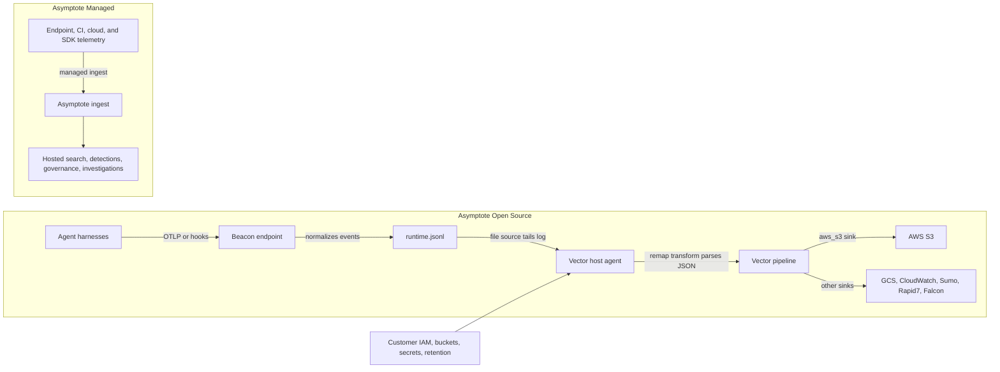

Vector is a lightweight observability pipeline agent. A Vector configuration connects **sources** that collect events, **transforms** that parse or reshape them, and **sinks** that deliver them to downstream systems. In Beacon forwarding, Vector is the customer-managed shipper that tails Beacon's local JSONL audit log, parses each line into the original Beacon event, batches records, retries delivery, and writes them to destinations such as AWS S3, Google Cloud Storage, AWS CloudWatch Logs, Sumo Logic, Rapid7 InsightIDR, or CrowdStrike Falcon LogScale.

Beacon uses Vector as a handoff pattern, not as a hosted dependency. Beacon writes
runtime activity to `runtime.jsonl` and metadata-only inventory snapshots to the
sibling `inventory_state.jsonl`. Vector runs beside Beacon only when you choose
to forward those local streams into your own storage, SIEM, data lake, or log
platform.

## Open Source And Managed

In **Asymptote Open Source**, Agent Beacon is local-first. It configures supported agent harnesses, receives OTLP or hook telemetry, normalizes events, writes local runtime and inventory JSONL, and can generate forwarding content packs. Destination credentials, bucket policies, IAM roles, lifecycle rules, retention, encryption, and remote ingestion settings stay outside Beacon endpoint configuration.

That is where Vector fits. For open-source deployments, Vector is an optional customer-managed forwarder. You install and operate Vector through MDM, endpoint management, launchd, systemd, Kubernetes, or your normal host-agent tooling. Beacon can generate a destination-specific `vector.toml`, but Vector owns:

- Reading the active Beacon log path.
- Persisting checkpoints in `data_dir`.
- Following local log rotation.
- Parsing JSONL into structured events.
- Batching events for the destination.
- Retrying transient failures.
- Holding destination URLs, tokens, IAM roles, cloud credentials, and destination-specific settings.

In **Asymptote Managed**, the main path is different. Managed deployments use Asymptote-hosted ingest, retention, search, detections, governance, identity mapping, and investigation workflows. Vector is not the required managed-ingest architecture. You might still use a customer-managed Vector pipeline for an additional archive or downstream copy, but the core managed product provides the central pipeline and operational surface.

## Why The Handoff Is Local

Beacon's local JSONL handoff keeps the endpoint posture simple and inspectable.
The endpoint agent does not need object-storage credentials to keep collecting
telemetry. If your destination changes, Beacon can keep writing the same
normalized streams while you replace the downstream shipper or sink.

This also creates a clear ownership boundary:

- Beacon owns runtime integration, normalization, local redaction, truncation, local retention, and validation events.
- Vector owns transport mechanics and destination delivery.
- Your cloud, SIEM, or log platform owns remote access control, encryption, retention, indexing, and downstream detections.

## The Pipeline Shape

Most Beacon Vector templates have the same shape:

```toml
data_dir = "/var/lib/vector/beacon-s3"

[sources.beacon_runtime]
type = "file"
include = ["/var/log/beacon-agent/runtime.jsonl"]
read_from = "end"

[transforms.beacon_runtime_json]
type = "remap"
inputs = ["beacon_runtime"]
source = '''
. = parse_json!(.message)
'''

[sinks.beacon_runtime_s3]
type = "aws_s3"
inputs = ["beacon_runtime_json"]
bucket = "${BEACON_S3_BUCKET}"
region = "${AWS_REGION:-us-east-1}"
key_prefix = "${BEACON_S3_PREFIX:-beacon}/runtime/date=%F/"
filename_time_format = "%s"
filename_append_uuid = true
filename_extension = "jsonl.gz"
compression = "gzip"
content_encoding = "gzip"
content_type = "application/x-ndjson"
```

The source reads Beacon's local file. The transform replaces Vector's wrapper event with the parsed Beacon JSON object. The sink writes destination-ready records without changing Beacon's event schema.

## S3 In Depth

AWS S3 forwarding is one example of how Beacon's local runtime and inventory
streams become durable object storage without Beacon storing AWS credentials.

First, Beacon writes endpoint activity and inventory locally. A managed
system-mode deployment writes to:

```text
/var/log/beacon-agent/runtime.jsonl
/var/log/beacon-agent/inventory_state.jsonl
```

Each line is one complete Beacon endpoint event. Beacon keeps the active paths
stable for shippers and rotates local archives when needed.

Next, you generate the S3 content pack:

```bash title="Generate the AWS S3 content pack"
sudo /opt/beacon/bin/beacon endpoint s3 install-pack \
  --system \
  --output ./beacon-s3-pack
```

The pack contains a `README.md`, `sample-event.jsonl`, an AWS CLI smoke-test script, and `vector.toml`. The generated config is a template for a customer-managed Vector host agent.

### File Source

The S3 template uses Vector's [`file` source](https://vector.dev/docs/reference/configuration/sources/file/) to tail the active Beacon log:

```toml
[sources.beacon_runtime]
type = "file"
include = ["{{LOG_PATH}}"]
read_from = "end"
```

`{{LOG_PATH}}` is replaced by the Beacon log path selected when you generate the pack. For system deployments, that is usually `/var/log/beacon-agent/runtime.jsonl`. `read_from = "end"` means a newly installed forwarder starts with new events rather than replaying the whole existing local audit log. If you want an initial backfill, you can adapt the template deliberately, but production installs usually avoid surprise bulk uploads.

Vector stores file checkpoints below its global [`data_dir`](https://vector.dev/docs/reference/configuration/global-options/). Those checkpoints let Vector continue from the last observed file offset after restarts. The Vector process must be able to read `runtime.jsonl`, execute its parent directories, and write its `data_dir`.

### Remap Transform

The source emits a Vector log event whose `.message` field contains the raw JSONL line. The [`remap` transform](https://vector.dev/docs/reference/configuration/transforms/remap/) uses Vector Remap Language to parse that message:

```toml
[transforms.beacon_runtime_json]
type = "remap"
inputs = ["beacon_runtime"]
source = '''
. = parse_json!(.message)
'''
```

`parse_json!` turns the line into a structured object. Assigning it to `.` is important: it removes the Vector wrapper and preserves the Beacon event as the outgoing record. Downstream S3 objects therefore contain Beacon JSON events, not a nested structure such as `{ "message": "{...}" }`.

The generated S3 pack also tails `inventory_state.jsonl` through a second source, transform, and S3 sink. Runtime events and inventory snapshots land under separate prefixes so operational inventory can be archived without mixing it into the runtime event stream.

### AWS S3 Sink

The [`aws_s3` sink](https://vector.dev/docs/reference/configuration/sinks/aws_s3/) writes batches into your bucket:

```toml
[sinks.beacon_runtime_s3]
type = "aws_s3"
inputs = ["beacon_runtime_json"]
bucket = "${BEACON_S3_BUCKET}"
region = "${AWS_REGION:-us-east-1}"
key_prefix = "${BEACON_S3_PREFIX:-beacon}/runtime/date=%F/"
filename_time_format = "%s"
filename_append_uuid = true
filename_extension = "jsonl.gz"
compression = "gzip"
content_encoding = "gzip"
content_type = "application/x-ndjson"
storage_class = "${BEACON_S3_STORAGE_CLASS:-STANDARD}"

[sinks.beacon_runtime_s3.encoding]
codec = "json"

[sinks.beacon_runtime_s3.framing]
method = "newline_delimited"

[sinks.beacon_runtime_s3.batch]
max_bytes = 10000000
timeout_secs = 300

[sinks.beacon_runtime_s3.request]
retry_attempts = 10
retry_initial_backoff_secs = 1
retry_max_duration_secs = 300
```

The bucket, prefix, region, storage class, and AWS credential provider settings come from the Vector service environment, host identity, or secret tooling. Beacon does not store them.

The default object layout is date partitioned:

```text
s3://example-security-logs/beacon/runtime/date=YYYY-MM-DD/<timestamp>-<uuid>.jsonl.gz
```

`filename_time_format = "%s"` and `filename_append_uuid = true` keep object names unique. `encoding.codec = "json"` plus newline-delimited framing keeps one Beacon event per line. `compression = "gzip"` and `content_type = "application/x-ndjson"` make the objects compact while remaining easy for Athena, SIEM import jobs, archive workflows, or downstream batch processors to consume.

For a dedicated Beacon prefix, least privilege usually starts with `s3:PutObject`:

```json
{
  "Version": "2012-10-17",
  "Statement": [
    {
      "Effect": "Allow",
      "Action": ["s3:PutObject"],
      "Resource": "arn:aws:s3:::example-security-logs/beacon/runtime/*"
    }
  ]
}
```

Add `s3:PutObjectTagging`, KMS permissions, bucket-owner controls, or condition keys only when your AWS environment requires them. Bucket lifecycle, retention, server-side encryption, replication, access logs, and object lock should be configured in AWS, not in Beacon.

## GCS Authentication On macOS

The packaged GCS flow mirrors the S3 runtime/inventory layout with
`gcp_cloud_storage` sinks and a root `BEACON_GCS_PREFIX`. The signed package
installs GCS helpers under `/opt/beacon/jamf/claude/gcs/` and runs Vector as
`com.beacon.endpoint.gcs-forwarder`.

The bundled Vector `0.56` supports service-account JSON and GCE metadata
authentication. Normal Macs do not have GCE metadata, and interactive `gcloud`
ADC or Workload Identity Federation is not a reliable launchd service contract
for this version. Deliver a service-account JSON through MDM or secret tooling,
store it outside Beacon-managed directories, and reference it with
`GOOGLE_APPLICATION_CREDENTIALS`. Beacon's root-owned `gcs-vector.env` stores
only that path.

Use `roles/storage.objectCreator` for the endpoint writer. Because that role
cannot list or read objects, validate with a distinct reader identity. See
[Google Cloud Storage forwarding](/log-forwarding/gcs) for full setup and
rotation steps.

## Validation

Beacon can write a known-good S3 validation event:

```bash title="Write an S3 validation event"
sudo /opt/beacon/bin/beacon endpoint s3 validate --system
```

Vector should ship that new JSONL line. Confirm it with AWS tooling:

```bash title="Search uploaded S3 objects"
aws s3 ls "s3://${BEACON_S3_BUCKET}/${BEACON_S3_PREFIX}/" --recursive --region "$AWS_REGION"
aws s3 cp "s3://${BEACON_S3_BUCKET}/${BEACON_S3_PREFIX}/date=<date>/<object>.jsonl.gz" - --region "$AWS_REGION" | gzip -dc | grep "Beacon endpoint S3 validation event"
```

Expected validation fields include:

```text
vendor=beacon product=endpoint-agent destination.type=s3 destination.mode=aws_s3_jsonl
```

If events do not appear, check the same ownership boundary in order: Beacon should be writing the local runtime log, Vector should be reading the same path and writing checkpoints, the Vector service should have AWS credentials available, and the bucket policy should allow object creation for the selected prefix.

## Broader Integrations

The same Vector pattern powers several Beacon content packs:

- [AWS S3](/log-forwarding/s3) uses Vector's `aws_s3` sink to write gzip NDJSON objects.
- [Google Cloud Storage](/log-forwarding/gcs) uses Vector's [`gcp_cloud_storage` sink](https://vector.dev/docs/reference/configuration/sinks/gcp_cloud_storage/) to write gzip NDJSON objects.
- [AWS CloudWatch Logs](/log-forwarding/cloudwatch) uses Vector's `aws_cloudwatch_logs` sink to write parsed Beacon events into a log group.
- [Sumo Logic](/log-forwarding/sumo), [Rapid7 InsightIDR](/log-forwarding/rapid7), and [Falcon LogScale](/log-forwarding/falcon) use HTTP-based Vector sinks with destination-specific headers, endpoints, and batching.

Other customer-managed pipelines can use the same contract even when they do not use Vector: read the active Beacon JSONL log, checkpoint offsets, follow rotation, preserve each line as one event, retry transient failures, and keep destination secrets outside Beacon endpoint configuration.

## Content Handling

Beacon applies redaction, sanitization, truncation, and event-size limits before endpoint events reach `runtime.jsonl`. Vector forwards what Beacon wrote. Review Beacon content settings, Vector service permissions, bucket or SIEM access, downstream retention, and object lifecycle policies together so retained telemetry matches your approved collection policy.

## Vector References

Use the official Vector docs when adapting generated templates:

- [Vector configuration](https://vector.dev/docs/reference/configuration/)
- [Global options and `data_dir`](https://vector.dev/docs/reference/configuration/global-options/)
- [`file` source](https://vector.dev/docs/reference/configuration/sources/file/)
- [`remap` transform](https://vector.dev/docs/reference/configuration/transforms/remap/)
- [VRL function reference](https://vector.dev/docs/reference/vrl/functions/)
- [`aws_s3` sink](https://vector.dev/docs/reference/configuration/sinks/aws_s3/)
- [`gcp_cloud_storage` sink](https://vector.dev/docs/reference/configuration/sinks/gcp_cloud_storage/)

## Related

<Columns cols={2}>
  <Card title="AWS S3 forwarding" icon="box-archive" href="/log-forwarding/s3">
    Configure Vector forwarding from Beacon JSONL into AWS S3.
  </Card>
  <Card title="Log forwarding" icon="tower-broadcast" href="/log-forwarding">
    Review destination-specific forwarding paths across SIEMs, log platforms, object storage, and local workflows.
  </Card>
  <Card title="Core Concepts" icon="book-open" href="/concepts/core-concepts">
    Review runtime logs, content packs, customer-managed forwarding, and endpoint terminology.
  </Card>
  <Card title="Open Source deployment" icon="code-branch" href="/deployment/open-source">
    See how Agent Beacon runs local-first with customer-controlled storage and forwarding.
  </Card>
  <Card title="Managed deployment" icon="cloud" href="/deployment/managed">
    Understand the hosted Asymptote ingest, retention, search, detections, governance, and investigation model.
  </Card>
  <Card title="Endpoint event schema" icon="code" href="/telemetry-schema/event-schema">
    Review normalized Beacon JSONL fields and example events.
  </Card>
</Columns>
