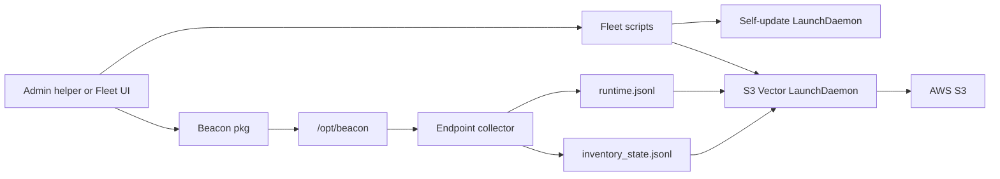

## Overview

Use this guide when you want Fleet to install Beacon on managed Macs and forward endpoint telemetry to a bucket you own.

When you are done:

- Beacon is installed under `/opt/beacon`.
- The collector runs as `com.beacon.endpoint.collector`.
- Runtime events go to `/var/log/beacon-agent/runtime.jsonl`.
- Inventory events go to `/var/log/beacon-agent/inventory_state.jsonl`.
- Vector uploads both files to S3:

```text
s3://<bucket>/<prefix>/runtime/date=YYYY-MM-DD/<object>.jsonl.gz
s3://<bucket>/<prefix>/inventory/date=YYYY-MM-DD/<object>.jsonl.gz
```



Start with the admin helper in this repo unless you would rather click through the Fleet UI. The helper talks to your Fleet server once. After that, you install the package on a pilot Mac and run two scripts.

## Before you start

You need:

- [Fleet Premium](https://fleetdm.com/guides/deploy-software-packages). Custom packages cannot be added to All teams.
- A Fleet team for the pilot, not All teams.
- `fleetd` with scripts enabled. That is the default when you use Fleet MDM. Otherwise deploy `fleetd` with `--enable-scripts`.
- Apple Silicon Macs. The signed Beacon package is `BeaconEndpointAgent-<version>-arm64.pkg`.
- An API token that can manage software, scripts, and variables on that team.
- An S3 bucket and an IAM principal that can `s3:PutObject` on one prefix in that bucket.
- `curl` and `python3` on the machine that runs the helper.

If you self-host Fleet, Fleet also needs its own S3 bucket to store uploaded installers. That bucket is separate from the telemetry bucket in this guide. Raise load-balancer timeouts to at least five minutes so the package upload does not time out.

<Warning>
  Do not put self-update or S3 setup in the software package's post-install script. If that script fails, Fleet uninstalls Beacon.
</Warning>

## 1. Prepare the S3 prefix and IAM

Pick a root prefix such as `beacon` or `beacon-prod`. Do not put `runtime` or `inventory` in the prefix. Beacon adds those folders itself:

```bash
BEACON_S3_PREFIX="beacon-prod"          # good
BEACON_S3_PREFIX="beacon-prod/runtime"  # avoid
```

Grant the writer `s3:PutObject` on that prefix only:

```json
{
  "Version": "2012-10-17",
  "Statement": [
    {
      "Effect": "Allow",
      "Action": ["s3:PutObject"],
      "Resource": "arn:aws:s3:::example-security-logs/beacon-prod/*"
    }
  ]
}
```

Beacon does not store AWS credentials in endpoint config. The packaged Vector helper writes provider-chain values into a root-owned file:

```text
/Library/Application Support/Beacon/Forwarders/s3-vector.env
```

That file is mode `0600`. Vector reads it when the LaunchDaemon starts.

## 2. Run the admin helper

The helper runs on your workstation. It does not run on the Macs.

Download it from the repo:

```bash
curl -fsSL -o configure-beacon-macos-s3.sh \
  https://raw.githubusercontent.com/Asymptote-Labs/agent-beacon/main/examples/fleet/configure-beacon-macos-s3.sh
chmod +x configure-beacon-macos-s3.sh
```

Or copy `examples/fleet/configure-beacon-macos-s3.sh` from a clone.

Preview the host scripts without calling Fleet:

```bash
BEACON_S3_BUCKET="example-security-logs" \
AWS_REGION="us-west-2" \
BEACON_S3_PREFIX="beacon-prod" \
./configure-beacon-macos-s3.sh --yes --dry-run --skip-software
```

Then run it against your Fleet server:

```bash
./configure-beacon-macos-s3.sh
```

It asks for:

| Prompt | Example |
| --- | --- |
| Fleet URL | `https://fleet.example.com` |
| Fleet API token | from Fleet Settings |
| Team ID | a number; the helper lists teams |
| Automatic install | `n` for a pilot |
| S3 bucket | `example-security-logs` |
| AWS region | `us-west-2` |
| S3 prefix | `beacon-prod` |
| AWS access key and secret | the writer key |

Non-interactive:

```bash
FLEET_URL="https://fleet.example.com" \
FLEET_TOKEN="..." \
FLEET_TEAM_ID="1" \
BEACON_S3_BUCKET="example-security-logs" \
AWS_REGION="us-west-2" \
BEACON_S3_PREFIX="beacon-prod" \
AWS_ACCESS_KEY_ID="..." \
AWS_SECRET_ACCESS_KEY="..." \
./configure-beacon-macos-s3.sh --yes
```

`--check-only` enables Beacon update monitoring without installing packages.

If you use Fleet GitOps, the next GitOps apply can overwrite these API changes. Fold the package, scripts, and `$FLEET_SECRET_*` variables into the GitOps repo, or rerun the helper after apply.

## What the helper does

On your workstation it:

1. Downloads the latest Apple Silicon `.pkg` from GitHub Releases and checks the SHA-256.
2. Uploads that package as Fleet software on the team you chose. The install script is Fleet's default `installer -pkg "$INSTALLER_PATH" -target /`. The Beacon package postinstall then configures the system collector. The uninstall script calls Beacon's cleanup helper, because Fleet's default `.pkg` uninstall only removes `.app` bundles.
3. Stores the AWS keys as Fleet secret variables so they are hidden in the Fleet UI.
4. Creates three host scripts:
   - `beacon-enable-self-updates.sh`
   - `beacon-configure-s3-forwarding.sh`
   - `beacon-validate.sh`
5. Creates saved queries for install state, collector health, and S3 forwarder health.

The S3 host script calls the helper that ships in the package, `/opt/beacon/jamf/claude/s3/install-forwarder.sh`. The path says `jamf` because that is where the package puts it. Fleet uses the same file.

Fleet replaces `$FLEET_SECRET_*` when it sends a script to a host. The script never prints those values. Fleet still records script output, so do not `echo` keys.

## 3. Install Beacon on a pilot Mac

In Fleet:

1. Open **Software**, select the team, and open the Beacon package.
2. Target a small label of Apple Silicon Macs. Do not target every host yet.
3. Install from the host's **Software** tab, or wait if you turned on automatic install.

The package install is enough for collection. Self-updates and S3 are still off at this point.

## 4. Enable self-updates and S3

After the package is installed, run the two scripts on those hosts, in this order:

1. `beacon-enable-self-updates.sh`
2. `beacon-configure-s3-forwarding.sh`

Then run `beacon-validate.sh` if you want a quick status dump.

On one Mac:

```bash
sudo /opt/beacon/bin/beacon endpoint status --json
sudo /opt/beacon/bin/beacon endpoint update status
sudo launchctl print system/com.beacon.endpoint.collector
sudo launchctl print system/com.beacon.endpoint.updater
sudo launchctl print system/com.beacon.endpoint.s3-forwarder
```

Collector, updater, and S3 forwarder should be loaded. The updater LaunchDaemon is idle most of the day and only runs in its scheduled windows.

## 5. Confirm S3 delivery

Write a test runtime event:

```bash
sudo /opt/beacon/bin/beacon endpoint test-event \
  --system \
  --log-path /var/log/beacon-agent/runtime.jsonl
```

Write an inventory heartbeat:

```bash
sudo /opt/beacon/bin/beacon endpoint inventory heartbeat \
  --system \
  --force \
  --trigger manual \
  --working-dir /Users/Shared \
  --log-path /var/log/beacon-agent/runtime.jsonl
```

Vector batches uploads. The packaged config waits up to five minutes (`timeout_secs = 300`) before the first object appears.

```bash
aws s3 ls "s3://${BEACON_S3_BUCKET}/${BEACON_S3_PREFIX}/runtime/" \
  --recursive \
  --region "$AWS_REGION"

aws s3 ls "s3://${BEACON_S3_BUCKET}/${BEACON_S3_PREFIX}/inventory/" \
  --recursive \
  --region "$AWS_REGION"
```

Inspect an object:

```bash
aws s3 cp "s3://${BEACON_S3_BUCKET}/${BEACON_S3_PREFIX}/runtime/date=<YYYY-MM-DD>/<object>.jsonl.gz" - \
  --region "$AWS_REGION" | gzip -dc | head
```

## Set this up in the Fleet UI instead

Skip the helper if you want to click through Fleet yourself.

### Upload the package

1. Download `BeaconEndpointAgent-<version>-arm64.pkg` from the [latest GitHub release](https://github.com/asymptote-labs/agent-beacon/releases/latest).
2. In Fleet, open **Software**, select the team, and add a custom package.
3. Leave the default install script. Do not add a post-install script.
4. Replace the uninstall script with:

```bash
#!/bin/sh
set -eu
if [ -x /opt/beacon/jamf/scripts/full-cleanup.sh ]; then
  /opt/beacon/jamf/scripts/full-cleanup.sh
elif [ -x /opt/beacon/fleet/scripts/uninstall.sh ]; then
  /opt/beacon/fleet/scripts/uninstall.sh
  rm -rf /opt/beacon "/Library/Application Support/Beacon" \
    /Library/LaunchDaemons/com.beacon.endpoint.*.plist
  pkgutil --forget ai.asymptote.beacon.endpoint >/dev/null 2>&1 || true
fi
```

See [Deploy software](https://fleetdm.com/guides/deploy-software-packages) for targeting and automatic install.

### Add secret variables

In **Controls > Variables**, add:

| Variable name | Used in scripts as |
| --- | --- |
| `BEACON_AWS_ACCESS_KEY_ID` | `$FLEET_SECRET_BEACON_AWS_ACCESS_KEY_ID` |
| `BEACON_AWS_SECRET_ACCESS_KEY` | `$FLEET_SECRET_BEACON_AWS_SECRET_ACCESS_KEY` |
| `BEACON_AWS_SESSION_TOKEN` | `$FLEET_SECRET_BEACON_AWS_SESSION_TOKEN` (only if you use temporary keys) |

### Add the host scripts

**Enable self-updates:**

```bash
#!/bin/sh
set -eu
BEACON="${BEACON_BIN:-/opt/beacon/bin/beacon}"
if [ ! -x "$BEACON" ]; then
  echo "Beacon is not installed at $BEACON" >&2
  exit 1
fi
"$BEACON" endpoint update enable
"$BEACON" endpoint update status
```

**Configure S3.** Change the bucket, region, and prefix, then save this as `beacon-configure-s3-forwarding.sh`:

```bash
#!/bin/sh
set -eu
INSTALLER="${BEACON_S3_VECTOR_SCRIPT:-/opt/beacon/jamf/claude/s3/install-forwarder.sh}"
VECTOR="${BEACON_VECTOR_BIN:-/opt/beacon/bin/vector}"
if [ ! -x "$INSTALLER" ]; then
  echo "S3 forwarder helper missing at $INSTALLER; install the Beacon package first" >&2
  exit 1
fi
if [ ! -x "$VECTOR" ]; then
  echo "Vector missing at $VECTOR" >&2
  exit 1
fi
export BEACON_S3_BUCKET="example-security-logs"
export AWS_REGION="us-west-2"
export BEACON_S3_PREFIX="beacon-prod"
export BEACON_S3_STORAGE_CLASS="STANDARD"
export BEACON_VECTOR_READ_FROM="${BEACON_VECTOR_READ_FROM:-end}"
export AWS_ACCESS_KEY_ID="$FLEET_SECRET_BEACON_AWS_ACCESS_KEY_ID"
export AWS_SECRET_ACCESS_KEY="$FLEET_SECRET_BEACON_AWS_SECRET_ACCESS_KEY"
"$INSTALLER"
echo "S3 Vector forwarder configured. Credential values were not printed."
```

Install the package first, then run those two scripts on the host.

## Policies to add

After the first Mac is installed, the package also drops queries under `/opt/beacon/fleet/queries`. Useful checks:

| Query | Healthy value |
| --- | --- |
| `beacon-version.sql` | `installed` |
| `collector-service-health.sql` | `running` |
| `s3-vector-forwarder-health.sql` | `running` |
| `s3-vector-forwarding-configured.sql` | `configured` |
| `last-event-age-seconds.sql` | less than `86400` |

## Troubleshooting

### The package will not upload

Custom packages need Fleet Premium and a team ID. Self-hosted Fleet needs installer S3 storage and a load balancer that waits at least five minutes.

### Scripts never run

Confirm `fleetd` was installed with scripts enabled. In Fleet MDM that is the default. Check **Host details > Activity** for the script result.

### Beacon installed, but S3 is empty

Confirm the package is on the disk and the S3 script ran after install:

```bash
ls /opt/beacon/bin/vector
ls /opt/beacon/jamf/claude/s3/install-forwarder.sh
sudo launchctl print system/com.beacon.endpoint.s3-forwarder
sudo tail -n 50 /tmp/com.beacon.endpoint.s3-forwarder.err
```

If `launchctl` says it cannot find the service, rerun `beacon-configure-s3-forwarding.sh`. Wait up to five minutes for Vector to flush.

Check that the env file exists without printing secrets:

```bash
sudo sh -c 'sed -E "s/(AWS_ACCESS_KEY_ID|AWS_SECRET_ACCESS_KEY|AWS_SESSION_TOKEN)=.*/\1=<redacted>/" "/Library/Application Support/Beacon/Forwarders/s3-vector.env"'
```

### Post-install uninstalled Beacon

A failing Fleet post-install script rolls the package back. Remove S3 and self-update from post-install, reinstall the package, and run the two scripts afterward.

### Self-update is off

```bash
sudo /opt/beacon/bin/beacon endpoint update status
sudo launchctl print system/com.beacon.endpoint.updater
```

Re-run `beacon-enable-self-updates.sh`, or:

```bash
sudo /opt/beacon/bin/beacon endpoint update enable
```

The Mac needs network access to GitHub Releases, or you must set `BEACON_UPDATE_MANIFEST_URL` to a manifest you host.

### Intel Macs

The current signed endpoint package is Apple Silicon only. Do not scope this software title to Intel hosts.

## Related

<Columns cols={2}>
  <Card title="Fleet" icon="laptop-file" href="/mdm/fleet">
    Package layout, Fleet scripts, queries, and self-update commands.
  </Card>
  <Card title="Deploy software in Fleet" icon="box-open" href="https://fleetdm.com/guides/deploy-software-packages">
    Fleet's custom package, script, and targeting model.
  </Card>
  <Card title="Jamf and S3" icon="bucket" href="/guides/jamf-s3-mdm">
    The same Vector S3 path, installed with Jamf Pro instead of Fleet.
  </Card>
  <Card title="Object storage forwarding" icon="box-archive" href="/guides/macos-object-storage-system">
    S3 and GCS Vector config for a single Mac.
  </Card>
</Columns>
