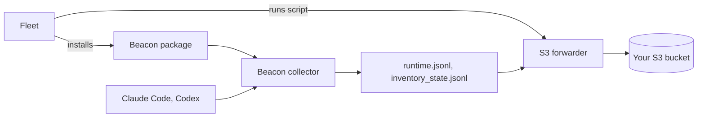

This guide takes you from no Beacon on your Macs to every Mac in scope sending its AI agent activity to an S3 bucket you own. Follow the steps in order.

## What you'll set up

When you finish, each Mac in scope has:

- Beacon installed under `/opt/beacon`, with its collector running as the LaunchDaemon `com.beacon.endpoint.collector`.
- Claude Code and Codex reporting to that collector for the user who is logged in at the Mac.
- Agent activity written to `/var/log/beacon-agent/runtime.jsonl`, and an inventory of the Mac's agents written to `/var/log/beacon-agent/inventory_state.jsonl` every 6 hours.
- A forwarder (Vector, shipped in the package) uploading both files to your bucket:

```text
s3://<bucket>/<prefix>/runtime/date=YYYY-MM-DD/<time>-<id>.jsonl.gz
s3://<bucket>/<prefix>/inventory/date=YYYY-MM-DD/<time>-<id>.jsonl.gz
```

Fleet shows each part's health per host through five policies.



## Before you start

| You need | Why |
| --- | --- |
| Fleet Premium, version 4.62 or later | Custom packages and secret variables are Premium features. |
| A pilot team in Fleet with a few test Macs | Custom packages can't be added to "All teams". Fleet 4.82 and later call teams *fleets*; this guide says *team*. |
| Apple Silicon Macs | The signed Beacon package is Apple Silicon only. |
| Scripts enabled in `fleetd` | On by default when you use Fleet MDM. Otherwise deploy `fleetd` with `--enable-scripts`. |
| An AWS account where you can create an S3 bucket and an IAM user | Step 2. |
| For the admin helper only: a Fleet API token with the global admin or maintainer role, and `curl` and `python3` on your workstation | Only a global role can store the AWS keys as Fleet secret variables. See [Create the API token](#create-the-api-token). |

The Macs don't need Beacon installed beforehand. Fleet installs it in step 4.

<Note>
  If you self-host Fleet, it needs its own storage for uploaded packages, separate from the telemetry bucket in this guide. Set load balancer timeouts to at least five minutes so the package upload doesn't time out.
</Note>

## 1. Try Beacon on one Mac (optional)

To see what the package does before involving Fleet, install it by hand on one Apple Silicon Mac. This install needs no account and sends nothing off the Mac. Run it in Terminal while logged in at the Mac:

```bash title="Download, verify, and install"
VERSION="$(curl -fsSLI -o /dev/null -w '%{url_effective}' https://github.com/asymptote-labs/agent-beacon/releases/latest)"; VERSION="${VERSION##*/v}"
PKG="BeaconEndpointAgent-${VERSION}-arm64.pkg"
BASE="https://github.com/asymptote-labs/agent-beacon/releases/download/v${VERSION}"
curl -fsSLO "${BASE}/${PKG}" && curl -fsSLO "${BASE}/${PKG}.sha256"
test "$(awk '{print $1}' "${PKG}.sha256")" = "$(shasum -a 256 "${PKG}" | awk '{print $1}')" \
  && pkgutil --check-signature "${PKG}" \
  && sudo installer -pkg "${PKG}" -target /
```

The block checks the package against its published SHA-256 and its Apple signature before installing. `pkgutil` should print `Status: signed by a developer certificate issued by Apple for distribution`.

Then check it:

```bash
sudo /opt/beacon/bin/beacon endpoint status --system
```

`Service: loaded=true running=true` and `telemetry=enabled` next to Claude Code and Codex mean it's working. Start a new Claude Code session and its activity appears in `/var/log/beacon-agent/runtime.jsonl`.

You can leave this Mac as it is. When Fleet installs the same package on it later, the install is simply repeated.

## 2. Prepare S3

**Pick a prefix** such as `beacon-prod`. Beacon adds `runtime/` and `inventory/` under it, so don't put either in the prefix.

**Create an IAM user for Beacon** with this policy. Replace the bucket and prefix with yours:

```json title="IAM policy for the Beacon writer"
{
  "Version": "2012-10-17",
  "Statement": [
    {
      "Effect": "Allow",
      "Action": ["s3:PutObject"],
      "Resource": "arn:aws:s3:::example-security-logs/beacon-prod/*"
    }
  ]
}
```

**Create an access key** for that user. Use a long-lived key, which starts with `AKIA`. Temporary credentials stop working when they expire, and uploads that fail after that point are lost.

Three things about the bucket:

- **Startup check.** When the forwarder starts, it checks that it can reach the bucket, which needs `s3:ListBucket` on `arn:aws:s3:::example-security-logs`. Without it, uploads still work, but the forwarder's log shows a health-check error at startup. Add the permission if you'd rather not see that error.
- **KMS.** If the bucket's default encryption uses a customer managed KMS key, also allow `kms:GenerateDataKey` on that key.
- **Encryption headers.** Beacon doesn't send encryption headers or ACLs, so the bucket's default encryption applies. A bucket policy that requires an encryption header on every upload will reject Beacon's uploads.

## 3. Set up Fleet

Both options end in the same place: the Beacon package, the AWS keys, three scripts, and five health policies in your pilot team.

<Tabs>
  <Tab title="Admin helper (recommended)">
    The helper runs once on your workstation and makes all the Fleet changes for you. It checks your token's role before changing anything.

    **Download it:**

    ```bash
    curl -fsSL -o configure-beacon-macos-s3.sh \
      https://raw.githubusercontent.com/asymptote-labs/agent-beacon/main/examples/fleet/configure-beacon-macos-s3.sh
    chmod +x configure-beacon-macos-s3.sh
    ```

    **Preview it.** This prints the plan and the scripts it would create, and makes no network calls:

    ```bash
    BEACON_S3_BUCKET="example-security-logs" \
    AWS_REGION="us-west-2" \
    BEACON_S3_PREFIX="beacon-prod" \
    ./configure-beacon-macos-s3.sh --yes --dry-run
    ```

    **Run it:**

    ```bash
    ./configure-beacon-macos-s3.sh
    ```

    It asks for:

    | Prompt | What to enter |
    | --- | --- |
    | Fleet URL | `https://fleet.example.com` |
    | Fleet API token | The global admin or maintainer token |
    | Install Beacon automatically on every Mac in this team? | `n` for now. You turn this on in step 6. |
    | S3 bucket, AWS region, S3 prefix | From step 2 |
    | S3 storage class | Press Enter for `STANDARD` |
    | AWS credentials | `k` for a key pair |
    | Access key ID and secret access key | The key from step 2. The secret is asked twice. |
    | Session token | Press Enter to skip |
    | Fleet team ID | The helper lists your teams. Pick the pilot team. |

    When it finishes, your pilot team has:

    - The package, named **Beacon Endpoint Agent**. It has a check that skips Intel Macs, and an uninstall script that removes Beacon completely.
    - The AWS keys stored as Fleet secret variables.
    - Three scripts: `beacon-configure-s3-forwarding.sh`, `beacon-enable-self-updates.sh`, and `beacon-validate.sh`.
    - Five policies whose names start with **Beacon:**, and five reports.

    You can run the helper again at any time. It changes only what's different, so rerunning it after a new Beacon release uploads the new package.

    <Accordion title="Run it without prompts">
      Set every value as an environment variable and pass `--yes`:

      ```bash
      FLEET_URL="https://fleet.example.com" \
      FLEET_TOKEN="..." \
      FLEET_TEAM_ID="7" \
      BEACON_S3_BUCKET="example-security-logs" \
      AWS_REGION="us-west-2" \
      BEACON_S3_PREFIX="beacon-prod" \
      AWS_ACCESS_KEY_ID="AKIA..." \
      AWS_SECRET_ACCESS_KEY="..." \
      ./configure-beacon-macos-s3.sh --yes
      ```

      With `--yes`, the helper stops if the AWS keys are missing, so it never sets up forwarding without credentials by accident.
    </Accordion>

    <Accordion title="If you manage Fleet with GitOps">
      The next GitOps run can overwrite changes the helper made through the API. Either add the package, scripts, policies, and `$FLEET_SECRET_*` variables to your GitOps repo, or rerun the helper after each GitOps run.
    </Accordion>
  </Tab>

  <Tab title="Fleet UI">
    **1. Download and verify the package** on your workstation:

    ```bash
    VERSION="$(curl -fsSLI -o /dev/null -w '%{url_effective}' https://github.com/asymptote-labs/agent-beacon/releases/latest)"; VERSION="${VERSION##*/v}"
    PKG="BeaconEndpointAgent-${VERSION}-arm64.pkg"
    BASE="https://github.com/asymptote-labs/agent-beacon/releases/download/v${VERSION}"
    curl -fsSLO "${BASE}/${PKG}" && curl -fsSLO "${BASE}/${PKG}.sha256"
    test "$(awk '{print $1}' "${PKG}.sha256")" = "$(shasum -a 256 "${PKG}" | awk '{print $1}')" \
      && pkgutil --check-signature "${PKG}"
    ```

    **2. Add the package.** In Fleet, go to **Software** and pick your pilot team in the team selector. Click **Add software**, open the **Custom package** tab, and choose the `.pkg` file. Then:

    - Leave **Deploy** off. Step 6 explains why.
    - Open **Advanced options**.
      - Set **Pre-install query** to `SELECT 1 FROM system_info WHERE cpu_type LIKE 'arm64%';`. This skips Intel Macs.
      - Replace the **Uninstall script** with the script below. Fleet's default only removes `.app` bundles, and Beacon has none.
      - Leave **Install script** as the default, and leave **Post-install script** empty.
    - Click **Add software**.

    ```bash title="Uninstall script"
    #!/bin/sh
    set -eu
    if [ -x /opt/beacon/jamf/scripts/full-cleanup.sh ]; then
      /opt/beacon/jamf/scripts/full-cleanup.sh
    elif [ -x /opt/beacon/fleet/scripts/uninstall.sh ]; then
      /opt/beacon/fleet/scripts/uninstall.sh
      rm -rf /opt/beacon "/Library/Application Support/Beacon" /Library/LaunchDaemons/com.beacon.endpoint.*.plist
      pkgutil --forget "ai.asymptote.beacon.endpoint" >/dev/null 2>&1 || true
    fi
    ```

    **3. Store the AWS keys.** Go to **Controls > Variables** and use **Add variable** to add each of these. Variables apply to every team, and only a global admin or maintainer can add them.

    | Name | Value |
    | --- | --- |
    | `BEACON_AWS_ACCESS_KEY_ID` | The access key ID from step 2 |
    | `BEACON_AWS_SECRET_ACCESS_KEY` | The secret access key from step 2 |

    **4. Add the scripts.** Go to **Controls > Scripts**, pick the pilot team, and use **Add script** to upload each of these. Change the bucket, region, and prefix in the first one.

    <Accordion title="beacon-configure-s3-forwarding.sh">
      ```bash
      #!/bin/sh
      set -eu
      # Fleet substitutes $FLEET_SECRET_* before this script reaches the Mac.
      # Don't echo credential values: Fleet shows script output in its UI.
      INSTALLER="${BEACON_S3_VECTOR_SCRIPT:-/opt/beacon/jamf/claude/s3/install-forwarder.sh}"
      VECTOR="${BEACON_VECTOR_BIN:-/opt/beacon/bin/vector}"
      if [ ! -x "$INSTALLER" ]; then
        echo "S3 forwarder helper missing at $INSTALLER; install the Beacon package first" >&2
        exit 1
      fi
      if [ ! -x "$VECTOR" ]; then
        echo "Vector missing at $VECTOR; the Beacon package must include /opt/beacon/bin/vector" >&2
        exit 1
      fi
      export BEACON_S3_BUCKET="example-security-logs"
      export AWS_REGION="us-west-2"
      export BEACON_S3_PREFIX="beacon-prod"
      export BEACON_S3_STORAGE_CLASS="STANDARD"
      export BEACON_VECTOR_READ_FROM="${BEACON_VECTOR_READ_FROM:-end}"
      export AWS_ACCESS_KEY_ID="$FLEET_SECRET_BEACON_AWS_ACCESS_KEY_ID"
      export AWS_SECRET_ACCESS_KEY="$FLEET_SECRET_BEACON_AWS_SECRET_ACCESS_KEY"
      "$INSTALLER"
      echo "S3 Vector forwarder configured. Credential values were not printed."
      if command -v launchctl >/dev/null 2>&1; then
        launchctl print system/com.beacon.endpoint.s3-forwarder | grep -E 'state =|pid =|last exit code' || true
      fi
      ```
    </Accordion>

    <Accordion title="beacon-enable-self-updates.sh">
      ```bash
      #!/bin/sh
      set -eu
      BEACON="${BEACON_BIN:-/opt/beacon/bin/beacon}"
      if [ ! -x "$BEACON" ]; then
        echo "Beacon is not installed at $BEACON" >&2
        exit 1
      fi
      "$BEACON" endpoint update enable
      "$BEACON" endpoint update status
      ```

      For update checks without automatic installs, change `update enable` to `update enable --check-only`.
    </Accordion>

    <Accordion title="beacon-validate.sh">
      ```bash
      #!/bin/sh
      set -eu
      BEACON="${BEACON_BIN:-/opt/beacon/bin/beacon}"
      "$BEACON" endpoint update status || true
      launchctl print system/com.beacon.endpoint.collector | grep -E 'state =|pid =|last exit code' || true
      launchctl print system/com.beacon.endpoint.updater | grep -E 'state =|pid =|last exit code' || true
      launchctl print system/com.beacon.endpoint.s3-forwarder | grep -E 'state =|pid =|last exit code' || true
      ```
    </Accordion>

    **5. Add the health policies.** Go to **Policies**, pick the pilot team, and click **Add policy** once per file below. Paste the file's contents into **Query**, click **Save**, and give the policy the name in the table.

    | Policy name | File |
    | --- | --- |
    | Beacon: installed | [`beacon-installed.sql`](https://github.com/asymptote-labs/agent-beacon/blob/main/packaging/macos/fleet/policies/beacon-installed.sql) |
    | Beacon: collector running | [`collector-running.sql`](https://github.com/asymptote-labs/agent-beacon/blob/main/packaging/macos/fleet/policies/collector-running.sql) |
    | Beacon: S3 forwarder running | [`s3-forwarder-running.sql`](https://github.com/asymptote-labs/agent-beacon/blob/main/packaging/macos/fleet/policies/s3-forwarder-running.sql) |
    | Beacon: S3 forwarding configured | [`s3-forwarding-configured.sql`](https://github.com/asymptote-labs/agent-beacon/blob/main/packaging/macos/fleet/policies/s3-forwarding-configured.sql) |
    | Beacon: inventory heartbeat within 4 days | [`inventory-heartbeat-recent.sql`](https://github.com/asymptote-labs/agent-beacon/blob/main/packaging/macos/fleet/policies/inventory-heartbeat-recent.sql) |
  </Tab>
</Tabs>

## 4. Install Beacon on a pilot Mac

In Fleet, go to **Hosts** and open one of the pilot Macs. On its **Software** tab, open **Library**, find **Beacon Endpoint Agent**, and click **Install**. The **Status** column changes to **Installed** when it's done; click the status to see the installer output.

What happens on the Mac:

- Fleet runs `installer -pkg <package> -target /`.
- The package installs Beacon under `/opt/beacon` and starts the collector.
- It configures Claude Code and Codex for the user logged in at the Mac.
- There are no prompts, no sign-in, and nothing is sent off the Mac yet.

**Check it worked.** The **Beacon: installed** and **Beacon: collector running** policies pass the next time Fleet checks the host's policies. Click **Refetch** on the host page to check now.

To check on the Mac itself:

```bash
sudo /opt/beacon/bin/beacon endpoint status --system
```

```
Beacon Endpoint Agent <version>
Config: /Library/Application Support/Beacon/Endpoint/config.json
Runtime log: /var/log/beacon-agent/runtime.jsonl
Collector: grpc=true http=true
Service: loaded=true running=true
Harness: Claude Code <version> telemetry=enabled
Harness: Codex CLI <version> telemetry=enabled
Last event: present
```

`running=true` and `telemetry=enabled` are the lines that matter. A line reading `Beacon Managed: not connected` is expected: Beacon's hosted service isn't used in this setup.

<Note>
  The package configures the agents of whoever is logged in at the Mac when it installs. If nobody was logged in, for example during Setup Assistant, run this after someone logs in, either as a Fleet script or on the Mac:
  `sudo /opt/beacon/bin/beacon endpoint user-config repair-installed --system`
</Note>

## 5. Turn on S3 forwarding

On the same host page in Fleet, open **Actions > Run script** and run `beacon-configure-s3-forwarding.sh`. Open the result in the host's **Activity** list. Its output should end with `S3 Vector forwarder configured.` and a `state = running` line.

To keep Beacon up to date automatically, also run `beacon-enable-self-updates.sh`. See [Updates](#updates).

**Confirm delivery.** On the Mac, write a test event:

```bash
sudo /opt/beacon/bin/beacon endpoint s3 validate --system
```

The forwarder uploads in batches, so allow up to five minutes. Then, from a machine with AWS access, list the uploaded objects and look for the test event:

```bash
aws s3 ls "s3://example-security-logs/beacon-prod/runtime/" --recursive
aws s3 cp "s3://example-security-logs/beacon-prod/runtime/date=<YYYY-MM-DD>/<object>.jsonl.gz" - \
  | gzip -dc | grep "Beacon endpoint S3 validation event"
```

In Fleet, **Beacon: S3 forwarder running** and **Beacon: S3 forwarding configured** now pass for this Mac.

## 6. Roll out to the rest of your Macs

When the pilot looks right:

1. **Put the Macs in scope.** Add them to the team, or repeat steps 3 to 5 for another team.
2. **Install Beacon automatically.** With the helper, rerun it with `FLEET_AUTOMATIC_INSTALL=true`. In the Fleet UI, go to **Policies**, click the **Automations** cell of the **Beacon: installed** policy, check **Install software**, select **Beacon Endpoint Agent**, and click **Save**. Fleet then installs Beacon on every Apple Silicon Mac in the team where that policy fails.
3. **Turn on S3 for each new Mac.** In the same way, give **Beacon: S3 forwarding configured** a **Run script** automation with `beacon-configure-s3-forwarding.sh`. Fleet then runs the script on each Mac where forwarding isn't set up yet. To turn on self-updates everywhere, run `beacon-enable-self-updates.sh` on the team's hosts: select them on the **Hosts** page and click **Run script**.
4. **Watch the policies.** Each **Beacon:** policy passes only when that part of Beacon is healthy on the host. A failing host tells you which part to look at.

<Warning>
  Leave the package's own **Deploy** switch (called **Automatic install** before Fleet 4.83) off. For a `.pkg`, the policy it creates looks for an app bundle to decide whether the package is installed, and Beacon has none. That policy never passes, so Fleet keeps reinstalling. Use the **Beacon: installed** policy instead.
</Warning>

## Running Beacon

### What reaches your bucket

- **Every line of both logs,** as gzipped JSON lines.
- **Full agent activity,** after local redaction of secrets and a 64 KB limit per event. That includes prompts, the commands agents ran and their output, tool inputs and outputs, and file paths and diffs. This path has no metadata-only option.
- **The host name.** Object keys don't include the host. Each record has the Mac's name in `endpoint.hostname`.
- **The date in the key** is the UTC date the forwarder handled the event, not when the event happened. Use each record's `timestamp` for the event time.
- **What's included from before step 5.** Runtime events are uploaded from the moment the forwarder first starts, so earlier history isn't included. Inventory is uploaded from the beginning. To include a Mac's earlier runtime history, change `end` to `beginning` on the script's `BEACON_VECTOR_READ_FROM` line before the script first runs on that Mac. Later runs continue from where the forwarder left off.
- **How often.** Each Mac uploads a batch per log every five minutes, or sooner when a batch reaches 10 MB.

### Updates

Self-updates stay off until you run `beacon-enable-self-updates.sh`. After that, each Mac checks for a new release a few times during local business hours. It verifies the package's checksum and Apple notarization, installs it, and rolls back if the new version fails its health check. S3 forwarding keeps running across updates.

- To only record that an update is available, use `update enable --check-only` in the script.
- To update through Fleet instead, rerun the helper after a new release. It uploads the new package to the same software title.
- To point Macs at a release manifest you host, write it to `/Library/Application Support/Beacon/Endpoint/managed.json`:

  ```json
  { "manifest_url": "https://updates.example.com/beacon/update-manifest.json" }
  ```

If an update can't restart the S3 forwarder afterwards, the install fails with `could not restore existing forwarder com.beacon.endpoint.s3-forwarder`. It fails on purpose, so forwarding never stops without anyone noticing.

### Capture more agents

The package sets up Claude Code and Codex. To add others, run a Fleet script like this on the Macs:

```bash
#!/bin/sh
/opt/beacon/bin/beacon endpoint user-config repair-installed --system --harness cursor,gemini
```

Agents that are already set up stay set up, so list only the ones you're adding. The names this command accepts are `claude`, `codex`, `gemini`, `cursor`, `vscode` (hooks only), `opencode`, `cline`, `factory`, `openhands`, `kiro`, `kimi`, `dsh`, `pi`, `omp`, `prime`, `omo`, `openclaw`, `grok`, `qwen`, `muse`, `hermes`, `devin-cli`, `devin-desktop`, and `antigravity`. Some agents need a step outside Beacon; see [Agent Harness Integrations](/runtimes).

### Rotate the AWS key

1. Create a second access key for the Beacon IAM user.
2. Update the Fleet variables. Rerun the helper with the new key, or edit `BEACON_AWS_ACCESS_KEY_ID` and `BEACON_AWS_SECRET_ACCESS_KEY` in **Controls > Variables**.
3. Run `beacon-configure-s3-forwarding.sh` on every Mac: on the **Hosts** page, select them and click **Run script**. The forwarder remembers where it was, so nothing is uploaded twice.
4. When every Mac has run it, deactivate and delete the old key. Until then, keep the old key active, because uploads it rejects are lost.

### Remove Beacon

In Fleet, open the host's **Software** tab, then **Library**, and click **Uninstall** on **Beacon Endpoint Agent**. The uninstall script removes:

- Beacon itself;
- the S3 forwarder;
- the AWS keys stored on the Mac;
- the local logs;
- the package receipt;
- Beacon's settings from the logged-in user's Claude Code, Codex, and Cursor.

If the Mac is still in scope of the **Beacon: installed** automation, Fleet installs Beacon again. Move the Mac out of the team first.

When you remove Beacon everywhere, also delete the IAM access key and the two Fleet variables.

## Troubleshooting

<AccordionGroup>
  <Accordion title="The helper stops with a role or permission error">
    The helper names the role the refused call needs. Storing AWS keys needs a **global** admin or maintainer, because team roles can't write variables. Use the API-only user from [Create the API token](#create-the-api-token), or add the keys yourself in **Controls > Variables** and run the helper with `BEACON_AWS_CREDENTIAL_MODE=none`.

    On self-hosted Fleet, saving variables also fails with "Please configure a private key" until the Fleet server has `server.private_key` set.
  </Accordion>
  <Accordion title="The package won't upload">
    Custom packages need Fleet Premium and a specific team, not "All teams". On self-hosted Fleet, check that package storage is set up and that load balancer timeouts are at least five minutes.
  </Accordion>
  <Accordion title="Scripts never run on the Mac">
    `fleetd` must have scripts enabled. That's the default with Fleet MDM; otherwise redeploy `fleetd` with `--enable-scripts`. Script results are in the host's **Activity** tab.
  </Accordion>
  <Accordion title="Beacon is installed, but no agent activity appears">
    The package only configures the user who was logged in when it installed. Run this after that user logs in:

    ```bash
    sudo /opt/beacon/bin/beacon endpoint user-config repair-installed --system
    sudo /opt/beacon/bin/beacon endpoint doctor --system
    ```

    `doctor` should report `0 failure(s)`. Agent sessions that were already open keep their old settings, so start a new one.
  </Accordion>
  <Accordion title="Nothing arrives in S3">
    Wait five minutes after the first event. Then check the forwarder on the Mac:

    ```bash
    sudo launchctl print system/com.beacon.endpoint.s3-forwarder | grep -E 'state =|last exit code'
    sudo tail -n 50 /tmp/com.beacon.endpoint.s3-forwarder.err
    ```

    If `launchctl` can't find the service, run `beacon-configure-s3-forwarding.sh` again. To confirm the credentials file exists without printing the keys:

    ```bash
    sudo sh -c 'sed -E "s/(AWS_ACCESS_KEY_ID|AWS_SECRET_ACCESS_KEY|AWS_SESSION_TOKEN)=.*/\1=<redacted>/" "/Library/Application Support/Beacon/Forwarders/s3-vector.env"'
    ```
  </Accordion>
  <Accordion title="The forwarder log shows a health-check or credentials error at startup">
    If uploads arrive anyway, the IAM user is missing `s3:ListBucket`, which only the startup check uses. Add it or ignore the error; see [step 2](#2-prepare-s3). If nothing arrives, check the key, the region, and any bucket policy that requires encryption headers.
  </Accordion>
  <Accordion title="An update failed with &quot;could not restore existing forwarder&quot;">
    The new package installed, but the S3 forwarder didn't stay running afterwards. Check `/tmp/com.beacon.endpoint.s3-forwarder.err` on the Mac, fix the cause, and run `beacon-configure-s3-forwarding.sh` again.
  </Accordion>
  <Accordion title="Self-updates aren't running">
    ```bash
    sudo /opt/beacon/bin/beacon endpoint update status
    ```

    `Update mode: off` means `beacon-enable-self-updates.sh` hasn't run on this Mac. The Mac also needs to reach GitHub Releases, or the manifest you set in `managed.json`.
  </Accordion>
  <Accordion title="Intel Macs">
    The package is Apple Silicon only. Its pre-install condition makes Fleet skip Intel Macs, and the **Beacon:** policies pass on Intel Macs, so they don't show up as failures.
  </Accordion>
</AccordionGroup>

## Reference

### What's on each Mac

| Path | What it is |
| --- | --- |
| `/opt/beacon/bin/beacon`, `beacon-otelcol`, `vector` | The CLI, the collector, and the forwarder |
| `/Library/LaunchDaemons/com.beacon.endpoint.collector.plist` | The collector service |
| `/Library/LaunchDaemons/com.beacon.endpoint.inventory.plist` | The inventory job, every 6 hours |
| `/Library/LaunchDaemons/com.beacon.endpoint.s3-forwarder.plist` | The S3 forwarder, after step 5 |
| `/Library/Application Support/Beacon/Endpoint/` | Beacon's configuration |
| `/Library/Application Support/Beacon/Forwarders/s3-vector.env` | The AWS keys, readable only by root |
| `/var/log/beacon-agent/runtime.jsonl` | Agent activity |
| `/var/log/beacon-agent/inventory_state.jsonl` | Inventory |

### Policies and reports

The policies return a row only when that part is healthy, so a failing policy points at a problem. All of them pass on Intel Macs. The files are in [`packaging/macos/fleet/policies`](https://github.com/asymptote-labs/agent-beacon/tree/main/packaging/macos/fleet/policies).

| Policy | Passes when |
| --- | --- |
| Beacon: installed | The package receipt and `/opt/beacon/bin/beacon` are present |
| Beacon: collector running | The collector process is running as root |
| Beacon: S3 forwarder running | Vector is running with Beacon's S3 config |
| Beacon: S3 forwarding configured | The credentials file, Vector config, and LaunchDaemon are all present |
| Beacon: inventory heartbeat within 4 days | Inventory was written in the last 96 hours. Laptops skip scheduled runs while asleep, so a shorter window fails them after a weekend. |

The reports, in [`packaging/macos/fleet/queries`](https://github.com/asymptote-labs/agent-beacon/tree/main/packaging/macos/fleet/queries), return one row per host with a status value such as `running` or a version number. Don't use them as policies: they return a row on every host, so a policy built from one always passes.

### Create the API token

The admin helper needs a token for a user with the global admin or maintainer role. An API-only user is the simplest:

- **In the Fleet UI:** open the avatar menu, go to **Users**, and choose **Add user > API-only user**. Choose **Global user** and the **Maintainer** role, then click **Add**. The token is shown once, under **API key**.
- **With fleetctl:** run the command below. It prints the token.

  ```bash
  fleetctl user create --name "Beacon deploy" --api-only --global-role maintainer
  ```

### Admin helper settings

| Setting | Meaning |
| --- | --- |
| `FLEET_URL`, `FLEET_TOKEN`, `FLEET_TEAM_ID` | Your Fleet server, token, and team |
| `BEACON_S3_BUCKET`, `AWS_REGION`, `BEACON_S3_PREFIX`, `BEACON_S3_STORAGE_CLASS` | The bucket settings from step 2 |
| `AWS_ACCESS_KEY_ID`, `AWS_SECRET_ACCESS_KEY` | The writer key, stored as Fleet secret variables |
| `BEACON_AWS_CREDENTIAL_MODE=none` | Store no keys. Use this when you add the variables yourself or the Macs get AWS credentials another way. |
| `FLEET_AUTOMATIC_INSTALL=true` | Install Beacon automatically through the **Beacon: installed** policy |
| `--dry-run` | Print the plan and scripts without any network calls |
| `--check-only` | Make the self-update script only check for updates |
| `--skip-software`, `--skip-scripts`, `--skip-policies`, `--skip-reports` | Leave that part out |

## Related

<Columns cols={2}>
  <Card title="Fleet" icon="laptop-file" href="/mdm/fleet">
    What the package ships for Fleet, and how to repair or remove it.
  </Card>
  <Card title="Deploy software in Fleet" icon="box-open" href="https://fleetdm.com/guides/deploy-software-packages">
    Fleet's own guide to custom packages, scripts, and targeting.
  </Card>
  <Card title="Jamf and S3" icon="bucket" href="/guides/jamf-s3-mdm">
    The same S3 setup, installed with Jamf Pro instead of Fleet.
  </Card>
  <Card title="Telemetry schema" icon="table" href="/telemetry-schema/event-schema">
    The fields in each record.
  </Card>
</Columns>
