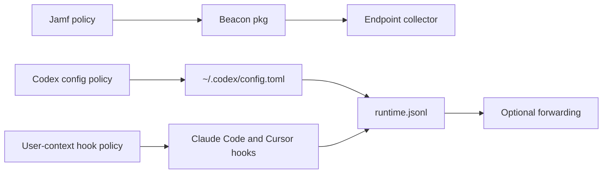

## Overview

Use this guide when you want a Jamf Pro rollout to cover supported Anthropic, OpenAI, and Cursor endpoint telemetry on managed Macs.

This guide is for products that run locally on the Mac. Anthropic and OpenAI also have cloud, CI, and SDK surfaces; those are covered in the runtime-specific pages and are not fully configured by a Mac endpoint MDM policy.

The end state is:

- Beacon is installed under `/opt/beacon`.
- The system endpoint collector runs as `com.beacon.endpoint.collector`.
- Claude Code and Cursor hooks are installed for the logged-in console user.
- Codex CLI is pointed at the local collector through per-user or managed Codex configuration.
- Runtime activity is written to `/var/log/beacon-agent/runtime.jsonl`.
- Optional forwarding is configured separately for S3, Falcon LogScale, Splunk HEC, or another supported destination.



## Coverage

Jamf can configure local endpoint telemetry for supported products that run on the managed Mac. Cloud, CI, and server-side SDK telemetry use separate collection paths.

| Product surface | Jamf-managed path | Notes |
| --- | --- | --- |
| Claude Code | User-context hooks with `claude`; optional managed/user Claude settings for native OTLP | The packaged hook helper can install Claude Code hooks for the console user. Do not assume a root package postinstall modifies the console user's `~/.claude/settings.json`. |
| Claude Cowork | Not installed by Jamf | Configure OTLP in Claude organization settings with a durable customer-managed collector endpoint. |
| Claude Code CI and cloud agents | Not installed by endpoint Jamf policy | Use CI or cloud-agent setup paths instead of a persistent Mac endpoint service. |
| Codex CLI | Per-user or managed Codex config pointing at the local collector | Codex is not hook-based. Configure `~/.codex/config.toml` or an equivalent managed config for each user. |
| OpenAI SDK applications | Not installed by Jamf | Instrument the application with the Asymptote SDK or OpenTelemetry. |
| Cursor | User-context hooks with `cursor` | Captures local Cursor hook payloads. Restart Cursor after hook installation. |
| Cursor Cloud Agents | Not installed by endpoint Jamf policy | Use the Cursor cloud-agent setup path for cloud sandbox telemetry. |

## Prerequisites

Before creating the Jamf policies, prepare:

- A signed and notarized Beacon endpoint `.pkg`.
- Claude Code, Codex CLI, and Cursor installed on the target Macs where those products are in scope.
- A pilot Smart Group for Macs with at least one interactive console user.
- A forwarding destination if runtime JSONL should leave the endpoint.
- A content handling decision for prompt, command, tool, file, and model telemetry.

## Jamf Policy Setup

Use at least two Jamf policies:

- **Policy 1: Install Beacon endpoint.** Runs as root and installs the system collector and runtime log.
- **Policy 2: Install user hooks.** Runs only when an interactive console user is present and configures Claude Code plus Cursor hooks in that user's home directory.
- **Optional Policy 3: Configure Codex CLI.** Runs in a user-aware context or deploys managed Codex settings so Codex sends logs and metrics to the local collector.

### 1. Upload The Beacon Package

Upload the signed Beacon endpoint package to Jamf Pro and add it to a policy using the Packages payload with the install action.

The package installs:

```text
/opt/beacon/bin/beacon
/opt/beacon/bin/beacon-otelcol
/opt/beacon/jamf/scripts/install.sh
/opt/beacon/jamf/scripts/repair.sh
/opt/beacon/jamf/scripts/install-cursor-hooks.sh
```

The package postinstall performs the default system install. Use the explicit install helper when you want policy parameters or a reinstall action.

<Note>
  The endpoint install policy runs as root. It prepares the system collector and endpoint paths, but it should not be treated as the only step for user-home configuration. Claude Code hooks, Cursor hooks, and Codex CLI user settings need a user-aware policy or managed settings.
</Note>

### 2. Configure Endpoint Harnesses

For the system endpoint collector, keep the default endpoint harness list:

```text
claude,codex
```

If you call the install helper from a Jamf Scripts payload, set parameter 4 to that value:

```bash
#!/bin/bash
set -euo pipefail

BEACON_ENDPOINT_HARNESSES="${4:-claude,codex}"
export BEACON_ENDPOINT_HARNESSES

/opt/beacon/jamf/scripts/install.sh "$@"
```

Use Jamf script parameter labels so policy editors know what each value means:

| Parameter | Label | Example |
| --- | --- | --- |
| 4 | Endpoint harnesses | `claude,codex` |
| 5 | OTLP gRPC port | `4317` |
| 6 | OTLP HTTP port | `4318` |
| 7 | Collector path | `/opt/beacon/bin/beacon-otelcol` |

The endpoint policy runs as root. It should not install Cursor hooks because Cursor hook configuration is per user. For the same reason, validate the user-facing Claude and Codex configuration from the logged-in user's account, not only from root.

### 3. Add A User-Context Hook Policy

Create a second Jamf policy that runs the packaged hook helper after the package is installed and a user is logged in:

```bash
#!/bin/bash
set -euo pipefail

export BEACON_HOOK_HARNESSES="${4:-claude,cursor}"
export BEACON_HOOK_LEVEL="${5:-user}"
export BEACON_HOOK_LOG_PATH="${6:-/var/log/beacon-agent/runtime.jsonl}"

CONSOLE_USER="$(stat -f %Su /dev/console 2>/dev/null || echo "")"
if [ -z "$CONSOLE_USER" ] || [ "$CONSOLE_USER" = "root" ] || [ "$CONSOLE_USER" = "loginwindow" ]; then
  echo "No interactive console user found for hook installation." >&2
  exit 1
fi

RUNTIME_DIR="$(dirname "$BEACON_HOOK_LOG_PATH")"
mkdir -p "$RUNTIME_DIR"
touch "$BEACON_HOOK_LOG_PATH" "$BEACON_HOOK_LOG_PATH.lock"
chown root:wheel "$RUNTIME_DIR" "$BEACON_HOOK_LOG_PATH" "$BEACON_HOOK_LOG_PATH.lock"
chmod 755 "$RUNTIME_DIR"
chmod 644 "$BEACON_HOOK_LOG_PATH" "$BEACON_HOOK_LOG_PATH.lock"
chmod +a "$CONSOLE_USER allow list,search,add_file,readattr,writeattr" "$RUNTIME_DIR" || true
chmod +a "$CONSOLE_USER allow read,write,append,readattr,writeattr,readextattr,writeextattr" "$BEACON_HOOK_LOG_PATH" || true
chmod +a "$CONSOLE_USER allow read,write,append,readattr,writeattr,readextattr,writeextattr" "$BEACON_HOOK_LOG_PATH.lock" || true

/opt/beacon/jamf/scripts/install-cursor-hooks.sh
```

Use these Jamf script parameter labels:

| Parameter | Label | Example |
| --- | --- | --- |
| 4 | Hook harnesses | `claude,cursor` |
| 5 | Hook level | `user` |
| 6 | Runtime log path | `/var/log/beacon-agent/runtime.jsonl` |

The helper resolves the interactive console user, switches to that user's home directory, and runs:

```bash
/opt/beacon/bin/beacon endpoint hooks install \
  --harness "claude,cursor" \
  --level user \
  --log-path /var/log/beacon-agent/runtime.jsonl
```

Restart Claude Code and Cursor after the hook policy runs so new sessions load the updated hook configuration.

### 4. Configure Codex CLI

Codex CLI is configured through `~/.codex/config.toml`, not through Beacon hooks. If Codex is in scope, deploy a per-user Codex config policy or an equivalent managed configuration that points Codex at Beacon's local OTLP gRPC receiver.

For a single user, the Beacon-generated Codex block looks like:

```toml
[otel]
environment = "dev"
log_user_prompt = true

[otel.exporter."otlp-grpc"]
endpoint = "http://127.0.0.1:4317"

[otel.metrics_exporter."otlp-grpc"]
endpoint = "http://127.0.0.1:4317"
```

If you use Jamf to write this file, preserve any existing non-OTel Codex settings and ensure the final file is owned by the console user.

## What The Policies Do

The endpoint install policy:

- Creates `/Library/Application Support/Beacon/Endpoint/config.json`.
- Creates `/Library/Application Support/Beacon/Endpoint/otelcol.yaml`.
- Loads `/Library/LaunchDaemons/com.beacon.endpoint.collector.plist`.
- Writes normalized events to `/var/log/beacon-agent/runtime.jsonl`.

The user-context hook policy:

- Installs Claude Code hooks into the logged-in user's Claude settings.
- Installs Cursor hooks into the logged-in user's Cursor hook configuration.
- Points hook events at the system runtime log.
- Leaves existing non-Beacon hook settings intact where the runtime supports merged hook config.

The Codex config policy:

- Writes or manages the user's Codex `[otel]` tables.
- Points Codex logs and token usage metrics at `http://127.0.0.1:4317`.
- Preserves existing non-OTel Codex settings.

## Validate A Deployed Mac

Run these commands on a target Mac after the relevant Jamf policies complete.

### Check Endpoint State

```bash
sudo /opt/beacon/bin/beacon endpoint status --system --json
sudo launchctl print system/com.beacon.endpoint.collector
```

The collector should be running and the runtime log should resolve to `/var/log/beacon-agent/runtime.jsonl`.

### Check Runtime Log

```bash
ls -l /var/log/beacon-agent/runtime.jsonl
sudo /opt/beacon/bin/beacon endpoint test-event \
  --system \
  --log-path /var/log/beacon-agent/runtime.jsonl
```

### Check Hook Status

Run hook status as the logged-in user:

```bash
/opt/beacon/bin/beacon endpoint hooks status --harness claude,cursor
```

If you need to inspect the files directly:

```bash
grep -n 'BEACON_ENDPOINT_CLI\|beacon-hooks' ~/.claude/settings.json
grep -n 'beacon-hooks' ~/.cursor/hooks.json
```

### Generate Product Events

Generate a Claude Code event:

```bash
MARKER="beacon jamf claude test $(date +%s)"
claude -p "$MARKER"
sudo grep "$MARKER" /var/log/beacon-agent/runtime.jsonl
```

Generate a Codex CLI event:

```bash
MARKER="beacon jamf codex test $(date +%s)"
codex exec "$MARKER"
sudo grep "$MARKER" /var/log/beacon-agent/runtime.jsonl
```

Generate a Cursor event by starting a new Cursor session after restart and sending a prompt with a unique marker. Then confirm the marker appears in the runtime log:

```bash
sudo grep "beacon jamf cursor test" /var/log/beacon-agent/runtime.jsonl
```

## Forwarding Options

This guide configures collection. Forwarding is destination-specific:

<Columns cols={2}>
  <Card title="Jamf and S3" icon="bucket" href="/guides/jamf-s3-mdm">
    Forward runtime and inventory JSONL to AWS S3 from a Jamf-managed Mac.
  </Card>
  <Card title="Jamf and CrowdStrike Falcon" icon="shield-halved" href="/guides/jamf-falcon-mdm">
    Forward runtime JSONL to CrowdStrike Falcon LogScale HEC.
  </Card>
  <Card title="Splunk HEC" icon="tower-broadcast" href="/log-forwarding/splunk">
    Configure endpoint forwarding to Splunk HEC through install or repair parameters.
  </Card>
  <Card title="Local JSONL" icon="file-lines" href="/log-forwarding/local-jsonl">
    Keep events local and collect them with your own file-based pipeline.
  </Card>
</Columns>

## Troubleshooting

### Endpoint Harnesses Are Missing

Check Jamf parameter 4 on the endpoint install policy. For this guide, the value should be:

```text
claude,codex
```

Then run the repair helper from a Jamf remediation policy:

```bash
/opt/beacon/jamf/scripts/repair.sh "$@"
```

### Cursor Hooks Are Missing

Confirm the hook policy ran while a user was logged in. The helper exits when the console user is `root` or `loginwindow`.

Run the hook policy again after login, then restart Cursor.

### Claude Code Events Are Missing

Confirm both the endpoint harness and optional hook are configured:

```bash
sudo /opt/beacon/bin/beacon endpoint status --system --json
/opt/beacon/bin/beacon endpoint hooks status --harness claude
```

Fully restart Claude Code after installing hooks.

### Codex Events Are Missing

Confirm Codex CLI is installed for the user and that Beacon configured Codex as an endpoint harness:

```bash
command -v codex
grep -n 'otel' ~/.codex/config.toml
```

Codex CLI is not hook-based in Beacon. Its events arrive through local OTLP logs and metrics.

### Cloud Or Admin Products Are Missing

Claude Cowork, Claude Code cloud agents, Cursor Cloud Agents, and SDK-instrumented OpenAI or Anthropic applications are not configured by the endpoint Jamf policy. Use their runtime-specific setup pages and validate those events at the collector or destination they target.

## Related

<Columns cols={2}>
  <Card title="Jamf Pro Overview" icon="laptop" href="/mdm/jamf">
    Review the general Beacon Jamf deployment model and package layout.
  </Card>
  <Card title="Claude Code" icon="terminal" href="/runtimes/claude-code">
    Review Claude Code endpoint telemetry coverage.
  </Card>
  <Card title="Codex CLI" icon="terminal" href="/runtimes/codex-cli">
    Review OpenAI Codex CLI endpoint telemetry coverage.
  </Card>
  <Card title="Cursor" icon="code" href="/runtimes/cursor">
    Review Cursor hook telemetry coverage.
  </Card>
</Columns>
