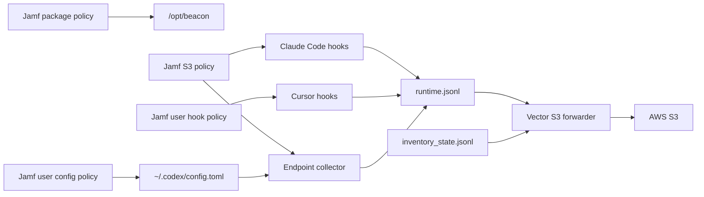

## Overview

Use this runbook when your security team wants Jamf Pro to deploy Beacon on managed Macs and forward supported Anthropic, OpenAI, and Cursor endpoint telemetry to AWS S3.

This guide is intentionally specific to S3. It covers local products that run on the Mac:

- Anthropic Claude Code
- OpenAI Codex CLI
- Cursor

It does not configure Claude Cowork, Claude Code cloud agents, Cursor Cloud Agents, CI agents, or SDK-instrumented server applications. Those use separate collection paths.



## Security Outcome

After rollout:

- Beacon is installed under `/opt/beacon`.
- The local collector runs as `com.beacon.endpoint.collector`.
- The S3 forwarder runs as `com.beacon.endpoint.s3-forwarder`.
- Claude Code hooks write local runtime telemetry.
- Cursor hooks write local runtime telemetry.
- Codex CLI sends OTLP logs and token metrics to Beacon's local collector.
- Runtime telemetry is written locally to `/var/log/beacon-agent/runtime.jsonl`.
- Inventory telemetry is written locally to `/var/log/beacon-agent/inventory_state.jsonl`.
- Vector uploads both JSONL streams to your S3 bucket.

Expected S3 prefixes:

```text
s3://<bucket>/<prefix>/runtime/date=YYYY-MM-DD/<timestamp>-<uuid>.jsonl.gz
s3://<bucket>/<prefix>/inventory/date=YYYY-MM-DD/<timestamp>-<uuid>.jsonl.gz
```

Runtime objects contain agent activity. Inventory objects contain agent configuration inventory such as known hooks, MCP servers, and skills where Beacon can inspect them locally.

## Product Coverage

| Product surface | Jamf step | What security receives |
| --- | --- | --- |
| Claude Code | S3 helper installs Claude Code hooks for the console user | Prompt, lifecycle, tool, permission, command, file, and inventory telemetry where Claude Code exposes it |
| Cursor | Separate user hook policy installs Cursor hooks | Prompt, tool, shell command, MCP-like, approval, file edit, and inventory telemetry where Cursor exposes it |
| Codex CLI | Separate user config policy writes `~/.codex/config.toml` | Codex semantic logs and token usage metrics emitted through local OTLP |
| Claude Cowork, cloud agents, CI, SDK apps | Out of scope for this Mac MDM runbook | Configure those from their runtime-specific pages |

## Prerequisites

Prepare these before touching Jamf:

- A signed and notarized Beacon endpoint `.pkg` that includes `/opt/beacon/bin/vector`.
- Claude Code, Codex CLI, and Cursor installed on the target Macs where those products are in scope.
- A pilot Jamf Smart Group.
- A target AWS S3 bucket.
- An S3 prefix root such as `beacon-prod`.
- AWS credentials, profile, web identity, or role material available to the Jamf S3 policy at install time.
- `s3:PutObject` permission for the selected bucket prefix.
- A security decision that prompt, command, tool, file, model, and inventory telemetry may be written to customer-controlled S3.

Use a root prefix. Do not include `runtime` or `inventory`:

```bash
BEACON_S3_PREFIX="beacon-prod" # good
BEACON_S3_PREFIX="beacon-prod/runtime" # avoid
```

## AWS Permission

Scope write access to the Beacon prefix:

```json
{
  "Version": "2012-10-17",
  "Statement": [
    {
      "Effect": "Allow",
      "Action": ["s3:PutObject"],
      "Resource": "arn:aws:s3:::example-security-logs/beacon-prod/*"
    }
  ]
}
```

Beacon does not store AWS credentials in endpoint configuration. The S3 helper writes only the AWS provider-chain values it receives into:

```text
/Library/Application Support/Beacon/Forwarders/s3-vector.env
```

That file is owned by root and mode `0600`.

## Jamf Policy Plan

Create these policies in order:

| Order | Policy | Runs as | Purpose |
| --- | --- | --- | --- |
| 1 | Install Beacon package | root | Installs Beacon binaries, Vector, and packaged Jamf helpers |
| 2 | Configure S3 and Claude Code | root, with console user present | Repairs the endpoint, installs Claude Code hooks, prepares local logs, and starts S3 forwarding |
| 3 | Configure Cursor hooks | root wrapper, switches to console user | Installs Cursor hooks for the logged-in user and points them at the system runtime log |
| 4 | Configure Codex CLI | user-aware policy or managed config | Writes Codex OTLP settings for each user |

Keep policies 2, 3, and 4 separate during rollout. That makes failures easier to triage and avoids hiding user-context failures behind package installation success.

## Step 1: Install Beacon Package

In Jamf Pro:

1. Upload the signed Beacon endpoint `.pkg`.
2. Create a policy named `Beacon - Install Package`.
3. Add the package with the install action.
4. Scope it to your pilot Smart Group.
5. Run it before the S3, Cursor, or Codex policies.

The package installs:

```text
/opt/beacon/bin/beacon
/opt/beacon/bin/beacon-otelcol
/opt/beacon/bin/vector
/opt/beacon/jamf/claude/common/repair-hooks.sh
/opt/beacon/jamf/claude/s3/install-forwarder.sh
/opt/beacon/jamf/claude/s3/repair-hooks-and-forwarder.sh
/opt/beacon/jamf/claude/s3/run-forwarder.sh
/opt/beacon/jamf/scripts/install-cursor-hooks.sh
```

## Step 2: Configure S3 And Claude Code

Create a Jamf script named `Beacon - Configure S3 Forwarding`.

Use this wrapper:

```bash
#!/bin/bash
set -euo pipefail

BEACON_S3_BUCKET="${4:-}"
AWS_REGION="${5:-}"
BEACON_S3_PREFIX="${6:-beacon}"
BEACON_S3_STORAGE_CLASS="${7:-STANDARD}"
BEACON_VECTOR_READ_FROM="${8:-end}"
BEACON_OTLP_GRPC_PORT="${9:-4317}"
BEACON_OTLP_HTTP_PORT="${10:-4318}"

export BEACON_S3_BUCKET
export AWS_REGION
export BEACON_S3_PREFIX
export BEACON_S3_STORAGE_CLASS
export BEACON_VECTOR_READ_FROM
export BEACON_OTLP_GRPC_PORT
export BEACON_OTLP_HTTP_PORT

# Use your Jamf secret injection mechanism, identity provider, or managed credential delivery.
# The helper persists any AWS provider-chain variables that are set.
export AWS_ACCESS_KEY_ID="${AWS_ACCESS_KEY_ID:-}"
export AWS_SECRET_ACCESS_KEY="${AWS_SECRET_ACCESS_KEY:-}"
export AWS_SESSION_TOKEN="${AWS_SESSION_TOKEN:-}"
export AWS_PROFILE="${AWS_PROFILE:-}"
export AWS_SHARED_CREDENTIALS_FILE="${AWS_SHARED_CREDENTIALS_FILE:-}"
export AWS_CONFIG_FILE="${AWS_CONFIG_FILE:-}"
export AWS_WEB_IDENTITY_TOKEN_FILE="${AWS_WEB_IDENTITY_TOKEN_FILE:-}"
export AWS_ROLE_ARN="${AWS_ROLE_ARN:-}"

/opt/beacon/jamf/claude/s3/repair-hooks-and-forwarder.sh
```

Set Jamf parameter labels:

| Parameter | Label | Example |
| --- | --- | --- |
| 4 | S3 bucket | `example-security-logs` |
| 5 | AWS region | `us-west-2` |
| 6 | S3 prefix root | `beacon-prod` |
| 7 | S3 storage class | `STANDARD` |
| 8 | Vector read position | `end` |
| 9 | OTLP gRPC port | `4317` |
| 10 | OTLP HTTP port | `4318` |

Create a policy named `Beacon - Configure S3 and Claude Code`:

1. Scope it to Macs where the package has installed.
2. Run it only when a normal interactive console user is logged in.
3. Add the script above.
4. Fill parameters 4-10.
5. Deliver AWS credentials through your approved Jamf secret or identity mechanism.

The S3 helper can persist these AWS provider-chain settings for the Vector LaunchDaemon:

| Credential pattern | Variables to provide |
| --- | --- |
| Access key | `AWS_ACCESS_KEY_ID`, `AWS_SECRET_ACCESS_KEY`, optional `AWS_SESSION_TOKEN` |
| AWS profile | `AWS_PROFILE`, optional `AWS_SHARED_CREDENTIALS_FILE`, `AWS_CONFIG_FILE` |
| Web identity | `AWS_WEB_IDENTITY_TOKEN_FILE`, `AWS_ROLE_ARN` |

Use Jamf parameters for non-secret values such as bucket, region, and prefix. Avoid putting long-lived access keys directly in ordinary policy parameter fields or policy logs.

This policy:

- Installs the S3 Vector forwarder.
- Repairs the Beacon system endpoint.
- Starts `com.beacon.endpoint.collector`.
- Creates `/var/log/beacon-agent/runtime.jsonl`.
- Creates `/var/log/beacon-agent/inventory_state.jsonl`.
- Grants the console user append access to Beacon logs.
- Installs Claude Code hooks for the console user.
- Starts `com.beacon.endpoint.s3-forwarder`.

## Step 3: Configure Cursor Hooks

Create a Jamf script named `Beacon - Configure Cursor Hooks`.

Use this wrapper:

```bash
#!/bin/bash
set -euo pipefail

export BEACON_HOOK_HARNESSES="${4:-cursor}"
export BEACON_HOOK_LEVEL="${5:-user}"
export BEACON_HOOK_LOG_PATH="${6:-/var/log/beacon-agent/runtime.jsonl}"

CONSOLE_USER="$(stat -f %Su /dev/console 2>/dev/null || echo "")"
if [ -z "$CONSOLE_USER" ] || [ "$CONSOLE_USER" = "root" ] || [ "$CONSOLE_USER" = "loginwindow" ]; then
  echo "No interactive console user found for hook installation." >&2
  exit 1
fi

RUNTIME_DIR="$(dirname "$BEACON_HOOK_LOG_PATH")"
mkdir -p "$RUNTIME_DIR"
touch "$BEACON_HOOK_LOG_PATH" "$BEACON_HOOK_LOG_PATH.lock"
chown root:wheel "$RUNTIME_DIR" "$BEACON_HOOK_LOG_PATH" "$BEACON_HOOK_LOG_PATH.lock"
chmod 755 "$RUNTIME_DIR"
chmod 644 "$BEACON_HOOK_LOG_PATH" "$BEACON_HOOK_LOG_PATH.lock"
chmod +a "$CONSOLE_USER allow list,search,add_file,readattr,writeattr" "$RUNTIME_DIR" || true
chmod +a "$CONSOLE_USER allow read,write,append,readattr,writeattr,readextattr,writeextattr" "$BEACON_HOOK_LOG_PATH" || true
chmod +a "$CONSOLE_USER allow read,write,append,readattr,writeattr,readextattr,writeextattr" "$BEACON_HOOK_LOG_PATH.lock" || true

/opt/beacon/jamf/scripts/install-cursor-hooks.sh
```

Set Jamf parameter labels:

| Parameter | Label | Example |
| --- | --- | --- |
| 4 | Hook harnesses | `cursor` |
| 5 | Hook level | `user` |
| 6 | Runtime log path | `/var/log/beacon-agent/runtime.jsonl` |

Create a policy named `Beacon - Configure Cursor Hooks`:

1. Scope it to Macs where the package has installed.
2. Run it only when a normal interactive console user is logged in.
3. Add the script above.
4. Set parameter 4 to `cursor`.
5. Ask users to fully restart Cursor after the policy runs.

The helper switches to the console user and runs:

```bash
/opt/beacon/bin/beacon endpoint hooks install \
  --harness "cursor" \
  --level user \
  --log-path /var/log/beacon-agent/runtime.jsonl
```

## Step 4: Configure Codex CLI

Codex CLI is not hook-based. It reads OTLP settings from `~/.codex/config.toml`.

Use your standard Jamf user-context mechanism or managed config approach to ensure each Codex user has this block:

```toml
[otel]
environment = "dev"
log_user_prompt = true

[otel.exporter."otlp-grpc"]
endpoint = "http://127.0.0.1:4317"

[otel.metrics_exporter."otlp-grpc"]
endpoint = "http://127.0.0.1:4317"
```

Preserve existing non-OTel Codex settings and ensure the final file is owned by the user. This step is required for Codex telemetry; the S3 helper does not install Codex hooks.

## Validate A Deployed Mac

Run these checks on a target Mac after each policy completes.

### 1. Confirm Services

```bash
sudo launchctl print system/com.beacon.endpoint.collector
sudo launchctl print system/com.beacon.endpoint.s3-forwarder
```

Both services should be `running`.

### 2. Confirm Local Files

```bash
ls -l /var/log/beacon-agent/runtime.jsonl
ls -l /var/log/beacon-agent/inventory_state.jsonl
ls -l "/Library/Application Support/Beacon/Forwarders/s3-vector.toml"
sudo test -r "/Library/Application Support/Beacon/Forwarders/s3-vector.env"
```

### 3. Confirm S3 Forwarder Config

```bash
sudo grep -E 'runtime.jsonl|inventory_state.jsonl|runtime/date|inventory/date|read_from' \
  "/Library/Application Support/Beacon/Forwarders/s3-vector.toml"
```

Expected lines include:

```text
include = ["/var/log/beacon-agent/runtime.jsonl"]
read_from = "${BEACON_VECTOR_READ_FROM:-end}"
include = ["/var/log/beacon-agent/inventory_state.jsonl"]
read_from = "beginning"
key_prefix = "${BEACON_S3_PREFIX:-beacon}/runtime/date=%F/"
key_prefix = "${BEACON_S3_PREFIX:-beacon}/inventory/date=%F/"
```

### 4. Confirm Hook And Codex Config

Run as the logged-in user:

```bash
grep -n 'BEACON_ENDPOINT_CLI\|beacon-hooks' ~/.claude/settings.json
grep -n 'beacon-hooks' ~/.cursor/hooks.json
grep -n 'otel' ~/.codex/config.toml
```

Claude and Cursor should reference `beacon-hooks`. Codex should include `[otel]`, `[otel.exporter."otlp-grpc"]`, and `[otel.metrics_exporter."otlp-grpc"]`.

### 5. Generate Local Test Events

Write a synthetic endpoint event:

```bash
sudo /opt/beacon/bin/beacon endpoint test-event \
  --system \
  --log-path /var/log/beacon-agent/runtime.jsonl
```

Write an inventory heartbeat:

```bash
sudo /opt/beacon/bin/beacon endpoint inventory heartbeat \
  --system \
  --force \
  --trigger manual \
  --trigger-harness claude \
  --working-dir /Users/Shared \
  --log-path /var/log/beacon-agent/runtime.jsonl
```

Confirm both local files have events:

```bash
tail -n 5 /var/log/beacon-agent/runtime.jsonl
tail -n 5 /var/log/beacon-agent/inventory_state.jsonl
```

### 6. Generate Product Events

Generate a Claude Code event:

```bash
MARKER="beacon jamf claude test $(date +%s)"
claude -p "$MARKER"
sudo grep "$MARKER" /var/log/beacon-agent/runtime.jsonl
```

Generate a Codex CLI event:

```bash
MARKER="beacon jamf codex test $(date +%s)"
codex exec "$MARKER"
sudo grep "$MARKER" /var/log/beacon-agent/runtime.jsonl
```

Generate a Cursor event by starting a new Cursor session after restart and sending a prompt with a unique marker:

```bash
sudo grep "beacon jamf cursor test" /var/log/beacon-agent/runtime.jsonl
```

### 7. Confirm S3 Delivery

Vector batches uploads. Production configs use `timeout_secs = 300`, so allow up to five minutes.

```bash
aws s3 ls "s3://${BEACON_S3_BUCKET}/${BEACON_S3_PREFIX}/runtime/" \
  --recursive \
  --region "$AWS_REGION"

aws s3 ls "s3://${BEACON_S3_BUCKET}/${BEACON_S3_PREFIX}/inventory/" \
  --recursive \
  --region "$AWS_REGION"
```

Inspect an object:

```bash
aws s3 cp "s3://${BEACON_S3_BUCKET}/${BEACON_S3_PREFIX}/runtime/date=<YYYY-MM-DD>/<object>.jsonl.gz" - \
  --region "$AWS_REGION" | gzip -dc | head
```

## Troubleshooting

### No S3 Objects

Check the forwarder:

```bash
sudo launchctl print system/com.beacon.endpoint.s3-forwarder
sudo tail -n 100 /tmp/com.beacon.endpoint.s3-forwarder.err
```

If `launchctl` reports `Could not find service "com.beacon.endpoint.s3-forwarder"`,
the S3 files may still be present but the optional LaunchDaemon is not loaded.
When the saved S3 environment exists, rerun the packaged installer to rewrite
the Vector config and plist and start the service:

```bash
sudo sh -c '. "/Library/Application Support/Beacon/Forwarders/s3-vector.env"; /opt/beacon/jamf/claude/s3/install-forwarder.sh'
sudo launchctl print system/com.beacon.endpoint.s3-forwarder | egrep 'state =|pid =|last exit code'
```

Use the same command as a Jamf remediation policy for devices where this health
check fails:

```bash
sudo launchctl print system/com.beacon.endpoint.s3-forwarder >/dev/null 2>&1
```

Then run this script on those devices, or on all Beacon devices if the original
S3 env file should already exist everywhere:

```bash
#!/bin/bash
set -euo pipefail

ENV_PATH="/Library/Application Support/Beacon/Forwarders/s3-vector.env"
INSTALLER="/opt/beacon/jamf/claude/s3/install-forwarder.sh"
LABEL="com.beacon.endpoint.s3-forwarder"

if [ ! -x "$INSTALLER" ]; then
  echo "Beacon S3 installer missing: $INSTALLER" >&2
  exit 1
fi

if [ ! -f "$ENV_PATH" ]; then
  echo "S3 env file missing: $ENV_PATH; rerun the original S3 configuration policy" >&2
  exit 1
fi

set -a
# shellcheck disable=SC1090
. "$ENV_PATH"
set +a

"$INSTALLER"

launchctl print "system/$LABEL" | egrep 'state =|pid =|last exit code' || true
```

Verify that the env file has non-secret settings without printing credentials:

```bash
sudo sh -c 'sed -E "s/(AWS_ACCESS_KEY_ID|AWS_SECRET_ACCESS_KEY|AWS_SESSION_TOKEN|BEACON_S3_BUCKET|AWS_REGION|BEACON_S3_PREFIX)=.*/\1=<redacted>/" "/Library/Application Support/Beacon/Forwarders/s3-vector.env"'
```

### Cursor Hooks Are Missing

Confirm the hook policy ran while a user was logged in. The helper exits when the console user is `root` or `loginwindow`.

Run the hook policy again after login, then restart Cursor.

### Claude Code Events Are Missing

Confirm the S3 helper ran while a user was logged in, then check Claude settings as that user:

```bash
grep -n 'BEACON_ENDPOINT_CLI\|beacon-hooks' ~/.claude/settings.json
```

Fully restart Claude Code after installing hooks.

### Codex Events Are Missing

Confirm Codex CLI is installed and the user config includes OTel:

```bash
command -v codex
grep -n 'otel\|otlp-grpc\|127.0.0.1:4317' ~/.codex/config.toml
```

Codex CLI is not hook-based. Re-run the Codex config policy for the logged-in user if the OTel block is missing.

### Inventory Is Empty

Force inventory and inspect the local file:

```bash
sudo /opt/beacon/bin/beacon endpoint inventory heartbeat \
  --system \
  --force \
  --trigger manual \
  --trigger-harness claude \
  --working-dir /Users/Shared \
  --log-path /var/log/beacon-agent/runtime.jsonl

tail -n 5 /var/log/beacon-agent/inventory_state.jsonl
```

### Cloud Or Admin Products Are Missing

Claude Cowork, Claude Code cloud agents, Cursor Cloud Agents, CI agents, and SDK-instrumented OpenAI or Anthropic applications are not configured by this Mac MDM policy. Use their runtime-specific setup pages and validate those events at the collector or destination they target.

## Related

<Columns cols={2}>
  <Card title="Claude with Jamf and S3" icon="bucket" href="/guides/jamf-s3-mdm">
    Review the Claude-specific S3 helper and validation flow.
  </Card>
  <Card title="Claude Code" icon="terminal" href="/runtimes/claude-code">
    Review Claude Code endpoint telemetry coverage.
  </Card>
  <Card title="Codex CLI" icon="terminal" href="/runtimes/codex-cli">
    Review OpenAI Codex CLI endpoint telemetry coverage.
  </Card>
  <Card title="Cursor" icon="code" href="/runtimes/cursor">
    Review Cursor hook telemetry coverage.
  </Card>
</Columns>
