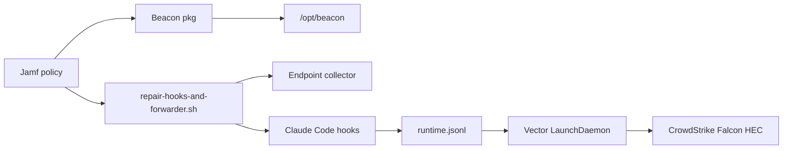

## Overview

Use this guide when you want a Jamf Pro policy to install Beacon for macOS users, configure Claude Code hooks, and forward Beacon runtime telemetry to CrowdStrike Falcon LogScale through HEC.

The end state is:

- Beacon is installed under `/opt/beacon`.
- The system endpoint collector runs as a LaunchDaemon.
- Claude Code hooks are installed for the logged-in console user.
- Runtime activity is written to `/var/log/beacon-agent/runtime.jsonl`.
- Vector tails the runtime JSONL log and forwards events to CrowdStrike Falcon HEC.
- The Falcon Vector forwarder runs as `com.beacon.endpoint.falcon-forwarder`.



## Prerequisites

Before creating the Jamf policy, prepare:

- A signed and notarized Beacon endpoint `.pkg` that includes `/opt/beacon/bin/vector`.
- Claude Code installed on the target Mac.
- A CrowdStrike Falcon LogScale data connection for Beacon JSONL events.
- The Falcon HEC endpoint URL from the data connection.
- The Falcon HEC token or API key generated for that data connection.
- A parser or sourcetype value, usually `json` or your custom Beacon parser name.

For CrowdStrike data onboarding, parser setup, screenshots, and a direct HEC smoke test, see [CrowdStrike Falcon LogScale](/log-forwarding/falcon).

## Falcon HEC Settings

CrowdStrike HEC values normally look like:

```bash
FALCON_HEC_ENDPOINT="https://<your-tenant>.ingest.<region>.crowdstrike.com/services/collector"
FALCON_HEC_TOKEN="<your-token>"
FALCON_SOURCE="beacon-endpoint-agent"
FALCON_SOURCETYPE="json"
```

Use the exact endpoint URL and token generated by your Falcon LogScale data connection. If your connection requires a repository or index, pass it as the optional repository parameter.

Beacon stores the Falcon token only in the root-owned Vector environment file:

```text
/Library/Application Support/Beacon/Forwarders/falcon-vector.env
```

That file is mode `0600` and is sourced by the Vector LaunchDaemon wrapper.

## Jamf Policy Setup

Jamf Pro separates package installation from script execution. Use the Packages payload to install the Beacon `.pkg`, then use a Scripts payload to run a wrapper that calls Beacon's packaged Jamf helper.

For the most reliable rollout, use two policies:

- **Policy 1: Install Beacon package.** Installs the signed `.pkg`.
- **Policy 2: Configure Beacon Falcon forwarding.** Runs after the package is installed and calls the packaged helper.

You can combine the package and script payloads in one policy if your Jamf workflow guarantees the package is installed before the script runs.

### 1. Upload The Beacon Package

Upload the signed Beacon endpoint package to Jamf Pro and add it to a policy using the Packages payload with the install action.

The package installs:

```text
/opt/beacon/bin/beacon
/opt/beacon/bin/beacon-otelcol
/opt/beacon/bin/vector
/opt/beacon/jamf/claude/common/repair-hooks.sh
/opt/beacon/jamf/claude/falcon/install-forwarder.sh
/opt/beacon/jamf/claude/falcon/repair-hooks-and-forwarder.sh
/opt/beacon/jamf/claude/falcon/run-forwarder.sh
```

Current packages use `/opt/beacon/jamf/claude/falcon/repair-hooks-and-forwarder.sh`. Older internal smoke-test instructions may refer to a legacy helper path under `/opt/beacon/jamf/scripts`; use the path that exists in the package installed on the target Mac.

### 2. Add A Jamf Script Wrapper

Add a script to Jamf Pro that invokes Beacon's packaged helper. The script must exist in Jamf Pro before it can be added to a policy.

```bash
#!/bin/bash
set -euo pipefail

FALCON_HEC_ENDPOINT="${4:-}"
FALCON_HEC_TOKEN="${5:-}"
FALCON_SOURCE="${6:-beacon-endpoint-agent}"
FALCON_SOURCETYPE="${7:-json}"
OTLP_GRPC_PORT="${8:-4317}"
OTLP_HTTP_PORT="${9:-4318}"
FALCON_REPOSITORY="${10:-}"

/opt/beacon/jamf/claude/falcon/repair-hooks-and-forwarder.sh \
  _ _ _ \
  "$FALCON_HEC_ENDPOINT" \
  "$FALCON_HEC_TOKEN" \
  "$FALCON_SOURCE" \
  "$FALCON_SOURCETYPE" \
  "$OTLP_GRPC_PORT" \
  "$OTLP_HTTP_PORT" \
  "$FALCON_REPOSITORY"
```

Use Jamf script parameter labels so policy editors know what each value means:

| Parameter | Label | Example |
| --- | --- | --- |
| 4 | Falcon HEC endpoint | `https://<tenant>.ingest.<region>.crowdstrike.com/services/collector` |
| 5 | Falcon HEC token | `********` |
| 6 | Falcon source | `beacon-endpoint-agent` |
| 7 | Falcon sourcetype/parser | `json` |
| 8 | OTLP gRPC port | `4317` |
| 9 | OTLP HTTP port | `4318` |
| 10 | Falcon repository/index | `beacon` |

Jamf script parameters are convenient for non-secret values such as endpoint, source, sourcetype, and repository. For the HEC token, prefer your Jamf secret injection mechanism when available. Avoid putting long-lived tokens directly in ordinary policy parameter fields or policy logs.

## What The Helper Does

The combined helper performs all endpoint and forwarding setup:

- Installs the Falcon Vector runtime-log forwarder.
- Repairs the Beacon system endpoint.
- Starts `com.beacon.endpoint.collector`.
- Prepares:
  - `/var/log/beacon-agent/runtime.jsonl`
  - `/var/log/beacon-agent/inventory_state.jsonl`
  - `/var/log/beacon-agent/inventory-state.json`
- Grants the console user append access for hook-written logs.
- Installs Claude Code hooks for the interactive console user.
- Writes:
  - `/Library/Application Support/Beacon/Forwarders/falcon-vector.toml`
  - `/Library/Application Support/Beacon/Forwarders/falcon-vector.env`
  - `/Library/LaunchDaemons/com.beacon.endpoint.falcon-forwarder.plist`
- Starts `com.beacon.endpoint.falcon-forwarder`.

End users do not need to run any Beacon command or edit any local config.

## Optional: Enable Endpoint Self-Updates

Beacon package self-updates are off by default. To let Beacon apply future signed package updates after the Jamf install, add a Jamf Files and Processes payload or post-install policy command:

```bash title="Enable automatic package self-updates"
sudo /opt/beacon/bin/beacon endpoint update enable
```

For visibility without automatic package installation, enable check-only mode instead:

```bash title="Enable check-only update monitoring"
sudo /opt/beacon/bin/beacon endpoint update enable --check-only
```

Both commands require root. `auto` mode verifies release manifest checksums, Developer ID signature, and Gatekeeper install assessment before applying a signed package. `check-only` mode writes update status events to `/var/log/beacon-agent/system.jsonl` without downloading or applying packages.

## Manual Smoke Test

To simulate the Jamf policy on one Mac, install the Beacon package, then run the packaged helper manually.

If the package downloaded to `~/Downloads`, install it first:

```bash
cd ~/Downloads
sudo installer -pkg ./BeaconEndpointAgent-*.pkg -target /
```

If the filename is different, replace `./BeaconEndpointAgent-*.pkg` with the exact package filename.

Then set your Falcon values and run the helper. Jamf reserves script arguments 1-3, so pass `_ _ _` before the custom parameters:

```bash
export FALCON_HEC_ENDPOINT="https://<your-tenant>.ingest.<region>.crowdstrike.com/services/collector"
export FALCON_HEC_TOKEN="<your-token>"

sudo /opt/beacon/jamf/claude/falcon/repair-hooks-and-forwarder.sh \
  _ _ _ \
  "$FALCON_HEC_ENDPOINT" \
  "$FALCON_HEC_TOKEN" \
  "beacon-endpoint-agent" \
  "json"
```

## Validate A Deployed Mac

Run these commands on a target Mac after the Jamf policy completes.

### Check Services

```bash
sudo launchctl print system/com.beacon.endpoint.collector
sudo launchctl print system/com.beacon.endpoint.falcon-forwarder
```

Both services should report `state = running`.

### Check Forwarder Logs

```bash
sudo tail -n 50 /tmp/com.beacon.endpoint.falcon-forwarder.err
```

Expected:

```text
no repeated auth, TLS, DNS, or HTTP errors in stderr
```

### Check Local Files

```bash
ls -l /var/log/beacon-agent/runtime.jsonl
ls -l /var/log/beacon-agent/inventory_state.jsonl
```

### Check Vector Config

```bash
sudo grep -E 'runtime.jsonl|read_from|BEACON_FALCON_HEC_ENDPOINT|Authorization' \
  "/Library/Application Support/Beacon/Forwarders/falcon-vector.toml"
```

Expected:

```text
include = ["/var/log/beacon-agent/runtime.jsonl", "/Users/*/.beacon/endpoint/logs/runtime.jsonl"]
read_from = "${BEACON_VECTOR_READ_FROM:-end}"
uri = "${BEACON_FALCON_HEC_ENDPOINT}"
Authorization = "Bearer ${BEACON_FALCON_HEC_TOKEN}"
```

Runtime forwarding starts at the end of the runtime log so historical session activity is not backfilled when Vector is first installed.

## Generate A Claude Hook Event

Generate a unique Claude prompt in headless mode or in a normal Claude Code session:

```bash
MARKER="beacon crowdstrike hook test $(date +%s)"
claude -p "$MARKER"
```

Confirm the event was written locally:

```bash
sudo grep "$MARKER" /var/log/beacon-agent/runtime.jsonl
```

Then search for the same marker in CrowdStrike Falcon LogScale. Example search:

```text
source = "beacon-endpoint-agent" "beacon crowdstrike hook test"
```

If you use a custom source, repository, or parser, adjust the query to match your data connection.

## Troubleshooting

### Forwarder Is Not Running

Check launchd and stderr:

```bash
sudo launchctl print system/com.beacon.endpoint.falcon-forwarder
sudo tail -n 100 /tmp/com.beacon.endpoint.falcon-forwarder.err
```

Load it manually:

```bash
sudo launchctl bootstrap system /Library/LaunchDaemons/com.beacon.endpoint.falcon-forwarder.plist
```

If launchd remains opaque, run Vector in the foreground:

```bash
sudo /opt/beacon/jamf/claude/falcon/run-forwarder.sh
```

Keep that terminal open while generating a Claude hook event.

### Token Or Endpoint Is Wrong

Check the env file without exposing secrets:

```bash
sudo sh -c 'sed -E "s/(BEACON_FALCON_HEC_ENDPOINT|BEACON_FALCON_HEC_TOKEN|BEACON_FALCON_SOURCE|BEACON_FALCON_SOURCETYPE|BEACON_FALCON_INDEX)=.*/\1=<redacted>/" "/Library/Application Support/Beacon/Forwarders/falcon-vector.env"'
```

If Vector reports `401`, `403`, or repository errors, regenerate the API key in Falcon and verify that the repository/index parameter matches the token scope.

### Claude Hooks Are Missing

Fully restart Claude Code after the Jamf policy runs. Then inspect the user's Claude settings:

```bash
grep -n 'BEACON_ENDPOINT_CLI\|beacon-hooks' ~/.claude/settings.json
```

You should see commands that call the packaged Beacon hook binary.

### Local Event Exists But Falcon Search Is Empty

Confirm the event appears in `/var/log/beacon-agent/runtime.jsonl`, then check Vector stderr for batching, TLS, DNS, or HTTP errors. Falcon searches can lag behind ingestion; wait a minute and search for the exact marker string.

## Related

<Columns cols={2}>
  <Card title="CrowdStrike Falcon LogScale" icon="shield-halved" href="/log-forwarding/falcon">
    Create the Falcon parser and data connection, then validate direct HEC ingestion.
  </Card>
  <Card title="Claude with Jamf" icon="laptop" href="/mdm/jamf/claude">
    Review the Claude-specific Jamf helper layout.
  </Card>
  <Card title="Endpoint event schema" icon="code" href="/telemetry-schema/event-schema">
    Review normalized Beacon JSONL fields and example events.
  </Card>
  <Card title="Vector forwarding" icon="route" href="/concepts/vector-forwarding">
    Understand how Beacon uses Vector for customer-managed forwarding.
  </Card>
</Columns>
