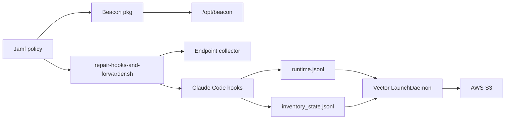

## Overview

Use this guide when you want a Jamf Pro policy to install Beacon for macOS users and forward both runtime and inventory telemetry to AWS S3 without asking end users to configure anything manually.

The end state is:

- Beacon is installed under `/opt/beacon`.
- The system endpoint collector runs as a LaunchDaemon.
- Claude Code hooks are installed for the logged-in console user.
- Runtime activity is written to `/var/log/beacon-agent/runtime.jsonl`.
- Agent config inventory is written to `/var/log/beacon-agent/inventory_state.jsonl`.
- Vector forwards both JSONL streams to S3:
  - `s3://<bucket>/<prefix>/runtime/date=YYYY-MM-DD/...`
  - `s3://<bucket>/<prefix>/inventory/date=YYYY-MM-DD/...`



## Prerequisites

Before creating the Jamf policy, prepare:

- A signed and notarized Beacon endpoint `.pkg` that includes `/opt/beacon/bin/vector`.
- A target AWS S3 bucket.
- An S3 prefix root such as `beacon`, `beacon-prod`, or `beacon-e2e`.
- AWS credentials or a role available to the Jamf policy at install time.
- `s3:PutObject` permission for the selected bucket prefix.
- Claude Code installed on the target Mac.

Use a root prefix. Do not include `runtime` or `inventory` in the value:

```bash
BEACON_S3_PREFIX="beacon-prod" # good
BEACON_S3_PREFIX="beacon-prod/runtime" # avoid
```

The helper normalizes old prefixes ending in `/runtime` or `/inventory`, but new deployments should use the root prefix.

## AWS Permission

Use a bucket policy or IAM policy scoped to the Beacon prefix. Example:

```json
{
  "Version": "2012-10-17",
  "Statement": [
    {
      "Effect": "Allow",
      "Action": ["s3:PutObject"],
      "Resource": "arn:aws:s3:::example-security-logs/beacon-prod/*"
    }
  ]
}
```

Beacon does not store AWS credentials in endpoint configuration. The Jamf helper persists only the AWS provider-chain values it receives into a root-owned Vector environment file:

```text
/Library/Application Support/Beacon/Forwarders/s3-vector.env
```

That file is mode `0600` and is sourced by the Vector LaunchDaemon wrapper.

## Jamf Policy Setup

Jamf Pro separates package installation from script execution. Use the Packages payload to install the Beacon `.pkg`, then use a Scripts payload to run a small wrapper that calls Beacon's packaged Jamf helper.

For the most reliable rollout, use two policies:

- **Policy 1: Install Beacon package.** Installs the signed `.pkg`.
- **Policy 2: Configure Beacon S3 forwarding.** Runs after the package is installed and calls the packaged helper.

You can also combine package and script payloads in one policy if your Jamf workflow guarantees the package is installed before the script runs. The two-policy approach is easier to reason about and troubleshoot.

### 1. Upload The Beacon Package

Upload the signed Beacon endpoint package to Jamf Pro and add it to a policy using the Packages payload with the install action.

The package installs:

```text
/opt/beacon/bin/beacon
/opt/beacon/bin/beacon-otelcol
/opt/beacon/bin/vector
/opt/beacon/jamf/claude/common/repair-hooks.sh
/opt/beacon/jamf/claude/s3/install-forwarder.sh
/opt/beacon/jamf/claude/s3/repair-hooks-and-forwarder.sh
/opt/beacon/jamf/claude/s3/run-forwarder.sh
```

### 2. Add A Jamf Script Wrapper

Add a script to Jamf Pro that invokes Beacon's packaged helper. The script must exist in Jamf Pro before it can be added to a policy.

```bash
#!/bin/bash
set -euo pipefail

BEACON_S3_BUCKET="${4:-}"
AWS_REGION="${5:-}"
BEACON_S3_PREFIX="${6:-beacon}"
BEACON_S3_STORAGE_CLASS="${7:-STANDARD}"
BEACON_VECTOR_READ_FROM="${8:-end}"

export BEACON_S3_BUCKET
export AWS_REGION
export BEACON_S3_PREFIX
export BEACON_S3_STORAGE_CLASS
export BEACON_VECTOR_READ_FROM

# Use your Jamf secret injection mechanism or managed credential delivery here.
# The Beacon helper will persist any AWS provider-chain variables that are set.
export AWS_ACCESS_KEY_ID="${AWS_ACCESS_KEY_ID:-}"
export AWS_SECRET_ACCESS_KEY="${AWS_SECRET_ACCESS_KEY:-}"
export AWS_SESSION_TOKEN="${AWS_SESSION_TOKEN:-}"
export AWS_PROFILE="${AWS_PROFILE:-}"
export AWS_SHARED_CREDENTIALS_FILE="${AWS_SHARED_CREDENTIALS_FILE:-}"
export AWS_CONFIG_FILE="${AWS_CONFIG_FILE:-}"
export AWS_WEB_IDENTITY_TOKEN_FILE="${AWS_WEB_IDENTITY_TOKEN_FILE:-}"
export AWS_ROLE_ARN="${AWS_ROLE_ARN:-}"

/opt/beacon/jamf/claude/s3/repair-hooks-and-forwarder.sh
```

Use Jamf script parameter labels so policy editors know what each value means:

| Parameter | Label | Example |
| --- | --- | --- |
| 4 | S3 bucket | `example-security-logs` |
| 5 | AWS region | `us-west-2` |
| 6 | S3 prefix root | `beacon-prod` |
| 7 | S3 storage class | `STANDARD` |
| 8 | Vector read position | `end` |

Jamf script parameters are convenient for non-secret values such as bucket, region, and prefix. For AWS credentials, prefer your Jamf secret injection mechanism, device identity, AWS profiles, web identity, or managed credential files. Avoid putting long-lived access keys directly in ordinary policy parameter fields or policy logs.

### 3. Inject AWS Provider Settings

The Beacon helper persists any AWS provider-chain variables it receives. Use one of these patterns:

| Credential pattern | Variables to provide |
| --- | --- |
| Access key | `AWS_ACCESS_KEY_ID`, `AWS_SECRET_ACCESS_KEY`, optional `AWS_SESSION_TOKEN` |
| AWS profile | `AWS_PROFILE`, optional `AWS_SHARED_CREDENTIALS_FILE`, `AWS_CONFIG_FILE` |
| Web identity | `AWS_WEB_IDENTITY_TOKEN_FILE`, `AWS_ROLE_ARN` |

For a local test, this is equivalent to:

```bash
BEACON_S3_BUCKET="example-security-logs"
AWS_REGION="us-west-2"
BEACON_S3_PREFIX="beacon-prod"
AWS_ACCESS_KEY_ID="..."
AWS_SECRET_ACCESS_KEY="..."
/opt/beacon/jamf/claude/s3/repair-hooks-and-forwarder.sh
```

## What The Helper Does

The combined helper performs all endpoint and forwarding setup:

- Repairs the Beacon system endpoint.
- Starts `com.beacon.endpoint.collector`.
- Prepares:
  - `/var/log/beacon-agent/runtime.jsonl`
  - `/var/log/beacon-agent/inventory_state.jsonl`
  - `/var/log/beacon-agent/inventory-state.json`
- Grants the console user append access for hook-written logs.
- Installs Claude Code hooks for the interactive console user.
- Writes:
  - `/Library/Application Support/Beacon/Forwarders/s3-vector.toml`
  - `/Library/Application Support/Beacon/Forwarders/s3-vector.env`
  - `/Library/LaunchDaemons/com.beacon.endpoint.s3-forwarder.plist`
- Starts `com.beacon.endpoint.s3-forwarder`.

End users do not need to run any Beacon command or edit any local config.

## Expected S3 Layout

If you configure:

```text
BEACON_S3_BUCKET=example-security-logs
BEACON_S3_PREFIX=beacon-prod
```

Beacon writes objects under:

```text
s3://example-security-logs/beacon-prod/runtime/date=YYYY-MM-DD/<timestamp>-<uuid>.jsonl.gz
s3://example-security-logs/beacon-prod/inventory/date=YYYY-MM-DD/<timestamp>-<uuid>.jsonl.gz
```

Runtime objects contain agent activity from `runtime.jsonl`.

Inventory objects contain `inventory.heartbeat` and `inventory.snapshot` events from `inventory_state.jsonl`.

## Validate A Deployed Mac

Run these commands on a target Mac after the Jamf policy completes.

### Check Services

```bash
sudo launchctl print system/com.beacon.endpoint.collector
sudo launchctl print system/com.beacon.endpoint.s3-forwarder
```

Both services should be `running`.

### Check Local Files

```bash
ls -l /var/log/beacon-agent/runtime.jsonl
ls -l /var/log/beacon-agent/inventory_state.jsonl
ls -l /var/log/beacon-agent/inventory-state.json
```

### Check Vector Config

```bash
sudo grep -E 'runtime.jsonl|inventory_state.jsonl|runtime/date|inventory/date|read_from' \
  "/Library/Application Support/Beacon/Forwarders/s3-vector.toml"
```

Expected:

```text
include = ["/var/log/beacon-agent/runtime.jsonl"]
read_from = "${BEACON_VECTOR_READ_FROM:-end}"
include = ["/var/log/beacon-agent/inventory_state.jsonl"]
read_from = "beginning"
key_prefix = "${BEACON_S3_PREFIX:-beacon}/runtime/date=%F/"
key_prefix = "${BEACON_S3_PREFIX:-beacon}/inventory/date=%F/"
```

Runtime forwarding starts at the end of the runtime log so historical session activity is not backfilled when Vector is first installed.

Inventory forwarding starts at the beginning of `inventory_state.jsonl` so the first inventory snapshot is not missed if the file was created before Vector began watching it.

## Generate Test Events

### Runtime Event

Write a synthetic runtime validation event:

```bash
sudo /opt/beacon/bin/beacon endpoint test-event \
  --system \
  --log-path /var/log/beacon-agent/runtime.jsonl
```

### Inventory Event

Write an inventory heartbeat and snapshot:

```bash
sudo /opt/beacon/bin/beacon endpoint inventory heartbeat \
  --system \
  --force \
  --trigger manual \
  --trigger-harness claude \
  --working-dir /Users/Shared \
  --log-path /var/log/beacon-agent/runtime.jsonl
```

Confirm both files have events:

```bash
tail -n 5 /var/log/beacon-agent/runtime.jsonl
tail -n 5 /var/log/beacon-agent/inventory_state.jsonl
```

## Confirm S3 Delivery

Vector batches uploads. Production configs use `timeout_secs = 300`, so allow up to five minutes unless you lower the batch timeout for a demo.

```bash
aws s3 ls "s3://${BEACON_S3_BUCKET}/${BEACON_S3_PREFIX}/runtime/" \
  --recursive \
  --region "$AWS_REGION"

aws s3 ls "s3://${BEACON_S3_BUCKET}/${BEACON_S3_PREFIX}/inventory/" \
  --recursive \
  --region "$AWS_REGION"
```

Inspect the latest inventory object:

```bash
aws s3 cp "s3://${BEACON_S3_BUCKET}/${BEACON_S3_PREFIX}/inventory/date=<YYYY-MM-DD>/<object>.jsonl.gz" - \
  --region "$AWS_REGION" | gzip -dc | grep 'inventory.snapshot'
```

## Live Demo Settings

For a live demo, reduce the inventory TTL:

```bash
sudo python3 - <<'PY'
import json
from pathlib import Path

path = Path("/Library/Application Support/Beacon/Endpoint/config.json")
data = json.loads(path.read_text())
data["inventory_heartbeat"] = {
    "enabled": True,
    "ttl_seconds": 5,
    "runtimes": ["cursor", "claude_code"]
}
path.write_text(json.dumps(data, indent=2) + "\n")
PY
```

Reduce Vector S3 batch timeout:

```bash
sudo python3 - <<'PY'
from pathlib import Path

path = Path("/Library/Application Support/Beacon/Forwarders/s3-vector.toml")
text = path.read_text()
text = text.replace("timeout_secs = 300", "timeout_secs = 5")
path.write_text(text)
PY
```

Restart the forwarder:

```bash
sudo launchctl bootout system/com.beacon.endpoint.s3-forwarder 2>/dev/null || true
sudo launchctl bootstrap system /Library/LaunchDaemons/com.beacon.endpoint.s3-forwarder.plist
```

If launchd returns `Bootstrap failed: 5`, run Vector in the foreground for the demo:

```bash
sudo /opt/beacon/jamf/claude/s3/run-forwarder.sh
```

Keep that terminal open while generating runtime and inventory events.

## Test A Live Skill And MCP Change

Create a Claude Code skill:

```bash
mkdir -p ~/.claude/skills/beacon-live-skill
cat > ~/.claude/skills/beacon-live-skill/SKILL.md <<'EOF'
# Beacon Live Skill

Harmless inventory validation skill.
EOF
```

Add a Claude Code MCP server to top-level `mcpServers` in `~/.claude.json`:

```json
"beacon_live_mcp": {
  "command": "node",
  "args": ["-e", "process.exit(0)"],
  "env": {
    "BEACON_SMOKE_ENV": "present"
  }
}
```

Then force inventory:

```bash
sudo /opt/beacon/bin/beacon endpoint inventory heartbeat \
  --system \
  --force \
  --trigger manual \
  --trigger-harness claude \
  --working-dir /Users/Shared \
  --log-path /var/log/beacon-agent/runtime.jsonl
```

Confirm the local inventory event includes both names:

```bash
grep 'beacon-live-skill\|beacon_live_mcp' /var/log/beacon-agent/inventory_state.jsonl
```

After Vector flushes, the same names should appear in an object under the S3 `inventory/` prefix.

## Restore Production Settings

After a demo, restore the production TTL:

```bash
sudo python3 - <<'PY'
import json
from pathlib import Path

path = Path("/Library/Application Support/Beacon/Endpoint/config.json")
data = json.loads(path.read_text())
data["inventory_heartbeat"] = {
    "enabled": True,
    "ttl_seconds": 86400,
    "runtimes": ["cursor", "claude_code"]
}
path.write_text(json.dumps(data, indent=2) + "\n")
PY
```

Regenerate the Vector config by rerunning the Jamf helper if you changed `timeout_secs` manually:

```bash
sudo env \
  BEACON_S3_BUCKET="$BEACON_S3_BUCKET" \
  AWS_REGION="$AWS_REGION" \
  BEACON_S3_PREFIX="$BEACON_S3_PREFIX" \
  AWS_ACCESS_KEY_ID="$AWS_ACCESS_KEY_ID" \
  AWS_SECRET_ACCESS_KEY="$AWS_SECRET_ACCESS_KEY" \
  /opt/beacon/jamf/claude/s3/install-forwarder.sh
```

## Troubleshooting

### No S3 Objects

Check the forwarder:

```bash
sudo launchctl print system/com.beacon.endpoint.s3-forwarder
sudo tail -n 100 /tmp/com.beacon.endpoint.s3-forwarder.err
```

### Forwarder Is Not Loaded

If `launchctl` reports `Could not find service "com.beacon.endpoint.s3-forwarder"`,
first confirm the managed files are still present:

```bash
ls -l /opt/beacon/bin/vector
ls -l /opt/beacon/jamf/claude/s3/install-forwarder.sh
ls -l "/Library/LaunchDaemons/com.beacon.endpoint.s3-forwarder.plist"
ls -l "/Library/Application Support/Beacon/Forwarders/s3-vector.toml" \
      "/Library/Application Support/Beacon/Forwarders/s3-vector.env"
```

If the plist exists, load it:

```bash
sudo launchctl bootstrap system /Library/LaunchDaemons/com.beacon.endpoint.s3-forwarder.plist
sudo launchctl print system/com.beacon.endpoint.s3-forwarder | egrep 'state =|pid =|last exit code'
```

If the LaunchDaemon files exist but you want an idempotent repair, rerun the
packaged S3 installer using the saved environment. This rewrites the Vector
config, environment file, and plist, then starts the forwarder:

```bash
sudo sh -c '. "/Library/Application Support/Beacon/Forwarders/s3-vector.env"; /opt/beacon/jamf/claude/s3/install-forwarder.sh'
```

For Jamf remediation, scope a policy to devices where the S3 forwarder is not
loaded:

```bash
sudo launchctl print system/com.beacon.endpoint.s3-forwarder >/dev/null 2>&1
```

Then run this script on those devices, or on all Beacon devices if the original
S3 env file should already exist everywhere:

```bash
#!/bin/bash
set -euo pipefail

ENV_PATH="/Library/Application Support/Beacon/Forwarders/s3-vector.env"
INSTALLER="/opt/beacon/jamf/claude/s3/install-forwarder.sh"
LABEL="com.beacon.endpoint.s3-forwarder"

if [ ! -x "$INSTALLER" ]; then
  echo "Beacon S3 installer missing: $INSTALLER" >&2
  exit 1
fi

if [ ! -f "$ENV_PATH" ]; then
  echo "S3 env file missing: $ENV_PATH; rerun the original S3 configuration policy" >&2
  exit 1
fi

set -a
# shellcheck disable=SC1090
. "$ENV_PATH"
set +a

"$INSTALLER"

launchctl print "system/$LABEL" | egrep 'state =|pid =|last exit code' || true
```

If launchd remains opaque after the repair, run Vector in the foreground:

```bash
sudo /opt/beacon/jamf/claude/s3/run-forwarder.sh
```

### Credentials Are Missing

Check the env file without exposing secrets:

```bash
sudo sh -c 'sed -E "s/(AWS_ACCESS_KEY_ID|AWS_SECRET_ACCESS_KEY|AWS_SESSION_TOKEN|BEACON_S3_BUCKET|AWS_REGION|BEACON_S3_PREFIX)=.*/\1=<redacted>/" "/Library/Application Support/Beacon/Forwarders/s3-vector.env"'
```

### Inventory Is Empty

Force inventory and inspect the local file:

```bash
sudo /opt/beacon/bin/beacon endpoint inventory heartbeat \
  --system \
  --force \
  --trigger manual \
  --trigger-harness claude \
  --working-dir /Users/Shared \
  --log-path /var/log/beacon-agent/runtime.jsonl

tail -n 5 /var/log/beacon-agent/inventory_state.jsonl
```

### Claude Hooks Are Missing

Fully restart Claude Code after the Jamf policy runs. Then inspect the user's Claude settings:

```bash
grep -n 'BEACON_ENDPOINT_CLI\|beacon-hooks' ~/.claude/settings.json
```

You should see commands that call the packaged Beacon hook binary.
