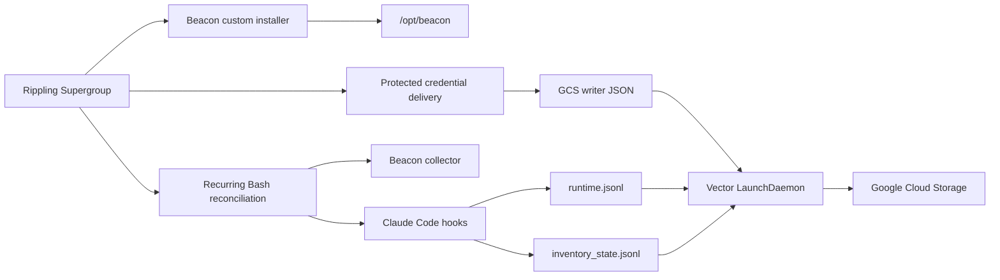

## Overview

Use this guide to deploy Beacon to Apple Silicon Macs with Rippling Device
Management, configure Claude Code telemetry for the logged-in user, and forward
runtime and inventory events to Google Cloud Storage (GCS).

The deployed state is:

- Rippling assigns the signed Beacon package to a Supergroup.
- Beacon and Vector are installed under `/opt/beacon`.
- `com.beacon.endpoint.collector` receives local Claude Code telemetry.
- Claude Code hooks are installed for the active console user.
- Runtime and inventory events are written to:
  - `/var/log/beacon-agent/runtime.jsonl`
  - `/var/log/beacon-agent/inventory_state.jsonl`
- `com.beacon.endpoint.gcs-forwarder` uploads both streams:

```text
gs://<bucket>/<prefix>/runtime/date=YYYY-MM-DD/<timestamp>-<uuid>.jsonl
gs://<bucket>/<prefix>/inventory/date=YYYY-MM-DD/<timestamp>-<uuid>.jsonl
```

Use a root prefix such as `beacon-prod`, not `beacon-prod/runtime` or
`beacon-prod/inventory`.



## Prerequisites

Prepare:

- Rippling IT with Device Management.
- Target Macs enrolled in Rippling MDM and connected through the Rippling
  Agent.
- A pilot Supergroup scoped to assigned Apple Silicon Macs and the intended
  Claude Code users.
- A signed and notarized `BeaconEndpointAgent-<version>-arm64.pkg` that includes
  `/opt/beacon/bin/vector`.
- A GCS bucket and permission to manage its IAM policy.
- A policy decision that permits a service-account key on managed endpoints.
- A separate GCS reader identity for delivery validation.

<Warning>
  Rippling's public documentation does not establish a protected arbitrary-file
  delivery feature or ordering dependencies between custom installers and
  scripts. Confirm available secret/file controls in your tenant. The flow below
  uses recurring reconciliation so devices converge after each prerequisite
  arrives.
</Warning>

## 1. Prepare Google Cloud

Set administrator-shell placeholders:

```bash
export GCP_PROJECT="<project-id>"
export GCP_REGION="<region>"                 # for example us-central1
export BEACON_GCS_BUCKET="<globally-unique-bucket>"
export BEACON_GCS_PREFIX="beacon-prod"
export BEACON_GCS_WRITER="beacon-endpoint-writer"
export BEACON_GCS_READER="beacon-endpoint-reader"
```

Enable APIs and create the bucket:

```bash
gcloud services enable storage.googleapis.com iam.googleapis.com \
  --project "$GCP_PROJECT"

gcloud storage buckets create "gs://${BEACON_GCS_BUCKET}" \
  --project "$GCP_PROJECT" \
  --location "$GCP_REGION" \
  --uniform-bucket-level-access
```

Create the endpoint writer:

```bash
gcloud iam service-accounts create "$BEACON_GCS_WRITER" \
  --project "$GCP_PROJECT" \
  --display-name "Beacon endpoint GCS writer"

export BEACON_GCS_WRITER_EMAIL="${BEACON_GCS_WRITER}@${GCP_PROJECT}.iam.gserviceaccount.com"

gcloud storage buckets add-iam-policy-binding "gs://${BEACON_GCS_BUCKET}" \
  --member "serviceAccount:${BEACON_GCS_WRITER_EMAIL}" \
  --role roles/storage.objectCreator
```

`roles/storage.objectCreator` permits new object creation but not listing,
reading, overwriting, or deleting objects. This limits the endpoint credential,
but it also means that credential cannot validate uploads.

Create a separate read-only identity:

```bash
gcloud iam service-accounts create "$BEACON_GCS_READER" \
  --project "$GCP_PROJECT" \
  --display-name "Beacon endpoint GCS reader"

export BEACON_GCS_READER_EMAIL="${BEACON_GCS_READER}@${GCP_PROJECT}.iam.gserviceaccount.com"

gcloud storage buckets add-iam-policy-binding "gs://${BEACON_GCS_BUCKET}" \
  --member "serviceAccount:${BEACON_GCS_READER_EMAIL}" \
  --role roles/storage.objectViewer
```

Apply lifecycle, retention, access logging, and CMEK controls according to your
organization's Google Cloud policy.

## 2. Create and deliver the writer credential

The packaged Vector version supports a service-account JSON file through
`GOOGLE_APPLICATION_CREDENTIALS` and GCE metadata credentials. A managed Mac
does not normally have GCE metadata. Interactive Application Default
Credentials and Workload Identity Federation are not a reliable authentication
contract for this launchd service.

Create a key only when service-account keys are permitted:

```bash
umask 077
gcloud iam service-accounts keys create "./${BEACON_GCS_WRITER}.json" \
  --project "$GCP_PROJECT" \
  --iam-account "$BEACON_GCS_WRITER_EMAIL"
```

Use this endpoint path, replacing the organization name:

```text
/Library/Application Support/Your Organization/Secrets/beacon-gcs-writer.json
```

Deliver the JSON using one of these methods, in preference order:

1. A protected arbitrary-file or secret-delivery capability enabled in your
   Rippling tenant.
2. A separate, tightly scoped signed custom installer package that writes only
   this credential file with `root:wheel` ownership and mode `0600`.

Keep credential deployment separate from the Beacon package so the key can be
rotated or revoked without rebuilding Beacon. Restrict access to the credential
installer and its source artifact.

Do not:

- paste the JSON into a Rippling custom Bash script;
- print it in script output or activity logs;
- place it under `/opt/beacon` or
  `/Library/Application Support/Beacon`, which Beacon owns;
- deploy it with group or world read permission.

Validate the delivered file on a pilot Mac:

```bash
export BEACON_GCS_CREDENTIAL_PATH="/Library/Application Support/Your Organization/Secrets/beacon-gcs-writer.json"

sudo test -r "$BEACON_GCS_CREDENTIAL_PATH"
sudo test "$(stat -f '%Su' "$BEACON_GCS_CREDENTIAL_PATH")" = "root"
sudo sh -c 'case "$(stat -f "%Lp" "$1")" in 400|600) exit 0;; *) exit 1;; esac' \
  _ "$BEACON_GCS_CREDENTIAL_PATH"
```

The Beacon helper stores only this path in its root-readable Vector environment
file. The credential remains in the externally managed location.

## 3. Upload the Beacon custom installer

In the Rippling Devices app:

1. Upload the signed Beacon `.pkg` as a custom installer.
2. Configure it as system-level software.
3. Assign it to the pilot Supergroup.
4. Wait for installation on the next device connection.
5. Review software installation status, pending actions, and activity logs.

Verify the installed payload:

```bash
sudo test -x /opt/beacon/bin/beacon
sudo test -x /opt/beacon/bin/beacon-otelcol
sudo test -x /opt/beacon/bin/vector
sudo test -x /opt/beacon/jamf/claude/gcs/repair-hooks-and-forwarder.sh
sudo /opt/beacon/bin/beacon endpoint status --system
```

The package postinstall creates and starts the base collector. The GCS
reconciliation script in the next section configures the forwarder and repairs
Claude Code hooks.

## 4. Deploy the Rippling reconciliation script

Create a macOS custom Bash script in Rippling and assign it to the same pilot
Supergroup. Configure it on a recurring schedule during rollout because:

- Rippling's public documentation does not define custom installer dependency
  ordering;
- the credential may arrive separately;
- Claude Code hooks require a logged-in non-root console user.

Use this script, replacing the four configuration values:

```bash
#!/bin/bash
set -euo pipefail

if [ "$(id -u)" -ne 0 ]; then
  echo "Beacon GCS reconciliation must run as root" >&2
  exit 1
fi

export BEACON_GCS_BUCKET="<bucket>"
export BEACON_GCS_PREFIX="beacon-prod"
export BEACON_GCS_STORAGE_CLASS="STANDARD"
export BEACON_VECTOR_READ_FROM="end"
export GOOGLE_APPLICATION_CREDENTIALS="/Library/Application Support/Your Organization/Secrets/beacon-gcs-writer.json"

test -x /opt/beacon/bin/beacon
test -x /opt/beacon/bin/vector
test -x /opt/beacon/jamf/claude/gcs/repair-hooks-and-forwarder.sh
test -r "$GOOGLE_APPLICATION_CREDENTIALS"

RECONCILE_DIR="/var/root/Library/Logs/Beacon"
RECONCILE_LOG="$RECONCILE_DIR/rippling-reconcile.log"
install -d -m 0700 -o root -g wheel "$RECONCILE_DIR"
rm -f "$RECONCILE_LOG"
install -m 0600 -o root -g wheel /dev/null "$RECONCILE_LOG"

if /opt/beacon/jamf/claude/gcs/repair-hooks-and-forwarder.sh \
  >>"$RECONCILE_LOG" 2>&1; then
  echo "Beacon GCS reconciliation succeeded"
else
  echo "Beacon GCS reconciliation failed; inspect the local root-only log" >&2
  exit 1
fi
```

These are non-secret configuration values:

| Variable | Example | Purpose |
| --- | --- | --- |
| `BEACON_GCS_BUCKET` | `example-security-logs` | Bucket name without `gs://`. |
| `BEACON_GCS_PREFIX` | `beacon-prod` | Root below which runtime and inventory prefixes are created. |
| `BEACON_GCS_STORAGE_CLASS` | `STANDARD` | GCS storage class for new objects. |
| `BEACON_VECTOR_READ_FROM` | `end` | Starts runtime forwarding with new events, avoiding unexpected historical upload. |
| `GOOGLE_APPLICATION_CREDENTIALS` | `/Library/Application Support/Your Organization/Secrets/beacon-gcs-writer.json` | Absolute path to the externally managed writer JSON. |

Do not add the credential JSON itself to the script.

The helper's smoke test prints recent runtime and inventory events. The wrapper
truncates a mode-`0600` log under root's private home and redirects verbose
output there so retained prompts, tool inputs, or command output are not
exported through Rippling's script-output view.

<Note>
  The packaged helpers remain under `/opt/beacon/jamf` for compatibility, but
  this flow does not call Jamf APIs. Environment variables are used instead of
  Jamf positional parameters.
</Note>

### What the helper does

The combined helper:

- verifies the GCS bucket, Vector binary, and credential path;
- requires the credential to be root-owned with mode `0400` or `0600`;
- writes and validates the Vector configuration;
- creates:

```text
/Library/Application Support/Beacon/Forwarders/gcs-vector.toml
/Library/Application Support/Beacon/Forwarders/gcs-vector.env
/Library/Application Support/Beacon/Forwarders/vector-data/gcs/
/Library/LaunchDaemons/com.beacon.endpoint.gcs-forwarder.plist
```

- starts `com.beacon.endpoint.gcs-forwarder`;
- repairs `com.beacon.endpoint.collector`;
- prepares the runtime and inventory JSONL files;
- grants the active console user append access;
- installs Claude Code hooks for the active user;
- runs a local hook smoke test and validates endpoint status.

Runtime forwarding starts at `end`. Inventory starts at `beginning` so the
initial inventory snapshot is not missed.

If no interactive user is logged in, forwarder and endpoint reconciliation can
complete before the hook-repair phase returns non-zero. Keep the recurring
script assigned so a later user session completes hook installation.

## 5. Validate a pilot Mac

### Rippling state

In Rippling, confirm:

- the device is assigned and remains in the pilot Supergroup;
- MDM and Rippling Agent status are healthy;
- the Beacon custom installer succeeded;
- the credential delivery action succeeded;
- no relevant pending action remains;
- the recurring script's latest output completed after an interactive login.

### Local endpoint and services

```bash
sudo /opt/beacon/bin/beacon endpoint status --system
sudo /opt/beacon/bin/beacon endpoint config validate --system
sudo launchctl print system/com.beacon.endpoint.collector
sudo launchctl print system/com.beacon.endpoint.gcs-forwarder
```

Check local files and non-secret forwarder settings:

```bash
sudo ls -l \
  /var/log/beacon-agent/runtime.jsonl \
  /var/log/beacon-agent/inventory_state.jsonl

sudo grep -E 'runtime.jsonl|inventory_state.jsonl|runtime/date|inventory/date|read_from' \
  "/Library/Application Support/Beacon/Forwarders/gcs-vector.toml"

sudo sh -c '. "/Library/Application Support/Beacon/Forwarders/gcs-vector.env"; test -r "$GOOGLE_APPLICATION_CREDENTIALS"'
```

### Generate validation events

Generate a runtime event and a forced inventory heartbeat after the forwarder is
running:

```bash
sudo /opt/beacon/bin/beacon endpoint gcs validate --system

sudo /opt/beacon/bin/beacon endpoint inventory heartbeat \
  --system \
  --force \
  --trigger manual \
  --trigger-harness claude \
  --working-dir /Users/Shared \
  --log-path /var/log/beacon-agent/runtime.jsonl
```

Allow up to five minutes for Vector's default batch timeout.

### Validate GCS with the reader

Use the separate reader identity, not the endpoint writer:

```bash
gcloud storage ls \
  "gs://${BEACON_GCS_BUCKET}/${BEACON_GCS_PREFIX}/runtime/**" \
  --impersonate-service-account "$BEACON_GCS_READER_EMAIL"

gcloud storage ls \
  "gs://${BEACON_GCS_BUCKET}/${BEACON_GCS_PREFIX}/inventory/**" \
  --impersonate-service-account "$BEACON_GCS_READER_EMAIL"
```

The administrator performing impersonation needs
`roles/iam.serviceAccountTokenCreator` on the reader service account:

```bash
export BEACON_GCS_VALIDATOR="<validator-user@example.com>"

gcloud iam service-accounts add-iam-policy-binding \
  "$BEACON_GCS_READER_EMAIL" \
  --project "$GCP_PROJECT" \
  --member "user:${BEACON_GCS_VALIDATOR}" \
  --role roles/iam.serviceAccountTokenCreator
```

Inspect a validation object:

```bash
gcloud storage cat \
  "gs://${BEACON_GCS_BUCKET}/${BEACON_GCS_PREFIX}/runtime/date=<YYYY-MM-DD>/<object>.jsonl" \
  --impersonate-service-account "$BEACON_GCS_READER_EMAIL" |
  grep "Beacon endpoint GCS validation event"
```

Fully restart Claude Code, start a new session, and perform a small tool action.
Confirm a newer runtime object arrives.

## 6. Expand the rollout

After the pilot is healthy:

1. Expand the custom installer, credential delivery, and reconciliation script
   to a staged production Supergroup.
2. Keep all three assignments scoped identically.
3. Continue recurring reconciliation for newly assigned devices and user
   logins.
4. Review Rippling software status, pending actions, script output, and activity
   logs during each stage.
5. Validate GCS object freshness with the reader identity or your downstream
   security pipeline.

## Credential rotation

Create the replacement key before deleting the old one:

```bash
umask 077
gcloud iam service-accounts keys create "./${BEACON_GCS_WRITER}-next.json" \
  --project "$GCP_PROJECT" \
  --iam-account "$BEACON_GCS_WRITER_EMAIL"
```

Update the protected file or credential installer while preserving the same
absolute path, `root:wheel` ownership, and mode `0600`. The recurring
reconciliation script restarts the forwarder when it next runs. To restart
immediately:

```bash
sudo launchctl kickstart -k system/com.beacon.endpoint.gcs-forwarder
sudo launchctl print system/com.beacon.endpoint.gcs-forwarder
```

After new objects arrive, identify and delete the retired key:

```bash
gcloud iam service-accounts keys list \
  --project "$GCP_PROJECT" \
  --iam-account "$BEACON_GCS_WRITER_EMAIL"

gcloud iam service-accounts keys delete "<old-key-id>" \
  --project "$GCP_PROJECT" \
  --iam-account "$BEACON_GCS_WRITER_EMAIL"
```

## Package updates

Upload the newer signed Beacon package to Rippling and test it with the pilot
Supergroup. Package postinstall restarts the collector and restores an existing
GCS forwarder. Keep the reconciliation script assigned to repair hooks and
forwarding state after the update.

Rippling's public documentation does not define custom-installer supersedence
or version comparison behavior. Verify your chosen update pattern in the pilot
before replacing the production assignment.

## Uninstall

Use an explicit cleanup sequence:

1. Remove the Mac from the recurring reconciliation script.
2. Copy the cleanup helper to a temporary root-only path while `/opt/beacon`
   still exists.
3. Remove or unassign the Beacon custom installer so Rippling does not reinstall
   it after cleanup.
4. Run the copied helper as a one-time root script and review all warnings.
5. Verify Beacon LaunchDaemons, files, and the package receipt are gone.
6. Remove the separately managed writer credential.
7. Revoke the writer key.

```bash
sudo install -m 0700 -o root -g wheel \
  /opt/beacon/jamf/scripts/full-cleanup.sh \
  /var/tmp/beacon-full-cleanup.sh

# Unassign the Beacon custom installer in Rippling, then run:
sudo /var/tmp/beacon-full-cleanup.sh
sudo rm -f /var/tmp/beacon-full-cleanup.sh
sudo rm -rf "/var/root/Library/Logs/Beacon"

for label in \
  com.beacon.endpoint.collector \
  com.beacon.endpoint.updater \
  com.beacon.endpoint.gcs-forwarder \
  com.beacon.endpoint.s3-forwarder \
  com.beacon.endpoint.falcon-forwarder; do
  if sudo launchctl print "system/$label" >/dev/null 2>&1; then
    echo "Beacon service remains: $label" >&2
    exit 1
  fi
done

test ! -e /opt/beacon
test ! -e "/Library/Application Support/Beacon"
if pkgutil --pkg-info ai.asymptote.beacon.endpoint >/dev/null 2>&1; then
  echo "Beacon package receipt remains" >&2
  exit 1
fi
```

The cleanup helper is best-effort and exits successfully after some warning
conditions, so the explicit checks are required. It does not remove the
externally managed credential path.

Do not rely only on automatic removal when a device leaves the Supergroup:
Rippling's public documentation does not confirm that custom installer removal
runs Beacon's cleanup helper.

## Troubleshooting

<AccordionGroup>
  <Accordion title="The reconciliation script fails before configuration">
    Review Rippling script output. Confirm it ran as root and that the Beacon
    package, Vector binary, helper script, and credential file all exist. A
    recurring run may occur before the custom installers have completed.
  </Accordion>
  <Accordion title="No interactive console user was found">
    The helper intentionally returns non-zero because Claude Code hooks are
    per-user. Keep the recurring script assigned and rerun it after the employee
    logs in. Forwarder and collector setup may already be healthy.
  </Accordion>
  <Accordion title="The credential is rejected">
    Check path, ownership, and mode:

    ```bash
    sudo stat -f 'owner=%Su group=%Sg mode=%Lp path=%N' \
      "/Library/Application Support/Your Organization/Secrets/beacon-gcs-writer.json"
    ```

    The path must be absolute, the owner must be `root`, and the mode must be
    `0400` or `0600`.
  </Accordion>
  <Accordion title="The GCS forwarder is not running">
    Inspect launchd and Vector errors, then validate the saved configuration
    without starting a second Vector process:

    ```bash
    sudo launchctl print system/com.beacon.endpoint.gcs-forwarder
    sudo tail -n 100 /tmp/com.beacon.endpoint.gcs-forwarder.err
    sudo sh -c '
      . "/Library/Application Support/Beacon/Forwarders/gcs-vector.env"
      exec /opt/beacon/bin/vector validate --skip-healthchecks \
        "/Library/Application Support/Beacon/Forwarders/gcs-vector.toml"
    '
    ```
  </Accordion>
  <Accordion title="GCS returns 403 Forbidden">
    Confirm the JSON belongs to the expected writer service account and that
    the account has `roles/storage.objectCreator` on the target bucket. If the
    bucket uses CMEK, confirm the writer can use the encryption key.
  </Accordion>
  <Accordion title="The writer cannot list uploaded objects">
    This is expected. `roles/storage.objectCreator` cannot list or read objects.
    Validate with the reader identity.
  </Accordion>
  <Accordion title="Runtime objects are missing">
    Runtime forwarding starts at `end`. Generate
    `beacon endpoint gcs validate --system` after the forwarder is running, wait
    up to five minutes, and inspect Vector stderr.
  </Accordion>
  <Accordion title="Inventory objects are missing">
    Force an inventory heartbeat, inspect
    `/var/log/beacon-agent/inventory_state.jsonl`, and confirm the Vector config
    includes the inventory source and `/inventory/date=%F/` key prefix.
  </Accordion>
</AccordionGroup>

## Rippling references

- [Rippling Device Management](https://www.rippling.com/products/it/device-management)
- [Role-based software installation with Supergroups](https://www.rippling.com/use-cases/role-based-software-installation)
- [Device health monitoring](https://www.rippling.com/use-cases/monitor-device-health-single-dashboard)
- [Rippling Device Management whitepaper](https://go.rippling.com/rs/345-FHM-674/images/Rippling-Device-Management.pdf)

## Related

<Columns cols={2}>
  <Card title="Rippling MDM overview" icon="laptop" href="/mdm/rippling">
    Review package deployment, Supergroups, recurring scripts, updates, and uninstall.
  </Card>
  <Card title="Claude Code" icon="code" href="/runtimes/claude-code">
    Review the Claude Code telemetry surface and local configuration.
  </Card>
  <Card title="GCS command reference" icon="bucket" href="/cli/gcs">
    Review local GCS validation commands and generated forwarding assets.
  </Card>
  <Card title="Endpoint operations" icon="shield-halved" href="/security/endpoint-operations">
    Review system paths, services, permissions, update behavior, and cleanup.
  </Card>
</Columns>
