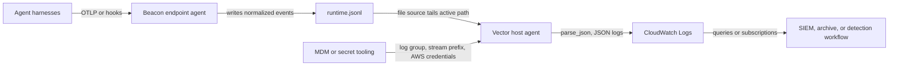

## Forwarding Overview

Beacon `v0.0.42` added the [AWS CloudWatch Logs content pack](/concepts/core-concepts#aws-cloudwatch-logs-content-pack) for teams that want Beacon endpoint events forwarded into a customer-managed CloudWatch Logs log group for observability, security search, subscriptions, exports, or downstream detection workflows. Beacon remains the local JSONL producer and writes one source of truth, the active [runtime JSONL log](/concepts/core-concepts#runtime-jsonl-log). Your customer-managed [Vector forwarding](/concepts/core-concepts#vector-forwarding) agent tails that file and writes parsed Beacon events to CloudWatch Logs.

Use this path when you want Beacon events forwarded to AWS CloudWatch Logs without storing AWS credentials, profiles, IAM roles, log group retention settings, stream names, or encryption settings in Beacon endpoint configuration.

## Runtime log paths

| Mode | Runtime log |
|------|-------------|
| User mode | `~/.beacon/endpoint/logs/runtime.jsonl` |
| System mode | `/var/log/beacon-agent/runtime.jsonl` |

Use system mode for MDM deployments so Vector can tail `/var/log/beacon-agent/runtime.jsonl` without per-user home directory permissions.

## Prerequisites

- Beacon endpoint installed and writing local JSONL.
- An AWS CloudWatch Logs log group for Beacon runtime logs.
- Vector installed or deployable through your endpoint-management tooling.
- An IAM role or credentials available through the standard AWS credential provider chain for the process running Vector or the AWS CLI validation checks.

Recommended log group and stream layout:

```text
/aws/beacon/runtime
beacon-runtime/<hostname>
```

Example least-privilege IAM policy for a pre-created log group:

```json
{
  "Version": "2012-10-17",
  "Statement": [
    {
      "Effect": "Allow",
      "Action": [
        "logs:CreateLogStream",
        "logs:DescribeLogStreams",
        "logs:PutLogEvents"
      ],
      "Resource": "arn:aws:logs:us-east-1:111122223333:log-group:/aws/beacon/runtime:*"
    }
  ]
}
```

Add `logs:CreateLogGroup`, KMS permissions, subscription-filter permissions, or account-specific conditions only if your AWS controls require them. Configure CloudWatch Logs retention, log group encryption, subscription filters, exports, and access policies in AWS.

## Install the CloudWatch pack

Generate the AWS CloudWatch Logs content pack for a managed system-mode deployment:

```bash title="Generate the AWS CloudWatch Logs content pack for a managed system-mode deployment"
sudo /opt/beacon/bin/beacon endpoint cloudwatch install-pack \
  --system \
  --output ./beacon-cloudwatch-pack
```

The pack includes:

- `README.md` with setup and validation steps.
- `vector.toml` for customer-managed Vector forwarding.
- `sample-event.jsonl` with Beacon endpoint sample events.

If you use a custom Beacon log path, generate the pack with `--log-path /path/to/runtime.jsonl`. The generated `vector.toml` uses the selected path.

## Production forwarding

For production, use the generated Vector config as a customer-managed host-agent forwarding template. Beacon remains the local JSONL producer; Vector tails `runtime.jsonl`, checkpoints file offsets in its `data_dir`, batches Beacon events, and writes JSON log events into AWS CloudWatch Logs.



Install Vector using your normal endpoint management tooling, then copy the generated config into Vector's config directory. On a macOS system-mode Beacon deployment, the generated config tails `/var/log/beacon-agent/runtime.jsonl`:

```bash title="Install Vector using your normal endpoint management tooling, then copy the generated config into Vector's config directory. On a macOS system-mode Beacon deployment, the generated config tails /var/log/beacon-agent/runtime.jsonl"
sudo mkdir -p /etc/vector
sudo cp ./beacon-cloudwatch-pack/vector.toml /etc/vector/beacon-cloudwatch.toml
export BEACON_CLOUDWATCH_LOG_GROUP="/aws/beacon/runtime"
export BEACON_CLOUDWATCH_LOG_STREAM_PREFIX="beacon-runtime"
export AWS_REGION="us-east-1"
vector validate /etc/vector/beacon-cloudwatch.toml
vector --config /etc/vector/beacon-cloudwatch.toml
```

In managed deployments, provide `BEACON_CLOUDWATCH_LOG_GROUP`, optional `BEACON_CLOUDWATCH_LOG_STREAM_PREFIX`, `AWS_REGION`, and any AWS credential-provider settings through the Vector service environment, host identity, or MDM/secret tooling. Do not store AWS destination secrets in Beacon endpoint configuration.

The template expects a Vector version with the `file` source, `remap` transform, and `aws_cloudwatch_logs` sink. It parses each Beacon JSONL line and re-encodes the original Beacon event as JSON so CloudWatch receives the Beacon event shape without a Vector wrapper.

The template sets `create_missing_group = false` and `create_missing_stream = true`. Pre-create the log group in AWS so you can manage retention, encryption, resource policy, tags, and subscription filters through your normal controls, while allowing Vector to create host-specific log streams as endpoints come online.

If you adapt the config or use another forwarder, it should:

- Checkpoint file offsets.
- Follow Beacon's local file rotation at the active `runtime.jsonl` path.
- Keep each Beacon event as one JSON object.
- Batch JSON records.
- Use host-specific log streams.
- Retry transient failures without duplicating the whole file.
- Keep AWS credentials, IAM roles, log group retention, stream naming, and encryption outside Beacon endpoint configuration.

## Validate forwarding

Confirm the Beacon runtime log exists and has recent endpoint events:

```bash title="Confirm the Beacon runtime log exists and has recent endpoint events"
sudo /opt/beacon/bin/beacon endpoint status --system --json
sudo test -r /var/log/beacon-agent/runtime.jsonl
```

Write a CloudWatch validation event:

```bash title="Write a CloudWatch validation event"
sudo /opt/beacon/bin/beacon endpoint cloudwatch validate --system
```

Wait for your production forwarder to ship the new line. Beacon can write the local validation event, but remote delivery must be confirmed with AWS tooling:

```bash title="Wait for your production forwarder to ship the new line. Beacon can write the local validation event, but remote delivery must be confirmed with AWS tooling"
aws logs filter-log-events \
  --log-group-name "$BEACON_CLOUDWATCH_LOG_GROUP" \
  --filter-pattern '"Beacon endpoint AWS CloudWatch Logs validation event"' \
  --region "$AWS_REGION"
```

CloudWatch Logs Insights query:

```sql
fields @timestamp, vendor, product, destination.type, destination.mode, message
| filter message like /Beacon endpoint AWS CloudWatch Logs validation event/
| sort @timestamp desc
| limit 20
```

Expected validation fields:

```text
vendor=beacon product=endpoint-agent destination.type=cloudwatch destination.mode=aws_cloudwatch_logs
```

If events do not appear, verify that Vector is reading the same runtime log path Beacon writes, that the AWS credential provider chain is available to the Vector process, that the log group name and region match your environment variables, and that IAM allows `logs:CreateLogStream`, `logs:DescribeLogStreams`, and `logs:PutLogEvents` for the selected log group.

## Content Handling

Beacon applies redaction, sanitization, truncation, and event-size limits before events are written to `runtime.jsonl` and forwarded to CloudWatch Logs. Review log group access, retention, subscription filters, and downstream consumers so retained telemetry matches your approved collection policy.

## Related

<Columns cols={2}>
  <Card title="beacon endpoint cloudwatch" icon="terminal" href="/cli/cloudwatch">
    Review AWS CloudWatch Logs command syntax, flags, and examples.
  </Card>
  <Card title="Log forwarding" icon="tower-broadcast" href="/log-forwarding">
    Review forwarding patterns across Wazuh, Splunk HEC, Falcon LogScale, Elastic, Datadog, Sumo Logic, Rapid7, Microsoft Sentinel, AWS CloudWatch Logs, AWS S3, Google Cloud Storage, and customer-managed pipelines.
  </Card>
  <Card title="AWS S3 forwarding" icon="box-archive" href="/log-forwarding/s3">
    Configure Vector forwarding from Beacon JSONL into AWS S3.
  </Card>
  <Card title="Endpoint event schema" icon="code" href="/telemetry-schema/event-schema">
    Review normalized Beacon JSONL fields and example events.
  </Card>
  <Card title="Agent harness integrations" icon="list-check" href="/runtimes">
    Review supported agent harnesses, deployment modes, storage, and forwarding.
  </Card>
</Columns>
