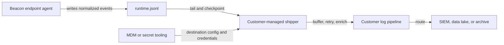

## Pipeline Overview

Beacon writes normalized [endpoint events](/concepts/core-concepts#endpoint-event) to the active local [runtime JSONL log](/concepts/core-concepts#runtime-jsonl-log). Customer-managed forwarding means your existing shipper, endpoint agent, Vector deployment, log pipeline, or SIEM collector tails that file and owns remote delivery.

Use this path when Beacon should remain the local event producer and your infrastructure should control destination URLs, credentials, buffering, retries, retention, and downstream routing.

## Runtime log paths

| Mode | Runtime log |
|------|-------------|
| User mode | `~/.beacon/endpoint/logs/runtime.jsonl` |
| System mode | `/var/log/beacon-agent/runtime.jsonl` |

Use system mode for MDM or managed endpoint deployments so the shipper can read a shared root-managed path instead of per-user home directories.

## Forwarding contract

Configure your pipeline to:

- Read from `/var/log/beacon-agent/runtime.jsonl` for system deployments.
- Follow Beacon's local rotation at the active `runtime.jsonl` path.
- Checkpoint file offsets in the shipper or pipeline.
- Treat each line as one complete JSON event.
- Preserve the raw Beacon JSON for investigation.
- Keep remote destination secrets outside Beacon endpoint configuration.

Beacon endpoint events use stable top-level fields such as `vendor`, `product`, `event`, `actor`, `endpoint`, `process`, `file`, `tool`, `mcp`, `approval`, `destination`, and `health`. Review the [endpoint event schema](/telemetry-schema/event-schema) before writing custom parsers or routing rules.

## Example pipeline shape



## Validation

Confirm Beacon is writing local events:

```bash title="Confirm Beacon is writing local events"
sudo /opt/beacon/bin/beacon endpoint status --system --json
sudo test -r /var/log/beacon-agent/runtime.jsonl
sudo /opt/beacon/bin/beacon endpoint test-event --system
```

Then confirm your shipper read the new line and delivered it downstream. If events do not arrive, first verify that the shipper is reading the same runtime log path Beacon writes and that it follows rotated files without re-uploading older archives.

## Related

<Columns cols={2}>
  <Card title="Log forwarding" icon="tower-broadcast" href="/log-forwarding">
    Compare SIEM, log aggregation, object storage, and local forwarding paths.
  </Card>
  <Card title="Endpoint event schema" icon="code" href="/telemetry-schema/event-schema">
    Review normalized Beacon JSONL fields and example events.
  </Card>
  <Card title="Local JSONL" icon="file-lines" href="/log-forwarding/local-jsonl">
    Review the default local runtime log and dashboard source.
  </Card>
  <Card title="Core Concepts" icon="book-open" href="/concepts/core-concepts#customer-managed-forwarding">
    Review customer-managed forwarding terminology.
  </Card>
</Columns>
