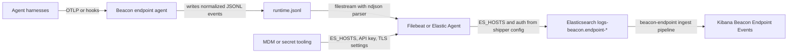

## Forwarding Overview

Beacon `v0.0.11` added an Elastic content pack for teams that want to search Beacon endpoint events in Elasticsearch and Kibana. Current Beacon releases write one local source of truth, the active [runtime JSONL log](/concepts/core-concepts#runtime-jsonl-log), and keep that handoff path bounded with local rotation. Filebeat or standalone Elastic Agent reads that file and owns the Elastic hosts, API keys, usernames, and passwords.

Use this path when you want Beacon events in Elastic Cloud, a self-managed Elastic deployment, or a local Kibana validation stack without giving Beacon itself cluster credentials.

## How forwarding works

Beacon writes endpoint telemetry to one local JSONL file. Filebeat or standalone Elastic Agent tails that file, parses each line as JSON, and forwards the events to Elasticsearch. The generated Elastic assets install the index lifecycle policy, templates, ingest pipeline, and starter Kibana objects used to normalize Beacon events into ECS-adjacent fields and searchable `beacon.*` fields.



Beacon never stores Elastic cluster URLs, API keys, usernames, passwords, or TLS settings. Keep those values in Filebeat, Elastic Agent, or your endpoint-management secret store.

## Runtime log paths

| Mode | Runtime log |
|------|-------------|
| User mode | `~/.beacon/endpoint/logs/runtime.jsonl` |
| System mode | `/var/log/beacon-agent/runtime.jsonl` |

Use system mode for MDM deployments so every managed endpoint writes to `/var/log/beacon-agent/runtime.jsonl`.

## Local Elastic stack

For a local macOS trial, install Beacon, configure endpoint telemetry, and start the bundled loopback-only stack:

```bash title="Start the local Elastic validation stack"
brew tap asymptote-labs/tap
brew install beacon

beacon endpoint install
beacon endpoint elastic install-pack --output ./beacon-elastic-pack
beacon endpoint elastic up --pack-dir ./beacon-elastic-pack
```

The stack starts Elasticsearch, Kibana, and Filebeat with Docker Desktop. Elasticsearch and Kibana bind to loopback:

| Service | URL |
|---------|-----|
| Elasticsearch | `http://localhost:9200` |
| Kibana | `http://localhost:5601` |

`install-pack` writes the Filebeat config, Elasticsearch assets, Kibana starter assets, sample event, and Docker Compose file. `elastic up` then uses that pack directory to start the local stack.

<Frame caption="Start the local Elastic validation stack and wait for Elasticsearch, Kibana, setup, and Filebeat to become healthy.">
  
</Frame>

Open Kibana, select the `Beacon Endpoint Events` data view, and use Discover to verify events. If ports are already in use, set `BEACON_ELASTIC_ES_PORT` or `BEACON_ELASTIC_KIBANA_PORT` before running `elastic up`.

<Frame caption="Search Beacon endpoint events in Kibana Discover with the generated Beacon Endpoint Events data view.">
  
</Frame>

Stop the local stack with:

```bash title="Stop the local stack with"
beacon endpoint elastic down --pack-dir ./beacon-elastic-pack
```

<Note>
  `beacon endpoint elastic up` and `beacon endpoint elastic down` are local validation helpers for macOS with Docker Desktop. For Linux endpoints or production deployments, use the generated Filebeat or standalone Elastic Agent configuration with your normal service manager.
</Note>

## Elastic Cloud or self-managed Elastic

Generate the content pack on the endpoint or in your endpoint management workflow:

```bash title="Generate the content pack on the endpoint or in your endpoint management workflow"
beacon endpoint install --system
beacon endpoint elastic install-pack --system --output ./beacon-elastic-pack
```

The pack includes:

- `filebeat.yml` for Filebeat filestream input over Beacon JSONL
- `elastic-agent-standalone.yml` for standalone Elastic Agent
- Elasticsearch ILM, component template, index template, and ingest pipeline JSON
- Starter Kibana saved objects
- A sample Beacon event for ingest pipeline simulation
- A Docker Compose file for local validation

Install the Elasticsearch assets before shipping events:

```bash title="Install the Elasticsearch assets before shipping events"
cd beacon-elastic-pack

curl -X PUT "$ES_HOSTS/_ilm/policy/beacon-endpoint" \
  -H "Authorization: ApiKey $ES_API_KEY" \
  -H 'Content-Type: application/json' \
  --data-binary @ilm-policy.json

curl -X PUT "$ES_HOSTS/_component_template/beacon-endpoint-mappings" \
  -H "Authorization: ApiKey $ES_API_KEY" \
  -H 'Content-Type: application/json' \
  --data-binary @component-template-mappings.json

curl -X PUT "$ES_HOSTS/_component_template/beacon-endpoint-settings" \
  -H "Authorization: ApiKey $ES_API_KEY" \
  -H 'Content-Type: application/json' \
  --data-binary @component-template-settings.json

curl -X PUT "$ES_HOSTS/_index_template/beacon-endpoint" \
  -H "Authorization: ApiKey $ES_API_KEY" \
  -H 'Content-Type: application/json' \
  --data-binary @index-template.json

curl -X PUT "$ES_HOSTS/_ingest/pipeline/beacon-endpoint" \
  -H "Authorization: ApiKey $ES_API_KEY" \
  -H 'Content-Type: application/json' \
  --data-binary @ingest-pipeline.json
```

Import `kibana-assets.ndjson` through Kibana Stack Management or the saved objects import API.

Then run Filebeat with your Elastic endpoint and one authentication method:

```bash title="Run Filebeat with your Elastic endpoint"
export ES_HOSTS="https://example.es.us-east-1.aws.elastic.cloud:443"
export ES_API_KEY="base64-encoded-api-key"
filebeat -e -c ./filebeat.yml
```

For self-managed clusters, `ES_HOSTS` can be an internal Elasticsearch URL such as `https://elasticsearch.example:9200`. If you use username/password auth, uncomment `username` and `password` in the generated config and provide `ES_USERNAME` and `ES_PASSWORD`.

To use standalone Elastic Agent instead of Filebeat, apply the same `ES_HOSTS` and authentication environment variables to `elastic-agent-standalone.yml` and run Elastic Agent in standalone mode.

## Required Elastic privileges

Use the least-privilege API key or role your Elastic administrator approves. Filebeat needs cluster `monitor` plus `auto_configure`, `create_doc`, and `view_index_metadata` on `logs-beacon.endpoint-*`.

The setup user or API key also needs permission to install ILM policies, component templates, index templates, ingest pipelines, and Kibana saved objects. You can use a separate higher-privilege setup credential for asset installation and a lower-privilege shipping credential for Filebeat or Elastic Agent.

## Validate forwarding

Confirm the Beacon runtime log exists and has recent endpoint events:

```bash title="Confirm the Beacon runtime log exists and has recent endpoint events"
sudo /opt/beacon/bin/beacon endpoint status --system --json
sudo test -r /var/log/beacon-agent/runtime.jsonl
```

Simulate the ingest pipeline with the generated sample event:

```bash title="Simulate the ingest pipeline with the generated sample event"
awk '{print "{\"docs\":[{\"_source\":" $0 "}]}"}' sample-event.jsonl | \
  curl -X POST "$ES_HOSTS/_ingest/pipeline/beacon-endpoint/_simulate" \
    -H "Authorization: ApiKey $ES_API_KEY" \
    -H 'Content-Type: application/json' \
    --data-binary @-
```

For an unsecured local development cluster, omit the `Authorization` header.

After Filebeat or Elastic Agent starts, search Kibana Discover with the `Beacon Endpoint Events` data view or query the index pattern. Beacon fields are mapped under `beacon.*` by the ingest pipeline:

```bash title="Search for Beacon events"
curl "$ES_HOSTS/logs-beacon.endpoint-*/_search?q=beacon.product:endpoint-agent" \
  -H "Authorization: ApiKey $ES_API_KEY"

curl "$ES_HOSTS/logs-beacon.endpoint-*/_search?q=beacon.prompt.text:%22Beacon%20E2E%22" \
  -H "Authorization: ApiKey $ES_API_KEY"
```

If events do not appear, verify that the generated `filebeat.yml` or `elastic-agent-standalone.yml` points at the same runtime log path Beacon is writing, that the shipper service can read that file, and that `ES_HOSTS`, `ES_API_KEY`, TLS verification, and any custom CA settings match your Elastic deployment.

## Related

<Columns cols={2}>
  <Card title="beacon endpoint elastic" icon="terminal" href="/cli/elastic">
    Review Elastic command syntax, flags, and examples.
  </Card>
  <Card title="Log forwarding" icon="tower-broadcast" href="/log-forwarding">
    Review forwarding patterns across Wazuh, Splunk HEC, Falcon LogScale, Elastic, and other SIEMs.
  </Card>
  <Card title="Endpoint event schema" icon="code" href="/telemetry-schema/event-schema">
    Review normalized Beacon JSONL fields and example events.
  </Card>
  <Card title="Agent harness integrations" icon="list-check" href="/runtimes">
    Review supported agent harnesses, deployment modes, storage, and forwarding.
  </Card>
</Columns>
