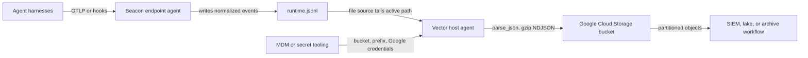

## Forwarding Overview

Beacon `v0.0.38` added Google Cloud Storage support for teams that want Beacon endpoint events stored in a GCS bucket for data lake, SIEM, archive, or downstream detection workflows. Beacon remains the local JSONL producer and writes one source of truth, the active [runtime JSONL log](/concepts/core-concepts#runtime-jsonl-log). Your customer-managed Vector agent tails that file and uploads gzip-compressed NDJSON objects to GCS.

Use this path when you want Beacon events forwarded to Google Cloud Storage without storing Google Cloud credentials, service accounts, workload identity settings, bucket IAM, lifecycle, retention, or encryption settings in Beacon endpoint configuration.

<Info>
  This page covers **local endpoint** GCS forwarding. For provider-managed cloud
  agent sandboxes, see [Claude Code Cloud Agents](/runtimes/claude-code-cloud-agents) or
  [Cursor Cloud Agents](/runtimes/cursor-cloud-agents). Cloud agents currently support GCS
  as the only self-serve artifact destination, with AWS S3 and SIEM destinations
  planned.
</Info>

## Runtime log paths

| Mode | Runtime log |
|------|-------------|
| User mode | `~/.beacon/endpoint/logs/runtime.jsonl` |
| System mode | `/var/log/beacon-agent/runtime.jsonl` |

Use system mode for MDM deployments so Vector can tail `/var/log/beacon-agent/runtime.jsonl` without per-user home directory permissions.

## Prerequisites

- Beacon endpoint installed and writing local JSONL.
- A Google Cloud Storage bucket for Beacon runtime logs.
- Vector installed or deployable through your endpoint-management tooling.
- A service account or workload identity available through Application Default Credentials for the process running Vector, `gcloud`, or `gsutil`.

Recommended object layout:

```text
gs://example-security-logs/beacon/runtime/date=YYYY-MM-DD/<timestamp>-<uuid>.jsonl.gz
```

For a dedicated Beacon bucket, `roles/storage.objectCreator` is usually enough for production uploads because it can create objects without listing or reading them. Add viewer, retention, CMEK, or bucket-specific conditional IAM only if your Google Cloud controls require them. Configure bucket lifecycle, retention, versioning, audit logs, and encryption in Google Cloud.

## Install the GCS pack

Generate the Google Cloud Storage content pack for a managed system-mode deployment:

```bash title="Generate the Google Cloud Storage content pack for a managed system-mode deployment"
sudo /opt/beacon/bin/beacon endpoint gcs install-pack \
  --system \
  --output ./beacon-gcs-pack
```

The pack includes:

- `README.md` with setup and validation steps
- `gcs-upload-smoke-test.sh` for one-shot GCS validation uploads
- `vector.toml` for customer-managed Vector forwarding
- `sample-event.jsonl` with Beacon endpoint sample events

If you use a custom Beacon log path, generate the pack with `--log-path /path/to/runtime.jsonl`. The generated `gcs-upload-smoke-test.sh` and `vector.toml` use the selected path.

## One-shot smoke test

Use the generated smoke-test script to upload the current runtime log once. This is only for validation because it re-uploads the whole file every time.

```bash title="Command example"
export BEACON_GCS_BUCKET="example-security-logs"
export BEACON_GCS_PREFIX="beacon/runtime"
./beacon-gcs-pack/gcs-upload-smoke-test.sh
```

The script uses `gcloud storage cp` when available and falls back to `gsutil cp`. Both rely on Application Default Credentials, workload identity, active `gcloud` configuration, or your managed endpoint secret tooling. Beacon does not store Google Cloud credentials.

Confirm the uploaded object:

```bash title="Confirm the uploaded object"
gcloud storage ls "gs://${BEACON_GCS_BUCKET}/${BEACON_GCS_PREFIX}/smoke-tests/"
gcloud storage cat "gs://${BEACON_GCS_BUCKET}/${BEACON_GCS_PREFIX}/smoke-tests/<object>.jsonl" | grep "Beacon endpoint GCS validation event"
```

## Production forwarding

For production, use the generated Vector config as a customer-managed host-agent forwarding template. Beacon remains the local JSONL producer; Vector tails `runtime.jsonl`, checkpoints file offsets in its `data_dir`, batches Beacon events, and writes gzip-compressed newline-delimited JSON objects into Google Cloud Storage.



Install Vector using your normal endpoint management tooling, then copy the generated config into Vector's config directory. On a macOS system-mode Beacon deployment, the generated config tails `/var/log/beacon-agent/runtime.jsonl`:

```bash title="Install Vector using your normal endpoint management tooling, then copy the generated config into Vector's config directory. On a macOS system-mode Beacon deployment, the generated config tails /var/log/beacon-agent/runtime.jsonl"
sudo mkdir -p /etc/vector
sudo cp ./beacon-gcs-pack/vector.toml /etc/vector/beacon-gcs.toml
export BEACON_GCS_BUCKET="example-security-logs"
export BEACON_GCS_PREFIX="beacon/runtime"
vector validate /etc/vector/beacon-gcs.toml
vector --config /etc/vector/beacon-gcs.toml
```

In managed deployments, provide `BEACON_GCS_BUCKET`, optional `BEACON_GCS_PREFIX`, optional `BEACON_GCS_STORAGE_CLASS`, and any Google Application Default Credentials or workload identity settings through the Vector service environment, host identity, MDM, or secret tooling. Do not store Google Cloud destination secrets in Beacon endpoint configuration.

## Cloud agent GCS upload

Claude Code Cloud Agents and Cursor Cloud Agents run in provider-managed cloud
sandboxes rather than on a local endpoint where Vector can tail
`/var/log/beacon-agent/runtime.jsonl`. Beacon's cloud-agent path therefore
writes an ephemeral sandbox log at `/tmp/beacon/runtime.jsonl` and uploads one
readable `runtime.jsonl` object to GCS per cloud session.

The current self-serve method uses `beacon cloud gcs setup` to create a
dedicated GCS uploader service account and passes that scoped credential to the
cloud agent environment. This is intended for proof-of-concept testing and
prototyping. Treat cloud environment variables as sensitive because they may be
visible to users of that environment. Avoid using broad credentials there.

For production enterprise deployments, [Asymptote Managed](/deployment/managed)
handles secure cloud-agent telemetry ingest and retention. If you prefer a
production-grade forwarding path in your own customer-managed, self-hosted
infrastructure, contact Asymptote and we can work with your team.

The template expects a Vector version with the `file` source, `remap` transform, and `gcp_cloud_storage` sink. It parses each Beacon JSONL line and re-encodes the original Beacon event as JSON with newline-delimited framing so GCS receives one Beacon event per line, without a Vector wrapper.

The template uses date-partitioned `key_prefix`, `filename_time_format = "%s"`, and `filename_append_uuid = true` so production forwarding does not overwrite previous GCS objects. It also sets `compression = "gzip"`, `content_encoding = "gzip"`, and `content_type = "application/x-ndjson"`.

If you adapt the config or use another forwarder, it should:

- Checkpoint file offsets.
- Follow Beacon's local file rotation at the active `runtime.jsonl` path.
- Keep each Beacon event as one JSON object per line.
- Batch newline-delimited JSON records.
- Use non-overwriting object keys.
- Retry transient failures without duplicating the whole file.
- Keep Google Cloud credentials, service-account bindings, workload identity, bucket IAM, lifecycle, retention, and encryption outside Beacon endpoint configuration.

## Validate forwarding

Confirm the Beacon runtime log exists and has recent endpoint events:

```bash title="Confirm the Beacon runtime log exists and has recent endpoint events"
sudo /opt/beacon/bin/beacon endpoint status --system --json
sudo test -r /var/log/beacon-agent/runtime.jsonl
```

Write a GCS validation event:

```bash title="Write a GCS validation event"
sudo /opt/beacon/bin/beacon endpoint gcs validate --system
```

Run the one-shot smoke test or wait for your production forwarder to ship the new line. Beacon can write the local validation event, but remote delivery must be confirmed with Google Cloud tooling:

```bash title="Run the one-shot smoke test or wait for your production forwarder to ship the new line. Beacon can write the local validation event, but remote delivery must be confirmed with Google Cloud tooling"
gcloud storage ls "gs://${BEACON_GCS_BUCKET}/${BEACON_GCS_PREFIX}/**"
gcloud storage cat "gs://${BEACON_GCS_BUCKET}/${BEACON_GCS_PREFIX}/date=<date>/<object>.jsonl.gz" | gzip -dc | grep "Beacon endpoint GCS validation event"
```

Expected validation fields:

```text
vendor=beacon product=endpoint-agent destination.type=gcs destination.mode=google_cloud_storage_jsonl
```

If events do not appear, verify that Vector is reading the same runtime log path Beacon writes, that Application Default Credentials or workload identity are available to the Vector process, that the bucket and prefix match your environment variables, and that IAM allows object creation for the selected bucket or prefix.

## Content Handling

Beacon applies redaction, sanitization, truncation, and event-size limits before events are written to `runtime.jsonl` and forwarded to GCS. Review bucket access, lifecycle, retention, and downstream consumers so retained telemetry matches your approved collection policy.

## Related

<Columns cols={2}>
  <Card title="beacon endpoint gcs" icon="terminal" href="/cli/gcs">
    Review Google Cloud Storage command syntax, flags, and examples.
  </Card>
  <Card title="Log forwarding" icon="tower-broadcast" href="/log-forwarding">
    Review forwarding patterns across Wazuh, Splunk HEC, Falcon LogScale, Elastic, Datadog, Sumo Logic, Rapid7, Microsoft Sentinel, AWS S3, Google Cloud Storage, and customer-managed pipelines.
  </Card>
  <Card title="Endpoint event schema" icon="code" href="/telemetry-schema/event-schema">
    Review normalized Beacon JSONL fields and example events.
  </Card>
  <Card title="Agent harness integrations" icon="list-check" href="/runtimes">
    Review supported agent harnesses, deployment modes, storage, and forwarding.
  </Card>
</Columns>
