## Forwarding Overview

Beacon `v0.0.32` added Microsoft Sentinel support for teams that want Beacon endpoint events in Log Analytics and Sentinel hunting workflows. Beacon remains the local JSONL producer and writes one source of truth, the active [runtime JSONL log](/concepts/core-concepts#runtime-jsonl-log). Azure Monitor Agent tails that file and sends new records through a Data Collection Rule (DCR) into a custom Log Analytics table.

Use this path when you want Sentinel ingestion without storing Azure tenant IDs, client secrets, workspace IDs, DCR identifiers, or ingestion endpoints in Beacon endpoint configuration.

## Runtime log paths

| Mode | Runtime log |
|------|-------------|
| User mode | `~/.beacon/endpoint/logs/runtime.jsonl` |
| System mode | `/var/log/beacon-agent/runtime.jsonl` |

Use system mode for MDM deployments so Azure Monitor Agent can tail `/var/log/beacon-agent/runtime.jsonl` without per-user home directory permissions.

## Prerequisites

- Beacon endpoint installed and writing local JSONL.
- A Log Analytics workspace, with Microsoft Sentinel enabled if you want Sentinel hunting and analytics workflows.
- Azure Monitor Agent installed or deployed to the endpoint.
- A custom Log Analytics table named `BeaconRuntime_CL`.
- A Data Collection Rule associated with the endpoint and workspace.

## Install the Sentinel pack

Generate the Sentinel content pack for a managed system-mode deployment:

```bash title="Generate the Sentinel content pack for a managed system-mode deployment"
sudo /opt/beacon/bin/beacon endpoint sentinel install-pack \
  --system \
  --output ./beacon-sentinel-pack
```

The pack includes:

- `README.md` with setup and validation steps
- `table-schema.json` for the `BeaconRuntime_CL` custom table
- `dcr-template.json` for Azure Monitor Agent custom text log collection
- `dcr-transform.kql` for parsing each Beacon JSONL line
- `queries.kql` with validation and starter hunting queries
- `detections.kql` with example analytics rule logic
- `sample-event.jsonl` with Beacon endpoint sample events

If you use a custom Beacon log path, generate the pack with `--log-path /path/to/runtime.jsonl`. The generated DCR template uses the selected path.

## Sentinel setup

Set up Microsoft Sentinel ingestion from the Azure Portal. If Sentinel is already enabled for your Log Analytics workspace, skip the Sentinel enablement step.

```mermaid
flowchart LR
  agentHarnesses["Agent harnesses"] -->|"OTLP or hooks"| beaconEndpoint["Beacon endpoint agent"]
  beaconEndpoint -->|"writes normalized events"| runtimeLog["runtime.jsonl"]
  runtimeLog -->|"custom text logs"| azureMonitorAgent["Azure Monitor Agent"]
  azureMonitorAgent -->|"DCR transform"| logAnalytics["BeaconRuntime_CL"]
  logAnalytics -->|"queries and analytics rules"| sentinel["Microsoft Sentinel"]
```



### 1. Enable Sentinel if needed

If the workspace does not already have Microsoft Sentinel enabled, open the Azure Portal, search for **Microsoft Sentinel**, click **Create**, select the `agent-beacon-instance` workspace, and click **Add**. Sentinel uses that Log Analytics workspace as its backend.

<Frame caption="Select the Log Analytics workspace to add to Microsoft Sentinel.">
  
</Frame>

### 2. Create the Data Collection Endpoint

Create a Data Collection Endpoint in the same region as the Log Analytics workspace. For the example workspace shown here, use:

| Field | Value |
|-------|-------|
| Name | `dce-agent-beacon-runtime` |
| Resource group | `agent-beacon` |
| Region | `East US` |

If Azure says no Data Collection Endpoint exists during the custom log wizard, create this endpoint first, then return to the wizard.

<Frame caption="Open Data collection endpoints and create a new endpoint if none exists.">
  
</Frame>

<Frame caption="Create the Beacon Data Collection Endpoint in the workspace region.">
  
</Frame>

### 3. Create the Beacon custom table

Open your Log Analytics workspace, such as `agent-beacon-instance`, then go to **Settings** > **Tables**. If you do not see **Tables**, use the search box inside the workspace left navigation and search for **Tables**.

Click **Create** > **New custom log (DCR-based)**. Use:

| Field | Value |
|-------|-------|
| Table name | `BeaconRuntime` |
| Description | `Agent Beacon endpoint runtime telemetry` |
| Table plan | `Analytics` |
| Data collection rule | `dcr-agent-beacon-runtime` |
| Data collection endpoint | `dce-agent-beacon-runtime` |

Enter the table name as `BeaconRuntime`, not `BeaconRuntime_CL`. Azure adds the `_CL` suffix automatically, so the final Log Analytics table is `BeaconRuntime_CL`. If you enter `BeaconRuntime_CL`, Azure may create `BeaconRuntime_CL_CL`.

<Frame caption="Open the Tables page in the Log Analytics workspace.">
  
</Frame>

<Frame caption="Create the Beacon custom log table and Data Collection Rule.">
  
</Frame>

### 4. Configure schema and transformation

In the **Schema and transformation** step, upload `sample-event.jsonl` from the generated Sentinel pack. Do not paste `table-schema.json` into the portal wizard; use it as the reference for the expected columns.

Paste the contents of `dcr-transform.kql` into the transformation editor and confirm the output columns match the `table-schema.json` schema. The key columns are:

| Column | Column | Column |
|--------|--------|--------|
| `TimeGenerated` | `Vendor` | `Product` |
| `SchemaVersion` | `EventKind` | `EventAction` |
| `EventCategory` | `Severity` | `HostName` |
| `UserName` | `HarnessName` | `SessionId` |
| `ToolName` | `CommandLine` | `Repository` |
| `Branch` | `Message` | `ContentRetention` |
| `RawData` | | |

The DCR uses Custom Text Logs because Beacon writes newline-delimited JSON. The transform parses each `RawData` line with `todynamic(RawData)`, projects common hunting columns, preserves the original Beacon event in `RawData`, and routes output to `BeaconRuntime_CL`.

### 5. Choose the ingestion path

Azure Monitor Agent cannot directly tail Beacon logs from macOS endpoints. For macOS fleets, use a small customer-managed forwarder or relay that reads Beacon JSONL records and posts them to the Azure Monitor Logs Ingestion API.

For supported Windows or Linux testing, install Azure Monitor Agent on the machine, add a custom text log source pointing to the Beacon runtime log path, usually `/var/log/beacon-agent/runtime.jsonl`, apply the Beacon DCR transform, route output to `BeaconRuntime_CL`, and associate the DCR with the machine.

The generated table schema includes columns such as `Vendor`, `Product`, `EventAction`, `Severity`, `HostName`, `UserName`, `HarnessName`, `SessionId`, `ToolName`, `CommandLine`, `Repository`, `Branch`, `Message`, `ContentRetention`, and `RawData`.

## Validate forwarding

Confirm the Beacon runtime log exists and has recent endpoint events:

```bash title="Confirm the Beacon runtime log exists and has recent endpoint events"
sudo /opt/beacon/bin/beacon endpoint status --system --json
sudo test -r /var/log/beacon-agent/runtime.jsonl
```

Write a Sentinel validation event:

```bash title="Write a Sentinel validation event"
sudo /opt/beacon/bin/beacon endpoint sentinel validate --system
```

After Azure Monitor Agent ships the new line, validate in Microsoft Sentinel or Log Analytics:

```kql
BeaconRuntime_CL
| where TimeGenerated > ago(24h)
| where Message has "Beacon endpoint Sentinel validation event"
| order by TimeGenerated desc
```

If the validation query does not return data, check the DCR association, Azure Monitor Agent health state, configured file path, and table schema. The target table must exist before the DCR can route transformed records to it.

## Hunting content

Use `queries.kql` for validation and starter hunting queries, including recent Beacon events, command execution, sensitive file edits, high tool-call volume, and new or rare agent runtimes.

Use `detections.kql` as example analytics rule logic. Review and tune thresholds, repository names, content handling policy, and severity mappings before enabling alerts in production.

## CEF, Syslog, and direct APIs

Microsoft Sentinel can also collect CEF and Syslog through Azure Monitor Agent, but the generated Beacon pack uses custom logs because Beacon events are rich structured JSON with prompts, tool calls, commands, files, runtime metadata, and optional raw fields. Flattening those events into CEF loses useful context.

The Azure Monitor Logs Ingestion API can be useful for a centralized customer-managed forwarder, but it should not be configured directly in Beacon endpoint agent state. Direct API forwarding requires Microsoft Entra credentials, DCR identifiers, ingestion endpoints, batching, retries, and network failure handling. Keep those concerns outside Beacon's local endpoint collector unless you are building a separate managed forwarder.

## Content Handling

Beacon applies redaction, sanitization, truncation, and event-size limits before events are written to `runtime.jsonl` and forwarded to Microsoft Sentinel. Review workspace access, table retention, analytics rules, and downstream consumers so retained telemetry matches your approved collection policy.

## Related

<Columns cols={2}>
  <Card title="beacon endpoint sentinel" icon="terminal" href="/cli/sentinel">
    Review Microsoft Sentinel command syntax, flags, and examples.
  </Card>
  <Card title="Log forwarding" icon="tower-broadcast" href="/log-forwarding">
    Review forwarding patterns across Wazuh, Splunk HEC, Falcon LogScale, Elastic, Datadog, Sumo Logic, Rapid7, Microsoft Sentinel, and customer-managed pipelines.
  </Card>
  <Card title="Endpoint event schema" icon="code" href="/telemetry-schema/event-schema">
    Review normalized Beacon JSONL fields and example events.
  </Card>
  <Card title="Agent harness integrations" icon="list-check" href="/runtimes">
    Review supported agent harnesses, deployment modes, storage, and forwarding.
  </Card>
</Columns>
