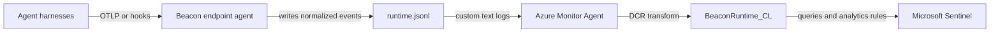

## Forwarding overview

Beacon `v0.0.32` added the [Microsoft Sentinel content pack](/concepts/core-concepts#microsoft-sentinel-content-pack) for teams that want Beacon endpoint events in Log Analytics and Sentinel hunting workflows. Beacon remains the local JSONL producer and writes one source of truth, the active [runtime JSONL log](/concepts/core-concepts#runtime-jsonl-log). Something on the host tails that file and sends new records through a Data Collection Rule (DCR) into a custom Log Analytics table. There are two ways to do that, and both fill the same `BeaconRuntime_CL` table through the same transform:

| Path | Runs on the host | Needs |
|---|---|---|
| Azure Monitor Agent | AMA | An Azure VM, or [Azure Arc](#azure-monitor-agent-outside-azure) on any other machine |
| Vector | The Vector that ships with Beacon | A Microsoft Entra app registration. No Arc and no agent extension. See [Vector and the Logs Ingestion API](#vector-and-the-logs-ingestion-api) |

On a desktop or server outside Azure, the Vector path is usually simpler.

Use this path when you want Sentinel ingestion without storing Azure tenant IDs, client secrets, workspace IDs, DCR identifiers, or ingestion endpoints in Beacon endpoint configuration.

## Runtime log paths

| Mode | Runtime log |
|------|-------------|
| User mode | `~/.beacon/endpoint/logs/runtime.jsonl` |
| System mode | `/var/log/beacon-agent/runtime.jsonl` |

Use system mode for MDM deployments so Azure Monitor Agent can tail `/var/log/beacon-agent/runtime.jsonl` without per-user home directory permissions.

## Prerequisites

- Beacon endpoint installed and writing local JSONL.
- A Log Analytics workspace, with Microsoft Sentinel enabled if you want Sentinel hunting and analytics workflows.
- A custom Log Analytics table named `BeaconRuntime_CL`.
- For the Azure Monitor Agent path: AMA on the endpoint (Azure Arc first, outside Azure) and a DCR associated with it.
- For the Vector path: an Entra app registration, a Data Collection Endpoint, and the Logs Ingestion DCR from the pack.

## Install the Sentinel pack

Generate the Sentinel content pack for a managed system-mode deployment:

```bash title="Generate the Sentinel content pack for a managed system-mode deployment"
sudo /opt/beacon/bin/beacon endpoint sentinel install-pack \
  --system \
  --output ./beacon-sentinel-pack
```

The pack includes:

- `README.md` with setup and validation steps
- `table-schema.json` for the `BeaconRuntime_CL` custom table
- `dcr-template.json` for Azure Monitor Agent custom text log collection
- `dcr-logs-ingestion-template.json` and `vector.toml` for the Vector path
- `dcr-transform.kql` for parsing each Beacon JSONL line
- `queries.kql` with validation and starter hunting queries
- `detections.kql` with example analytics rule logic
- `sample-event.jsonl` with Beacon endpoint sample events

If you use a custom Beacon log path, generate the pack with `--log-path /path/to/runtime.jsonl`. The generated DCR template uses the selected path.

## Sentinel setup

Set up Microsoft Sentinel ingestion from the Azure Portal. If Sentinel is already enabled for your Log Analytics workspace, skip the Sentinel enablement step.


```mermaid
flowchart LR
  agentHarnesses["Agent harnesses"] -->|"OTLP or hooks"| beaconEndpoint["Beacon endpoint agent"]
  beaconEndpoint -->|"writes normalized events"| runtimeLog["runtime.jsonl"]
  runtimeLog -->|"custom text logs"| azureMonitorAgent["Azure Monitor Agent"]
  azureMonitorAgent -->|"DCR transform"| logAnalytics["BeaconRuntime_CL"]
  logAnalytics -->|"queries and analytics rules"| sentinel["Microsoft Sentinel"]
```

### 1. Enable Sentinel if needed

If the workspace does not already have Microsoft Sentinel enabled, open the Azure Portal, search for **Microsoft Sentinel**, click **Create**, select the `agent-beacon-instance` workspace, and click **Add**. Sentinel uses that Log Analytics workspace as its backend.

<Frame caption="Select the Log Analytics workspace to add to Microsoft Sentinel.">
  
</Frame>

### 2. Create the Data Collection Endpoint

Create a Data Collection Endpoint in the same region as the Log Analytics workspace. For the example workspace shown here, use:

| Field | Value |
|-------|-------|
| Name | `dce-agent-beacon-runtime` |
| Resource group | `agent-beacon` |
| Region | `East US` |

If Azure says no Data Collection Endpoint exists during the custom log wizard, create this endpoint first, then return to the wizard.

<Frame caption="Open Data collection endpoints and create a new endpoint if none exists.">
  
</Frame>

<Frame caption="Create the Beacon Data Collection Endpoint in the workspace region.">
  
</Frame>

### 3. Create the Beacon custom table

Open your Log Analytics workspace, such as `agent-beacon-instance`, then go to **Settings** > **Tables**. If you do not see **Tables**, use the search box inside the workspace left navigation and search for **Tables**.

Click **Create** > **New custom log (DCR-based)**. Use:

| Field | Value |
|-------|-------|
| Table name | `BeaconRuntime` |
| Description | `Agent Beacon endpoint runtime telemetry` |
| Table plan | `Analytics` |
| Data collection rule | `dcr-agent-beacon-runtime` |
| Data collection endpoint | `dce-agent-beacon-runtime` |

Enter the table name as `BeaconRuntime`, not `BeaconRuntime_CL`. Azure adds the `_CL` suffix automatically, so the final Log Analytics table is `BeaconRuntime_CL`. If you enter `BeaconRuntime_CL`, Azure may create `BeaconRuntime_CL_CL`.

<Frame caption="Open the Tables page in the Log Analytics workspace.">
  
</Frame>

<Frame caption="Create the Beacon custom log table and Data Collection Rule.">
  
</Frame>

### 4. Configure schema and transformation

In the **Schema and transformation** step, upload `sample-event.jsonl` from the generated Sentinel pack. Do not paste `table-schema.json` into the portal wizard; use it as the reference for the expected columns.

Paste the contents of `dcr-transform.kql` into the transformation editor and confirm the output columns match the `table-schema.json` schema. The key columns are:

| Column | Column | Column |
|--------|--------|--------|
| `TimeGenerated` | `Vendor` | `Product` |
| `SchemaVersion` | `EventKind` | `EventAction` |
| `EventCategory` | `Severity` | `HostName` |
| `UserName` | `HarnessName` | `SessionId` |
| `ToolName` | `CommandLine` | `Repository` |
| `Branch` | `Message` | `ContentRetention` |
| `RawData` | | |

The DCR uses Custom Text Logs because Beacon writes newline-delimited JSON. The transform parses each `RawData` line with `todynamic(RawData)`, projects common hunting columns, preserves the original Beacon event in `RawData`, and routes output to `BeaconRuntime_CL`.

### 5. Choose the ingestion path

Azure Monitor Agent does not run on macOS, so Macs use the [Vector path](#vector-and-the-logs-ingestion-api). The signed macOS package installs Vector at `/opt/beacon/bin/vector`, just like the Linux packages.

For Azure Monitor Agent on Windows or Linux, install AMA on the machine, add a custom text log source pointing at the Beacon runtime log (usually `/var/log/beacon-agent/runtime.jsonl`), apply the Beacon DCR transform, route output to `BeaconRuntime_CL`, and associate the DCR with the machine.

### Azure Monitor Agent outside Azure

AMA is an Azure VM extension. On a machine that is not an Azure VM, you have to onboard it to [Azure Arc](https://learn.microsoft.com/en-us/azure/azure-arc/servers/overview) (`azcmagent connect`) before AMA can be installed. That makes every endpoint an Azure resource, running the Connected Machine agent next to AMA. The DCE's logs ingestion endpoint must be in the workspace's region.

A host that cannot reach Azure at all cannot use either path.

## Vector and the Logs Ingestion API

Vector reads `runtime.jsonl` and posts each line to the [Logs Ingestion API](https://learn.microsoft.com/en-us/azure/azure-monitor/logs/logs-ingestion-api-overview) with an Entra app registration. It needs no Arc, no AMA, and no Azure resource per machine. Vector ships with Beacon: the `.deb`, `.rpm`, and macOS package install it at `/opt/beacon/bin/vector`, and the Linux archive carries it as `beacon-vector`.

Each record carries the original Beacon line as `RawData`. The Logs Ingestion DCR runs the same transform as the AMA path, so the rows are identical either way.

### 1. Azure side, once

1. Create the `BeaconRuntime_CL` table and a Data Collection Endpoint in the workspace's region, as in steps 2 and 3 above.
2. Deploy `dcr-logs-ingestion-template.json` with the workspace and DCE resource IDs. Note the `dcrImmutableId` output.
3. Register an app in Microsoft Entra ID and create a client secret for it.
4. On the DCR, grant the app the **Monitoring Metrics Publisher** role.

### 2. Each host

The host needs outbound HTTPS to `login.microsoftonline.com` and to your DCE's `*.ingest.monitor.azure.com` hostname. Nothing else.

```bash title="Install the config and credentials"
sudo mkdir -p /etc/beacon-sentinel
sudo cp beacon-sentinel-pack/vector.toml /etc/beacon-sentinel/vector.toml
sudo install -m 0600 /dev/null /etc/beacon-sentinel/azure.env
sudo tee /etc/beacon-sentinel/azure.env >/dev/null <<'ENV'
BEACON_SENTINEL_DCE_ENDPOINT=https://<dce>.<region>.ingest.monitor.azure.com
BEACON_SENTINEL_DCR_IMMUTABLE_ID=dcr-...
AZURE_TENANT_ID=...
AZURE_CLIENT_ID=...
AZURE_CLIENT_SECRET=...
ENV
```

```ini title="/etc/systemd/system/beacon-sentinel.service"
[Unit]
Description=Vector: Beacon events to Microsoft Sentinel
After=network-online.target
Wants=network-online.target

[Service]
ExecStart=/opt/beacon/bin/vector --config /etc/beacon-sentinel/vector.toml
EnvironmentFile=/etc/beacon-sentinel/azure.env
DynamicUser=yes
StateDirectory=vector/beacon-sentinel
Restart=always

[Install]
WantedBy=multi-user.target
```

```bash title="Start it"
sudo systemctl daemon-reload
sudo systemctl enable --now beacon-sentinel
```

`DynamicUser` runs Vector as an unprivileged user. It can read the runtime log because Beacon writes it world-readable, and systemd reads `azure.env` as root before dropping privileges. `StateDirectory` creates `/var/lib/vector/beacon-sentinel`, where Vector keeps its read position.

The pack ships a client secret config. Vector also supports a certificate (`azure_credential_kind = "client_certificate_credential"` with `certificate_path`); see the [`azure_logs_ingestion` sink](https://vector.dev/docs/reference/configuration/sinks/azure_logs_ingestion/).

The generated table schema includes columns such as `Vendor`, `Product`, `EventAction`, `Severity`, `HostName`, `UserName`, `HarnessName`, `SessionId`, `ToolName`, `CommandLine`, `Repository`, `Branch`, `Message`, `ContentRetention`, and `RawData`.

## Validate forwarding

Confirm the Beacon runtime log exists and has recent endpoint events:

```bash title="Confirm the Beacon runtime log exists and has recent endpoint events"
sudo /opt/beacon/bin/beacon endpoint status --system --json
sudo test -r /var/log/beacon-agent/runtime.jsonl
```

Write a Sentinel validation event:

```bash title="Write a Sentinel validation event"
sudo /opt/beacon/bin/beacon endpoint sentinel validate --system
```

After Azure Monitor Agent ships the new line, validate in Microsoft Sentinel or Log Analytics:

```kql
BeaconRuntime_CL
| where TimeGenerated > ago(24h)
| where Message has "Beacon endpoint Sentinel validation event"
| order by TimeGenerated desc
```

If the validation query does not return data, check the DCR association, Azure Monitor Agent health state, configured file path, and table schema. On the Vector path, check `journalctl -u beacon-sentinel` for authentication errors and confirm the app has Monitoring Metrics Publisher on the DCR. Role assignments can take several minutes to apply. The target table must exist before the DCR can route transformed records to it.

## Hunting content

Use `queries.kql` for validation and starter hunting queries, including recent Beacon events, command execution, sensitive file edits, high tool-call volume, and new or rare agent runtimes.

Use `detections.kql` as example analytics rule logic. Review and tune thresholds, repository names, content handling policy, and severity mappings before enabling alerts in production.

## CEF, syslog, and direct APIs

Microsoft Sentinel can also collect CEF and Syslog through Azure Monitor Agent, but the generated Beacon pack uses custom logs because Beacon events are rich structured JSON with prompts, tool calls, commands, files, runtime metadata, and optional raw fields. Flattening those events into CEF loses useful context.

Beacon's own endpoint config never holds Azure credentials. On the Vector path, the Entra secret, DCR ID, and ingestion endpoint live only in the Vector service's environment file. Vector does the batching and retries.

## Content handling

Beacon applies redaction, sanitization, truncation, and event-size limits before events are written to `runtime.jsonl` and forwarded to Microsoft Sentinel. Review workspace access, table retention, analytics rules, and downstream consumers so retained telemetry matches your approved collection policy.

## Related

<Columns cols={2}>
  <Card title="beacon endpoint sentinel" icon="terminal" href="/cli/sentinel">
    Review Microsoft Sentinel command syntax, flags, and examples.
  </Card>
  <Card title="Log forwarding" icon="tower-broadcast" href="/log-forwarding">
    Review forwarding patterns across Wazuh, Splunk HEC, Falcon LogScale, Elastic, Datadog, Sumo Logic, Rapid7, Microsoft Sentinel, and customer-managed pipelines.
  </Card>
  <Card title="Endpoint event schema" icon="code" href="/telemetry-schema/event-schema">
    Review normalized Beacon JSONL fields and example events.
  </Card>
  <Card title="Agent harness integrations" icon="list-check" href="/runtimes">
    Review supported agent harnesses, deployment modes, storage, and forwarding.
  </Card>
</Columns>
