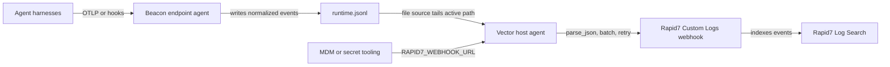

## Forwarding Overview

Beacon `v0.0.25` added Rapid7 InsightIDR support for teams that want Beacon endpoint events in Rapid7 Log Search and investigations. Current Beacon releases write one local source of truth, the active [runtime JSONL log](/concepts/core-concepts#runtime-jsonl-log), and keep that handoff path bounded with local rotation. Your customer-managed shipper or deployment tooling owns Rapid7 webhook URLs, checkpointing, rotation handling, and retries.

Use this path when you want Beacon events forwarded to a Rapid7 InsightIDR Custom Logs webhook event source without storing Rapid7 webhook URLs in Beacon endpoint configuration.

## Runtime log paths

| Mode | Runtime log |
|------|-------------|
| User mode | `~/.beacon/endpoint/logs/runtime.jsonl` |
| System mode | `/var/log/beacon-agent/runtime.jsonl` |

Use system mode for MDM deployments so your shipper can tail `/var/log/beacon-agent/runtime.jsonl` without per-user home directory permissions.

## Rapid7 setup

Create a Rapid7 InsightIDR Custom Logs event source with the Webhook collection method.

<Frame caption="Add a new Rapid7 InsightIDR event source for Beacon endpoint telemetry.">
  
</Frame>

Recommended setup:

```text
Data Collection > Setup Event Source > Add Event Source > Raw Data > Custom Logs
Collection Method: Webhook
Name: Asymptote Agent Beacon
JSON Events Key: leave blank for Beacon NDJSON payloads
```

<Frame caption="Choose Raw Data > Custom Logs for the Beacon event source.">
  
</Frame>

Rapid7 webhook URLs are bearer destinations. Store the generated URL securely as `RAPID7_WEBHOOK_URL` for smoke testing or in your customer-managed forwarder. Avoid committing it to endpoint configuration or source control.

<Frame caption="Configure the Custom Logs source with the Webhook collection method.">
  
</Frame>

## Install the Rapid7 pack

Generate the Rapid7 content pack for a managed system-mode deployment:

```bash title="Generate the Rapid7 content pack for a managed system-mode deployment"
sudo /opt/beacon/bin/beacon endpoint rapid7 install-pack \
  --system \
  --output ./beacon-rapid7-pack
```

The pack includes:

- `README.md` with setup and validation steps
- `rapid7-upload-smoke-test.sh` for one-shot NDJSON validation uploads
- `vector.toml` for customer-managed Vector forwarding
- `sample-event.jsonl` with Beacon endpoint sample events

If you use a custom Beacon log path, generate the pack with `--log-path /path/to/runtime.jsonl`. The generated `rapid7-upload-smoke-test.sh` and `vector.toml` use the selected path.

## One-shot smoke test

Use the generated smoke-test script to upload the current runtime log once. This is only for validation because it re-uploads the whole file every time.

```bash title="Command example"
export RAPID7_WEBHOOK_URL="https://..."
./beacon-rapid7-pack/rapid7-upload-smoke-test.sh
```

You can override the Beacon log path:

```bash title="You can override the Beacon log path"
export BEACON_LOG="/var/log/beacon-agent/runtime.jsonl"
```

The script sends `Content-Type: application/x-ndjson` and preserves one Beacon event per line. Rapid7 InsightIDR Custom Logs treats each NDJSON line as an individual event.

## Production forwarding

For production, use the generated Vector config as a customer-managed host-agent forwarding template. Beacon remains the local JSONL producer; Vector tails `runtime.jsonl`, checkpoints file offsets in its `data_dir`, batches Beacon events, and posts newline-delimited JSON to the Rapid7 Custom Logs webhook.



Install Vector using your normal endpoint management tooling, then copy the generated config into Vector's config directory. On a macOS system-mode Beacon deployment, the generated config tails `/var/log/beacon-agent/runtime.jsonl`:

```bash title="Install Vector using your normal endpoint management tooling, then copy the generated config into Vector's config directory. On a macOS system-mode Beacon deployment, the generated config tails /var/log/beacon-agent/runtime.jsonl"
sudo mkdir -p /etc/vector
sudo cp ./beacon-rapid7-pack/vector.toml /etc/vector/beacon-rapid7.toml
export RAPID7_WEBHOOK_URL="https://..."
vector validate /etc/vector/beacon-rapid7.toml
vector --config /etc/vector/beacon-rapid7.toml
```

In managed deployments, provide `RAPID7_WEBHOOK_URL` through the Vector service environment or your MDM/secret tooling. Do not store Rapid7 webhook URLs in Beacon endpoint configuration.

The template expects a Vector version with the `file` source, `remap` transform, and `http` sink. It parses each Beacon JSONL line and re-encodes the original Beacon event as JSON with newline-delimited framing so Rapid7 receives one Beacon event per line, without a Vector wrapper.

If you adapt the config or use another forwarder, it should:

- Checkpoint file offsets.
- Follow Beacon's local file rotation at the active `runtime.jsonl` path.
- Keep each Beacon event as one JSON object per line.
- Batch newline-delimited JSON records.
- Send `Content-Type: application/x-ndjson`.
- Retry transient failures without duplicating the whole file.
- Keep the Rapid7 webhook URL outside Beacon endpoint configuration.

## Validate forwarding

Confirm the Beacon runtime log exists and has recent endpoint events:

```bash title="Confirm the Beacon runtime log exists and has recent endpoint events"
sudo /opt/beacon/bin/beacon endpoint status --system --json
sudo test -r /var/log/beacon-agent/runtime.jsonl
```

Write a Rapid7 validation event:

```bash title="Write a Rapid7 validation event"
sudo /opt/beacon/bin/beacon endpoint rapid7 validate --system
```

Run the one-shot smoke test or wait for your production forwarder to ship the new line. In Rapid7 Log Search, start with the Custom Logs event source and search for:

```text
"Beacon endpoint Rapid7 validation event"
```

You can also confirm normalized Beacon fields are present:

```text
vendor=beacon product=endpoint-agent destination.type=rapid7
```

If events do not appear, verify that your forwarder is reading the same runtime log path Beacon writes, that the webhook URL is current, and that each Beacon JSONL line is preserved as a distinct event.

## Content Handling

Beacon applies redaction, sanitization, truncation, and event-size limits before events are written to `runtime.jsonl` and forwarded to Rapid7. Review event source access, retention, and downstream consumers so retained telemetry matches your approved collection policy.

## Related

<Columns cols={2}>
  <Card title="beacon endpoint rapid7" icon="terminal" href="/cli/rapid7">
    Review Rapid7 command syntax, flags, and examples.
  </Card>
  <Card title="Log forwarding" icon="tower-broadcast" href="/log-forwarding">
    Review forwarding patterns across Wazuh, Splunk HEC, Falcon LogScale, Elastic, Datadog, Sumo Logic, Rapid7, and customer-managed pipelines.
  </Card>
  <Card title="Endpoint event schema" icon="code" href="/telemetry-schema/event-schema">
    Review normalized Beacon JSONL fields and example events.
  </Card>
  <Card title="Agent harness integrations" icon="list-check" href="/runtimes">
    Review supported agent harnesses, deployment modes, storage, and forwarding.
  </Card>
</Columns>
