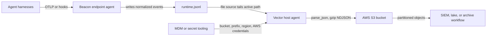

## Forwarding Overview

Beacon `v0.0.37` added the [AWS S3 content pack](/concepts/core-concepts#aws-s3-content-pack) for teams that want Beacon endpoint events stored in an S3 bucket for data lake, SIEM, archive, or downstream detection workflows. Beacon remains the local JSONL producer and writes one source of truth, the active [runtime JSONL log](/concepts/core-concepts#runtime-jsonl-log). Your customer-managed [Vector forwarding](/concepts/core-concepts#vector-forwarding) agent tails that file and uploads gzip-compressed NDJSON objects to S3.

Use this path when you want Beacon events forwarded to S3 without storing AWS credentials, bucket policy, lifecycle, retention, or encryption settings in Beacon endpoint configuration.

## Runtime log paths

| Mode | Runtime log |
|------|-------------|
| User mode | `~/.beacon/endpoint/logs/runtime.jsonl` |
| System mode | `/var/log/beacon-agent/runtime.jsonl` |

Use system mode for MDM deployments so Vector can tail `/var/log/beacon-agent/runtime.jsonl` without per-user home directory permissions.

## Prerequisites

- Beacon endpoint installed and writing local JSONL.
- An AWS S3 bucket for Beacon runtime logs.
- Vector installed or deployable through your endpoint-management tooling.
- An IAM role or credentials available through the standard AWS credential provider chain for the process running Vector or the AWS CLI smoke test.

Recommended object layout:

```text
s3://example-security-logs/beacon/runtime/date=YYYY-MM-DD/<timestamp>-<uuid>.jsonl.gz
```

Example least-privilege IAM policy for a dedicated Beacon prefix:

```json
{
  "Version": "2012-10-17",
  "Statement": [
    {
      "Effect": "Allow",
      "Action": ["s3:PutObject"],
      "Resource": "arn:aws:s3:::example-security-logs/beacon/runtime/*"
    }
  ]
}
```

Add `s3:PutObjectTagging`, KMS permissions, or bucket-specific conditions only if your AWS controls require them. Configure bucket lifecycle, retention, server-side encryption, and access logging in AWS.

## Install the S3 pack

Generate the AWS S3 content pack for a managed system-mode deployment:

```bash title="Generate the AWS S3 content pack for a managed system-mode deployment"
sudo /opt/beacon/bin/beacon endpoint s3 install-pack \
  --system \
  --output ./beacon-s3-pack
```

The pack includes:

- `README.md` with setup and validation steps
- `s3-upload-smoke-test.sh` for one-shot AWS CLI validation uploads
- `vector.toml` for customer-managed Vector forwarding
- `sample-event.jsonl` with Beacon endpoint sample events

If you use a custom Beacon log path, generate the pack with `--log-path /path/to/runtime.jsonl`. The generated `s3-upload-smoke-test.sh` and `vector.toml` use the selected path.

## One-shot smoke test

Use the generated smoke-test script to upload the current runtime log once. This is only for validation because it re-uploads the whole file every time.

```bash title="Command example"
export BEACON_S3_BUCKET="example-security-logs"
export BEACON_S3_PREFIX="beacon/runtime"
export AWS_REGION="us-east-1"
./beacon-s3-pack/s3-upload-smoke-test.sh
```

The script uses `aws s3 cp` and the standard AWS credential provider chain. You can provide credentials with an instance profile, SSO/profile configuration, environment variables, or your managed endpoint secret tooling. Beacon does not store AWS credentials.

Confirm the uploaded object:

```bash title="Confirm the uploaded object"
aws s3 ls "s3://${BEACON_S3_BUCKET}/${BEACON_S3_PREFIX}/smoke-tests/" --region "$AWS_REGION"
aws s3 cp "s3://${BEACON_S3_BUCKET}/${BEACON_S3_PREFIX}/smoke-tests/<object>.jsonl" - --region "$AWS_REGION" | grep "Beacon endpoint S3 validation event"
```

## Production forwarding

For production, use the generated Vector config as a customer-managed host-agent forwarding template. Beacon remains the local JSONL producer; Vector tails `runtime.jsonl`, checkpoints file offsets in its `data_dir`, batches Beacon events, and writes gzip-compressed newline-delimited JSON objects into AWS S3.



Install Vector using your normal endpoint management tooling, then copy the generated config into Vector's config directory. On a macOS system-mode Beacon deployment, the generated config tails `/var/log/beacon-agent/runtime.jsonl`:

```bash title="Install Vector using your normal endpoint management tooling, then copy the generated config into Vector's config directory. On a macOS system-mode Beacon deployment, the generated config tails /var/log/beacon-agent/runtime.jsonl"
sudo mkdir -p /etc/vector
sudo cp ./beacon-s3-pack/vector.toml /etc/vector/beacon-s3.toml
export BEACON_S3_BUCKET="example-security-logs"
export BEACON_S3_PREFIX="beacon/runtime"
export AWS_REGION="us-east-1"
vector validate /etc/vector/beacon-s3.toml
vector --config /etc/vector/beacon-s3.toml
```

In managed deployments, provide `BEACON_S3_BUCKET`, optional `BEACON_S3_PREFIX`, `AWS_REGION`, optional `BEACON_S3_STORAGE_CLASS`, and any AWS credential-provider settings through the Vector service environment, host identity, or MDM/secret tooling. Do not store AWS destination secrets in Beacon endpoint configuration.

The template expects a Vector version with the `file` source, `remap` transform, and `aws_s3` sink. It parses each Beacon JSONL line and re-encodes the original Beacon event as JSON with newline-delimited framing so S3 receives one Beacon event per line, without a Vector wrapper.

The template uses date-partitioned `key_prefix`, `filename_time_format = "%s"`, and `filename_append_uuid = true` so production forwarding does not overwrite previous S3 objects. It also sets `compression = "gzip"`, `content_encoding = "gzip"`, and `content_type = "application/x-ndjson"`.

If you adapt the config or use another forwarder, it should:

- Checkpoint file offsets.
- Follow Beacon's local file rotation at the active `runtime.jsonl` path.
- Keep each Beacon event as one JSON object per line.
- Batch newline-delimited JSON records.
- Use non-overwriting object keys.
- Retry transient failures without duplicating the whole file.
- Keep AWS credentials, IAM roles, bucket policy, lifecycle, and encryption outside Beacon endpoint configuration.

## Validate forwarding

Confirm the Beacon runtime log exists and has recent endpoint events:

```bash title="Confirm the Beacon runtime log exists and has recent endpoint events"
sudo /opt/beacon/bin/beacon endpoint status --system --json
sudo test -r /var/log/beacon-agent/runtime.jsonl
```

Write an S3 validation event:

```bash title="Write an S3 validation event"
sudo /opt/beacon/bin/beacon endpoint s3 validate --system
```

Run the one-shot smoke test or wait for your production forwarder to ship the new line. Beacon can write the local validation event, but remote delivery must be confirmed with AWS tooling:

```bash title="Run the one-shot smoke test or wait for your production forwarder to ship the new line. Beacon can write the local validation event, but remote delivery must be confirmed with AWS tooling"
aws s3 ls "s3://${BEACON_S3_BUCKET}/${BEACON_S3_PREFIX}/" --recursive --region "$AWS_REGION"
aws s3 cp "s3://${BEACON_S3_BUCKET}/${BEACON_S3_PREFIX}/date=<date>/<object>.jsonl.gz" - --region "$AWS_REGION" | gzip -dc | grep "Beacon endpoint S3 validation event"
```

Expected validation fields:

```text
vendor=beacon product=endpoint-agent destination.type=s3 destination.mode=aws_s3_jsonl
```

If events do not appear, verify that Vector is reading the same runtime log path Beacon writes, that the AWS credential provider chain is available to the Vector process, that the bucket and prefix match your environment variables, and that IAM allows `s3:PutObject` for the selected prefix.

## Content Handling

Beacon applies redaction, sanitization, truncation, and event-size limits before events are written to `runtime.jsonl` and forwarded to S3. Review bucket access, lifecycle, retention, and downstream consumers so retained telemetry matches your approved collection policy.

## Related

<Columns cols={2}>
  <Card title="beacon endpoint s3" icon="terminal" href="/cli/s3">
    Review AWS S3 command syntax, flags, and examples.
  </Card>
  <Card title="Log forwarding" icon="tower-broadcast" href="/log-forwarding">
    Review forwarding patterns across Wazuh, Splunk HEC, Falcon LogScale, Elastic, Datadog, Sumo Logic, Rapid7, Microsoft Sentinel, AWS S3, Google Cloud Storage, and customer-managed pipelines.
  </Card>
  <Card title="Google Cloud Storage forwarding" icon="chart-line" href="/log-forwarding/gcs">
    Configure Vector forwarding from Beacon JSONL into Google Cloud Storage.
  </Card>
  <Card title="Endpoint event schema" icon="code" href="/telemetry-schema/event-schema">
    Review normalized Beacon JSONL fields and example events.
  </Card>
  <Card title="Agent harness integrations" icon="list-check" href="/runtimes">
    Review supported agent harnesses, deployment modes, storage, and forwarding.
  </Card>
</Columns>
