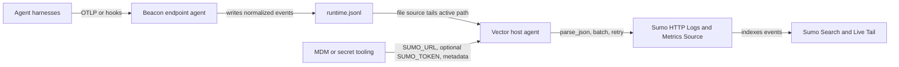

## Forwarding Overview

Beacon `v0.0.20` added Sumo Logic support for teams that want Beacon endpoint events in Sumo Logic search, Live Tail, dashboards, and investigations. Current Beacon releases write one local source of truth, the active [runtime JSONL log](/concepts/core-concepts#runtime-jsonl-log), and keep that handoff path bounded with local rotation. Your customer-managed shipper or deployment tooling owns Sumo Source URLs, tokens, checkpointing, rotation handling, and retries.

Use this path when you want Beacon events forwarded to a Sumo Logic Hosted Collector HTTP Logs & Metrics Source without storing Sumo credentials in Beacon endpoint configuration.

## Runtime log paths

| Mode | Runtime log |
|------|-------------|
| User mode | `~/.beacon/endpoint/logs/runtime.jsonl` |
| System mode | `/var/log/beacon-agent/runtime.jsonl` |

Use system mode for MDM deployments so your shipper can tail `/var/log/beacon-agent/runtime.jsonl` without per-user home directory permissions.

## Sumo Logic setup

Create or reuse a Sumo Logic Hosted Collector, then add an HTTP Logs & Metrics Source for Beacon endpoint events.

<Frame caption="Create or reuse a Hosted Collector for Beacon endpoint telemetry.">
  
</Frame>

Configure the HTTP Logs & Metrics Source with source metadata your team can search and route consistently:

```text
_sourceCategory=security/agentbeacon
source name=agentbeacon
fields=product=agentbeacon,telemetry=ai_agent,env=prod
```

<Frame caption="Configure an HTTP Logs & Metrics Source for Beacon JSONL events.">
  
</Frame>

If you use Sumo fields, confirm the fields exist and are enabled in the Sumo Fields table schema so they are not dropped at ingest.

## Source URL and token

Copy the Source URL from the HTTP Logs & Metrics Source. You can use either:

- A presigned Source URL in `SUMO_URL`.
- Sumo's Auth Header URL in `SUMO_URL` with the separate token in `SUMO_TOKEN`.

<Frame caption="Use the Auth Header option when you want the URL and `x-sumo-token` separated.">
  
</Frame>

Keep the Source URL and token in your log shipper, endpoint-management secret store, or deployment tooling. Beacon does not store them.

## Install the Sumo pack

Generate the Sumo Logic content pack for a managed system-mode deployment:

```bash title="Generate the Sumo Logic content pack for a managed system-mode deployment"
sudo /opt/beacon/bin/beacon endpoint sumo install-pack \
  --system \
  --output ./beacon-sumo-pack
```

The pack includes:

- `README.md` with setup and validation steps
- `sumo-upload-smoke-test.sh` for one-shot validation uploads
- `vector.toml` for customer-managed Vector forwarding
- `sample-event.jsonl` with Beacon endpoint sample events

If you use a custom Beacon log path, generate the pack with `--log-path /path/to/runtime.jsonl`. The generated `sumo-upload-smoke-test.sh` and `vector.toml` use the selected path.

## One-shot smoke test

Use the generated smoke-test script to upload the current runtime log once. This is only for validation because it re-uploads the whole file every time.

With a presigned Sumo Source URL:

```bash title="With a presigned Sumo Source URL"
export SUMO_URL="https://collectors.sumologic.com/receiver/v1/http/..."
./beacon-sumo-pack/sumo-upload-smoke-test.sh
```

With Sumo's Auth Header option:

```bash title="With Sumo's Auth Header option"
export SUMO_URL="https://collectors.sumologic.com/receiver/v1/http"
export SUMO_TOKEN="..."
./beacon-sumo-pack/sumo-upload-smoke-test.sh
```

You can override the default metadata:

```bash title="You can override the default metadata"
export BEACON_LOG="/var/log/beacon-agent/runtime.jsonl"
export SUMO_SOURCE_CATEGORY="security/agentbeacon"
export SUMO_FIELDS="product=agentbeacon,telemetry=ai_agent,env=prod"
```

The script uses `curl -T` so JSONL line breaks are preserved for Sumo message boundary detection.

## Production forwarding

For production, use the generated Vector config as a customer-managed host-agent forwarding template. Beacon remains the local JSONL producer; Vector tails `runtime.jsonl`, checkpoints file offsets in its `data_dir`, batches Beacon events, and posts newline-delimited JSON to the HTTP Logs & Metrics Source.



Install Vector using your normal endpoint management tooling, then copy the generated config into Vector's config directory. On a macOS system-mode Beacon deployment, the generated config tails `/var/log/beacon-agent/runtime.jsonl`:

```bash title="Install Vector using your normal endpoint management tooling, then copy the generated config into Vector's config directory. On a macOS system-mode Beacon deployment, the generated config tails /var/log/beacon-agent/runtime.jsonl"
sudo mkdir -p /etc/vector
sudo cp ./beacon-sumo-pack/vector.toml /etc/vector/beacon-sumo.toml
export SUMO_URL="https://collectors.sumologic.com/receiver/v1/http/..."
export SUMO_TOKEN="..."
vector validate /etc/vector/beacon-sumo.toml
vector --config /etc/vector/beacon-sumo.toml
```

`SUMO_TOKEN` is optional when `SUMO_URL` is a presigned Source URL. In managed deployments, provide `SUMO_URL`, optional `SUMO_TOKEN`, `SUMO_SOURCE_CATEGORY`, and `SUMO_FIELDS` through the Vector service environment or your MDM/secret tooling. Do not store Sumo destination secrets in Beacon endpoint configuration.

The template expects a Vector version with the `file` source, `remap` transform, and `http` sink. It parses each Beacon JSONL line and re-encodes the original Beacon event as JSON with newline-delimited framing so Sumo receives one Beacon event per line, without a Vector wrapper.

If you adapt the config, use Sumo's OpenTelemetry Collector distribution, or use another forwarder, it should:

- Checkpoint file offsets.
- Follow Beacon's local file rotation at the active `runtime.jsonl` path.
- Keep each Beacon event as one JSON object per line.
- Batch newline-delimited JSON records.
- Keep uncompressed POST payloads near Sumo's 100 KB to 1 MB guidance.
- Gzip payloads with `Content-Encoding: gzip`.
- Retry transient failures without duplicating the whole file.

In the Sumo HTTP Source advanced log options, avoid `One Message Per Request` when sending batched JSONL payloads. Use automatic message boundary detection or a boundary configuration that treats each JSON line as a distinct log record.

## Validate forwarding

Confirm the Beacon runtime log exists and has recent endpoint events:

```bash title="Confirm the Beacon runtime log exists and has recent endpoint events"
sudo /opt/beacon/bin/beacon endpoint status --system --json
sudo test -r /var/log/beacon-agent/runtime.jsonl
```

Write a Sumo Logic validation event:

```bash title="Write a Sumo Logic validation event"
sudo /opt/beacon/bin/beacon endpoint sumo validate --system
```

Run the one-shot smoke test or wait for your production forwarder to ship the new line. In Sumo Logic, validate with Live Tail first because normal Search can lag while data is indexed.

Suggested Live Tail or Search filters:

```text
_sourceCategory=security/agentbeacon product=agentbeacon telemetry=ai_agent
```

```text
_sourceCategory=security/agentbeacon "Beacon endpoint Sumo validation event"
```

<Frame caption="Search Beacon endpoint events in Sumo Logic after forwarding starts.">
  
</Frame>

If events do not appear, verify that your forwarder is reading the same runtime log path Beacon writes, that the Source URL or Auth Header token is current, that `X-Sumo-Category` and `X-Sumo-Fields` match your searches, and that message boundary detection treats each JSONL line as a distinct event.

## Content Handling

Beacon applies redaction, sanitization, truncation, and event-size limits before events are written to `runtime.jsonl` and forwarded to Sumo Logic. Review source access, retention, and downstream consumers so retained telemetry matches your approved collection policy.

## Related

<Columns cols={2}>
  <Card title="beacon endpoint sumo" icon="terminal" href="/cli/sumo">
    Review Sumo Logic command syntax, flags, and examples.
  </Card>
  <Card title="Log forwarding" icon="tower-broadcast" href="/log-forwarding">
    Review forwarding patterns across Wazuh, Splunk HEC, Falcon LogScale, Elastic, Datadog, Sumo Logic, Rapid7, and customer-managed pipelines.
  </Card>
  <Card title="Endpoint event schema" icon="code" href="/telemetry-schema/event-schema">
    Review normalized Beacon JSONL fields and example events.
  </Card>
  <Card title="Agent harness integrations" icon="list-check" href="/runtimes">
    Review supported agent harnesses, deployment modes, storage, and forwarding.
  </Card>
</Columns>
