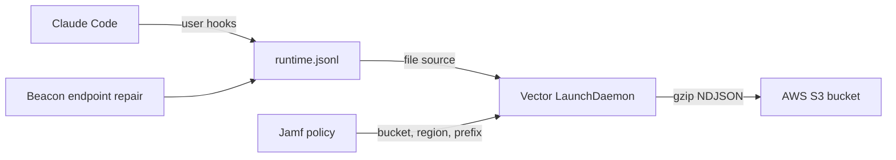

## S3 Forwarding Overview

Use this flow to test a managed Claude Code deployment on a pilot Mac where Beacon writes local endpoint events to `/var/log/beacon-agent/runtime.jsonl` and a packaged Vector service forwards those events to AWS S3.

Beacon remains the local JSONL producer. AWS credentials, bucket policy, encryption, lifecycle, retention, and access logging stay in AWS, host identity, or MDM secret tooling.



## Package Requirements

Build or obtain a signed and notarized Beacon macOS package that includes:

```text
/opt/beacon/bin/beacon
/opt/beacon/bin/beacon-otelcol
/opt/beacon/bin/vector
/opt/beacon/jamf/claude/common/repair-hooks.sh
/opt/beacon/jamf/claude/s3/install-forwarder.sh
/opt/beacon/jamf/claude/s3/repair-hooks-and-forwarder.sh
/opt/beacon/jamf/claude/s3/run-forwarder.sh
```

These packaged helpers come from the repository paths:

- [`packaging/macos/jamf/claude/common/repair-hooks.sh`](https://github.com/Asymptote-Labs/agent-beacon/blob/main/packaging/macos/jamf/claude/common/repair-hooks.sh)
- [`packaging/macos/jamf/claude/s3/install-forwarder.sh`](https://github.com/Asymptote-Labs/agent-beacon/blob/main/packaging/macos/jamf/claude/s3/install-forwarder.sh)
- [`packaging/macos/jamf/claude/s3/repair-hooks-and-forwarder.sh`](https://github.com/Asymptote-Labs/agent-beacon/blob/main/packaging/macos/jamf/claude/s3/repair-hooks-and-forwarder.sh)
- [`packaging/macos/jamf/claude/s3/run-forwarder.sh`](https://github.com/Asymptote-Labs/agent-beacon/blob/main/packaging/macos/jamf/claude/s3/run-forwarder.sh)

When building from source, pass a Vector binary into the package build:

```bash
BEACON_VECTOR_BIN=/path/to/vector \
BEACON_APP_SIGN_IDENTITY="Developer ID Application: Example Team" \
PKG_SIGN_IDENTITY="Developer ID Installer: Example Team" \
NOTARYTOOL_PROFILE="notarytool-profile" \
  sh packaging/macos/build-pkg.sh
```

`BEACON_APP_SIGN_IDENTITY` signs the payload binaries with hardened runtime. `PKG_SIGN_IDENTITY` signs the package with `pkgbuild`. `NOTARYTOOL_PROFILE` submits the package to Apple notary service and staples the result.

## AWS Setup

Create a dedicated bucket prefix for the pilot and grant the identity used by the Vector process permission to write only that prefix:

```json
{
  "Version": "2012-10-17",
  "Statement": [
    {
      "Effect": "Allow",
      "Action": ["s3:PutObject"],
      "Resource": "arn:aws:s3:::example-security-logs/beacon/claude/*"
    }
  ]
}
```

Provide AWS credentials through host identity, MDM secret tooling, or the standard AWS credential provider chain available to the LaunchDaemon. When `AWS_ACCESS_KEY_ID`, `AWS_SECRET_ACCESS_KEY`, `AWS_SESSION_TOKEN`, `AWS_PROFILE`, `AWS_SHARED_CREDENTIALS_FILE`, `AWS_CONFIG_FILE`, `AWS_WEB_IDENTITY_TOKEN_FILE`, or `AWS_ROLE_ARN` are present in the MDM script environment, the helper persists them to the root-owned forwarder environment file so launchd-started Vector can use them. Do not place AWS access keys in Beacon endpoint configuration.

## Jamf Policy

Install the Beacon package first, then run the combined helper from a policy scoped to the pilot Mac:

```bash
/opt/beacon/jamf/claude/s3/repair-hooks-and-forwarder.sh "$@"
```

Environment variables take precedence over Jamf parameters:

| Parameter | Environment variable | Value |
| --- | --- | --- |
| 4 | `BEACON_S3_BUCKET` | Required S3 bucket name |
| 5 | `AWS_REGION` | Required AWS region |
| 6 | `BEACON_S3_PREFIX` | Optional prefix, default `beacon/runtime` |
| 7 | `BEACON_S3_STORAGE_CLASS` | Optional storage class, default `STANDARD` |
| 8 | `BEACON_VECTOR_READ_FROM` | Optional Vector read position, default `end` |
| 9 | `BEACON_OTLP_GRPC_PORT` | Optional Beacon OTLP gRPC port, default `4317` |
| 10 | `BEACON_OTLP_HTTP_PORT` | Optional Beacon OTLP HTTP port, default `4318` |

The S3 helper also persists any standard AWS provider-chain environment variables listed above when they are set. This supports MDM secret injection without baking secrets into the package.

The helper:

- writes `/Library/Application Support/Beacon/Forwarders/s3-vector.toml`
- writes `/Library/Application Support/Beacon/Forwarders/s3-vector.env` with mode `0600`
- starts `com.beacon.endpoint.s3-forwarder`
- repairs the Beacon system endpoint
- prepares `/var/log/beacon-agent/runtime.jsonl` for user-run hooks
- installs Claude Code hooks for the interactive console user
- writes a manual Claude hook smoke event

## Manual Pilot Command

For a one-Mac pilot without Jamf policy parameters, install the signed package and run:

```bash
sudo BEACON_S3_BUCKET="example-security-logs" \
  AWS_REGION="us-west-2" \
  AWS_ACCESS_KEY_ID="AKIA..." \
  AWS_SECRET_ACCESS_KEY="..." \
  BEACON_S3_PREFIX="beacon/claude" \
  /opt/beacon/jamf/claude/s3/repair-hooks-and-forwarder.sh
```

Fully restart Claude Code after the hook install, then start a new Claude session to generate real hook events.

## Validate Delivery

Confirm local state on the Mac:

```bash
sudo /opt/beacon/bin/beacon endpoint status --system --json
sudo test -r /var/log/beacon-agent/runtime.jsonl
sudo launchctl print system/com.beacon.endpoint.s3-forwarder
```

Write a Beacon S3 validation event:

```bash
sudo /opt/beacon/bin/beacon endpoint s3 validate --system
```

Confirm an object arrives in S3:

```bash
aws s3 ls "s3://${BEACON_S3_BUCKET}/${BEACON_S3_PREFIX}/" \
  --recursive \
  --region "$AWS_REGION"

aws s3 cp "s3://${BEACON_S3_BUCKET}/${BEACON_S3_PREFIX}/date=<date>/<object>.jsonl.gz" - \
  --region "$AWS_REGION" | gzip -dc | grep "Beacon endpoint S3 validation event"
```

S3 objects are gzip-compressed newline-delimited JSON with non-overwriting names under:

```text
s3://<bucket>/<prefix>/date=YYYY-MM-DD/<timestamp>-<uuid>.jsonl.gz
```

## Troubleshooting

If objects do not arrive, check that Vector is running, that `/tmp/com.beacon.endpoint.s3-forwarder.err` is empty or actionable, that the env file contains the expected bucket and region, and that the identity available to the Vector LaunchDaemon has `s3:PutObject` for the selected prefix.

If Claude hook events do not appear in `/var/log/beacon-agent/runtime.jsonl`, rerun the policy while an interactive user is logged in, then fully restart Claude Code.
