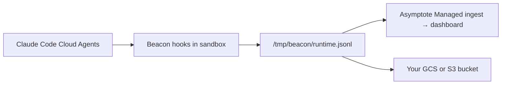

<Frame>
  <iframe
    src="https://www.loom.com/embed/5de72ffb97d7409db292119aada1218b?t=0s"
    title="Claude Code Cloud Agents walkthrough"
    allowFullScreen
    style={{ aspectRatio: "16 / 9", width: "100%", border: 0 }}
  />
</Frame>

## Overview

Use this integration to capture Claude Code cloud-agent activity and send each
session log to one of three places: [Asymptote Managed](/deployment/managed),
where it appears in your dashboard next to your laptops' sessions, or a Google
Cloud Storage or Amazon S3 bucket you own.

This flow depends on the Beacon CLI. You run `beacon cloud` commands from your
workstation to create a bucket upload path if you want one, print Claude
environment variables, and generate the setup script that runs inside the Claude
cloud sandbox.

## How it works

Claude Code Cloud Agents run in Anthropic's cloud environment, so Beacon cannot
use the long-running endpoint agent that local installs use. Instead, the setup
script installs Beacon hooks inside the sandbox. During a cloud-agent session,
those hooks write `/tmp/beacon/runtime.jsonl`. When the agent stops, Beacon
ships that file: to Asymptote Managed it posts the new lines to the same ingest
endpoint the laptop forwarder uses, so the session shows up in the dashboard a
minute or two later; to a bucket it uploads the whole file as one object.


```mermaid
flowchart LR
  ClaudeWeb["Claude Code Cloud Agents"] --> Hooks["Beacon hooks in sandbox"]
  Hooks --> RuntimeLog["/tmp/beacon/runtime.jsonl"]
  RuntimeLog --> Managed["Asymptote Managed ingest → dashboard"]
  RuntimeLog --> Storage["Your GCS or S3 bucket"]
```

The setup has three parts:

1. Get a device key from Asymptote, or create a GCS or S3 upload path with Beacon.
2. Add Beacon cloud telemetry environment variables to the Claude Code cloud environment.
3. Paste a Beacon-generated setup script into the Claude cloud environment.

With Asymptote Managed, the sessions land in the same per-organization tables as
your endpoints' telemetry, attributed to the device you created for the cloud
environment. With a bucket, each Claude Code cloud agent session writes one
readable JSONL object:

```text
gs://<bucket>/<prefix>/runtime/date=YYYY-MM-DD/<timestamp>-claude_code_web-<claude_session_id>.jsonl.gz
```

or:

```text
s3://<bucket>/<prefix>/runtime/date=YYYY-MM-DD/<timestamp>-claude_code_web-<claude_session_id>.jsonl.gz
```

## Prerequisites

- Beacon CLI `v0.0.51` or later.
- For GCS: `gcloud` installed and authenticated to the Google Cloud project you
  will use for telemetry storage.
- For S3: AWS CLI installed and authenticated to an AWS account where you can
  create buckets, IAM users, inline IAM policies, and access keys.
- Claude Code cloud agent access for the repository you want to test.
- A Claude cloud environment with outbound access to:
  - For Asymptote Managed: the ingest host from your device key hand-off
    (currently `beacon-ingest-gulcylfs4a-uw.a.run.app`)
  - For GCS: `oauth2.googleapis.com` and `storage.googleapis.com`
  - For S3: `s3.<region>.amazonaws.com`
  - `github.com`
  - `*.githubusercontent.com`

Install or upgrade Beacon before you start:

```bash
brew tap asymptote-labs/tap
brew install beacon
brew upgrade beacon
beacon version
```

For GCS, authenticate `gcloud` and select your project:

```bash
gcloud auth login
gcloud config set project <your-gcp-project>
```

For S3, authenticate the AWS CLI:

```bash
aws sts get-caller-identity
```

## 1. Create the upload path

Choose Asymptote Managed, GCS, or S3 for the cloud-agent session logs.

### Asymptote Managed

A cloud sandbox has no browser and no Vector, so it cannot run
[`beacon endpoint connect`](/cli/endpoint-connect). Instead it authenticates with
a device key that an Asymptote operator mints for the environment itself: one
key per cloud environment, bound to your organization, listed on
`/dashboard/endpoints` like any laptop and revocable from there. Ask your
Asymptote contact for a key, naming the environment (for example
"Claude Code web, acme/frontend"). You receive three values to put in the
environment in step 2: `BEACON_CLOUD_UPLOAD=asymptote`, the ingest URL, and the
key itself. Self-serve headless enrollment is on the roadmap.

### GCS

From your workstation, choose a bucket and prefix:

```bash
export GCP_PROJECT="your-gcp-project"
export BEACON_TEST_BUCKET="your-beacon-cloud-agent-traces"
export BEACON_CLOUD_GCS_PREFIX="agent-traces/customer=my-team"
```

Review the GCP changes Beacon will make:

```bash
beacon cloud gcs setup \
  --project "$GCP_PROJECT" \
  --bucket "$BEACON_TEST_BUCKET" \
  --location us-central1 \
  --prefix "$BEACON_CLOUD_GCS_PREFIX" \
  --service-account beacon-cloud-trace-uploader \
  --print
```

<Frame caption="Review the bucket, service account, and IAM commands before applying them.">
  
</Frame>

Apply the setup and print the Claude environment variables:

```bash
beacon cloud gcs setup \
  --project "$GCP_PROJECT" \
  --bucket "$BEACON_TEST_BUCKET" \
  --location us-central1 \
  --prefix "$BEACON_CLOUD_GCS_PREFIX" \
  --service-account beacon-cloud-trace-uploader \
  --apply \
  --print-env
```

Copy the printed values. Redact `BEACON_CLOUD_GCS_CREDENTIALS_B64` anywhere you
share screenshots or logs.

<Frame caption="Copy the printed BEACON_CLOUD_GCS_* variables into the Claude cloud environment.">
  
</Frame>

The helper creates a dedicated uploader service account and grants it object
upload access to the selected bucket.

### S3

From your workstation, choose a bucket, region, and prefix:

```bash
export AWS_REGION="us-east-1"
export BEACON_TEST_BUCKET="your-beacon-cloud-agent-traces"
export BEACON_CLOUD_S3_PREFIX="agent-traces/customer=my-team"
```

Review the AWS changes Beacon will make:

```bash
beacon cloud s3 setup \
  --bucket "$BEACON_TEST_BUCKET" \
  --region "$AWS_REGION" \
  --prefix "$BEACON_CLOUD_S3_PREFIX" \
  --iam-user beacon-cloud-trace-uploader \
  --print
```

Apply the setup and print the Claude environment variables:

```bash
beacon cloud s3 setup \
  --bucket "$BEACON_TEST_BUCKET" \
  --region "$AWS_REGION" \
  --prefix "$BEACON_CLOUD_S3_PREFIX" \
  --iam-user beacon-cloud-trace-uploader \
  --apply \
  --print-env
```

Copy the printed values. Redact `AWS_ACCESS_KEY_ID` and
`AWS_SECRET_ACCESS_KEY` anywhere you share screenshots or logs.

The helper creates a dedicated IAM user and grants it `s3:PutObject` only under
the selected bucket prefix.

## 2. Configure Claude Code Cloud Agents

Open the Claude Code web application and select the cloud environment for your
repository.

<Frame caption="Select or create the Claude cloud environment that should run Beacon telemetry hooks.">
  
</Frame>

Set network access to **Custom** and allow:

```text
beacon-ingest-gulcylfs4a-uw.a.run.app
github.com
*.githubusercontent.com
```

For GCS, allow `oauth2.googleapis.com` and `storage.googleapis.com` instead of
the ingest host; for S3, allow `s3.<region>.amazonaws.com`.

Add these common environment variables:

```bash
BEACON_ORIGIN=cloud
BEACON_RUN_PROVIDER=claude_code_web
BEACON_RUN_EPHEMERAL=true
BEACON_CLOUD_USER_ID_HASH=<stable-user-or-test-id>
```

For Asymptote Managed, add:

```bash
BEACON_CLOUD_UPLOAD=asymptote
BEACON_CLOUD_INGEST_URL=<ingest-url-from-asymptote>
BEACON_CLOUD_DEVICE_KEY=<bcn_device_...-from-asymptote>
```

For GCS, add:

```bash
BEACON_CLOUD_GCS_BUCKET=<bucket-from-setup>
BEACON_CLOUD_GCS_PREFIX=<prefix-from-setup>
BEACON_CLOUD_GCS_CREDENTIALS_B64=<base64-service-account-json>
```

For S3, add:

```bash
BEACON_CLOUD_UPLOAD=s3
BEACON_CLOUD_S3_BUCKET=<bucket-from-setup>
BEACON_CLOUD_S3_PREFIX=<prefix-from-setup>
BEACON_CLOUD_S3_REGION=<region-from-setup>
AWS_ACCESS_KEY_ID=<access-key-id-from-setup>
AWS_SECRET_ACCESS_KEY=<secret-access-key-from-setup>
```

<Frame caption="Configure network access, Beacon metadata, GCS bucket settings, and the setup script in the Claude cloud environment.">
  
</Frame>

## 3. Add the setup script

Generate the setup script for your Beacon release:

```bash
beacon cloud claude-web print-setup --version v0.0.95
```

Paste the generated script into the Claude environment **Setup script** field.
The script:

- installs `beacon` and `beacon-hooks` in `/tmp/beacon/bin`,
- finds the cloud sandbox repository root,
- writes `.claude/settings.local.json` inside the sandbox clone,
- excludes generated Claude settings from git commits.

<Tip>
  If you are testing unreleased Beacon changes from a branch, build `beacon` and
  `beacon-hooks` from that branch in the setup script instead of using
  `print-setup --version`.
</Tip>

## 4. Run a cloud agent task

Start a Claude Code cloud agent task that uses tools. You can start the task
from the Claude app on your phone or from the Claude Code web application. For
example:

```text
Read the README, run pwd && ls, create a tiny temporary markdown note under /tmp or in the repo, then summarize what you did.
```

<Frame caption="A successful Claude Code cloud agent session runs the setup script, starts Claude Code, and produces normal agent activity.">
  
</Frame>

## 5. Verify upload

For Asymptote Managed, open `/dashboard/endpoints`: the cloud environment's
device shows a fresh **last seen** time as soon as the first batch is accepted,
and the session appears on `/dashboard/telemetry` within a couple of minutes,
with `run.provider=claude_code_web` and the Claude session id as the run id.
To check the key itself from your workstation:

```bash
curl -sS -o /dev/null -w '%{http_code}\n' \
  -H "Authorization: Bearer $BEACON_CLOUD_DEVICE_KEY" \
  "$BEACON_CLOUD_INGEST_URL/v1/ingest/health"     # 200 valid, 401 revoked
```

For GCS, list the uploaded session objects:

```bash
gcloud storage ls --recursive "gs://${BEACON_TEST_BUCKET}/${BEACON_CLOUD_GCS_PREFIX}/"
```

For S3, list the uploaded session objects:

```bash
aws s3 ls --recursive "s3://${BEACON_TEST_BUCKET}/${BEACON_CLOUD_S3_PREFIX}/"
```

You should see a path like:

```text
runtime/date=YYYY-MM-DD/<timestamp>-claude_code_web-cse_....jsonl.gz
```

<Frame caption="Beacon uploads one readable runtime.jsonl object per Claude Code cloud agent session.">
  
</Frame>

Inspect the log:

```bash
gcloud storage cat "gs://${BEACON_TEST_BUCKET}/${BEACON_CLOUD_GCS_PREFIX}/runtime/date=<date>/<object>.jsonl.gz" | gzip -dc | head
```

For S3:

```bash
aws s3 cp "s3://${BEACON_TEST_BUCKET}/${BEACON_CLOUD_S3_PREFIX}/runtime/date=<date>/<object>.jsonl.gz" - | gzip -dc | head
```

Expected fields include:

```text
vendor=beacon
product=endpoint-agent
schema_version=1.0
origin=cloud
harness.name=claude
run.provider=claude_code_web
run.run_id=cse_...
```

## Security note

The Asymptote Managed flow puts a per-device key in the Claude Code environment.
It can only append telemetry to your organization's ingest stream; it reads
nothing and grants no dashboard access, and revoking the device on
`/dashboard/endpoints` stops it within a minute. This is the one place a Beacon
device key lives in an environment variable: a sandbox has no keychain and no
secrets file to hold it, unlike a laptop, where the key stays in a `0600` file.

The self-serve GCS flow above creates a dedicated service account scoped to
object uploads for one bucket. The S3 flow creates a dedicated IAM user scoped
to `s3:PutObject` under one prefix. All three flows store credentials in the
Claude Code environment, so treat those environment variables as sensitive
credentials.

Claude notes that cloud environment variables are visible to users of that
environment and recommends avoiding secrets there when possible. Avoid broad
credentials, rotate or delete the generated key after testing, and review access
before using this flow with sensitive telemetry.

## Troubleshooting

### Nothing reaches the dashboard

Run the health check from step 5. A `401` means the key was revoked or the
approver left the organization; ask for a new key. A `200` with no sessions
usually means the ingest host is not in the environment's allowed network
domains, or the Stop hook did not run (the upload happens on Stop and
SessionEnd). Beacon logs upload failures to the hook log with the HTTP status.

### The bucket is empty

Confirm the Claude setup script ran and generated hooks:

```bash
ls -la .claude
sed -n '1,120p' .claude/settings.local.json
```

Confirm hooks wrote telemetry:

```bash
ls -l /tmp/beacon/runtime.jsonl
head /tmp/beacon/runtime.jsonl
```

If `runtime.jsonl` exists but object storage is empty, check network access and
credentials. The cloud sandbox must reach either the GCS OAuth/storage endpoints
or the regional S3 endpoint you configured.

### Claude tries to commit hook settings

The setup script should write `.claude/settings.local.json`, not
`.claude/settings.json`. `settings.local.json` is intended for local or
sandbox-specific configuration and should stay out of commits.

## Related

<Columns cols={2}>
  <Card title="Claude Code runtime support" icon="terminal" href="/runtimes/claude-code">
    Review local Claude Code telemetry through OTLP and hooks.
  </Card>
  <Card title="Log forwarding" icon="database" href="/log-forwarding">
    Review local endpoint S3 forwarding for persistent endpoint deployments.
  </Card>
  <Card title="Asymptote Managed" icon="cloud" href="/deployment/managed">
    Use managed secure ingest for production enterprise cloud-agent telemetry.
  </Card>
  <Card title="Agent Beacon on GitHub" icon="github" href="https://github.com/Asymptote-Labs/agent-beacon">
    Request new cloud-agent destinations or contribute support.
  </Card>
</Columns>
