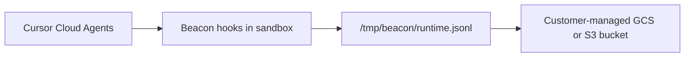

## Integration Overview

Use this integration to capture Cursor cloud-agent activity and upload each
session log to your own Google Cloud Storage or Amazon S3 bucket. It is meant
for testing cloud-agent telemetry without running a hosted Asymptote backend.

This flow depends on the Beacon CLI. You run `beacon cloud` commands from your
workstation to create the object-storage upload path, generate project hooks to
commit to your repository, and generate the setup script that installs Beacon
binaries in the Cursor cloud sandbox.

<Info>
  If you're interested in leveraging this telemetry ingest across your
  enterprise, [Asymptote Managed](/deployment/managed) is designed for
  production cloud-agent telemetry ingest at scale.
</Info>

## Overview

Cursor Cloud Agents run in Cursor's cloud environment, so Beacon cannot use the
long-running endpoint agent that local installs use. Instead, commit
project-level Cursor hooks to `.cursor/hooks.json` and use the setup script to
install Beacon binaries in the sandbox. During a cloud-agent session, those
hooks write `/tmp/beacon/runtime.jsonl`; Beacon refreshes the corresponding GCS
or S3 object as supported Cursor hook events run.



The setup has four parts:

1. Create a dedicated GCS or S3 upload path with Beacon.
2. Add Beacon cloud telemetry environment variables to the Cursor cloud environment.
3. Commit Beacon's project-level Cursor hooks to `.cursor/hooks.json`.
4. Run a Beacon-generated setup script inside the Cursor cloud environment to
   install `/tmp/beacon/bin/beacon` and `/tmp/beacon/bin/beacon-hooks`.

Each Cursor cloud agent conversation writes one readable JSONL object:

```text
gs://<bucket>/<prefix>/runtime/date=YYYY-MM-DD/<timestamp>-cursor_cloud-<cursor_conversation_id>.jsonl.gz
```

or:

```text
s3://<bucket>/<prefix>/runtime/date=YYYY-MM-DD/<timestamp>-cursor_cloud-<cursor_conversation_id>.jsonl.gz
```

Beacon uses Cursor's `conversation_id` hook field as the default `run_id` for
Cursor Cloud telemetry. If you set `BEACON_RUN_ID` yourself, Beacon preserves
that value instead.

## Prerequisites

- Beacon CLI `v1.0.3` or later for direct S3 upload. Cursor Cloud prompt capture
  requires the branch containing this change until a release includes it.
- For GCS: `gcloud` installed and authenticated to a project where you can
  create buckets, service accounts, IAM bindings, and service account keys.
- For S3: AWS CLI installed and authenticated to an account where you can
  create buckets, IAM users, inline policies, and access keys.
- `jq` on the verification workstation.
- Cursor Cloud Agent access for the repository you want to test.
- A Cursor cloud environment with outbound access to:
  - `oauth2.googleapis.com`
  - `storage.googleapis.com`
  - `s3.<region>.amazonaws.com`
  - `github.com`
  - `*.githubusercontent.com`

Install or upgrade Beacon before you start:

```bash
brew tap asymptote-labs/tap
brew install beacon
brew upgrade beacon
beacon version
```

Authenticate `gcloud` and select your project:

```bash
gcloud auth login
gcloud config set project <your-gcp-project>
```

## 1. Create the Object Storage Upload Path

Choose GCS or S3 for the cloud-agent session logs.

### GCS

From your workstation, choose a bucket and prefix:

```bash
export GCP_PROJECT="your-gcp-project"
export BEACON_TEST_BUCKET="your-beacon-cloud-agent-traces"
export BEACON_CLOUD_GCS_PREFIX="agent-traces/customer=my-team"
```

Review the GCP changes Beacon will make:

```bash
beacon cloud gcs setup \
  --project "$GCP_PROJECT" \
  --bucket "$BEACON_TEST_BUCKET" \
  --location us-central1 \
  --prefix "$BEACON_CLOUD_GCS_PREFIX" \
  --service-account beacon-cloud-trace-uploader \
  --print
```

<Frame caption="Review the bucket, service account, and IAM commands before applying them.">
  
</Frame>

Apply the setup and print the cloud telemetry environment variables:

```bash
beacon cloud gcs setup \
  --project "$GCP_PROJECT" \
  --bucket "$BEACON_TEST_BUCKET" \
  --location us-central1 \
  --prefix "$BEACON_CLOUD_GCS_PREFIX" \
  --service-account beacon-cloud-trace-uploader \
  --apply \
  --print-env
```

Copy the printed values. Redact `BEACON_CLOUD_GCS_CREDENTIALS_B64` anywhere you
share screenshots or logs.

<Frame caption="Copy the printed BEACON_CLOUD_GCS_* variables into the Cursor cloud environment.">
  
</Frame>

The helper creates a dedicated uploader service account and grants it object
upload access to the selected bucket.

### S3

From your workstation, choose a bucket, region, and prefix:

```bash
export AWS_REGION="us-east-1"
export BEACON_TEST_BUCKET="your-beacon-cloud-agent-traces"
export BEACON_CLOUD_S3_PREFIX="agent-traces/customer=my-team"
```

Review the AWS changes Beacon will make:

```bash
beacon cloud s3 setup \
  --bucket "$BEACON_TEST_BUCKET" \
  --region "$AWS_REGION" \
  --prefix "$BEACON_CLOUD_S3_PREFIX" \
  --iam-user beacon-cloud-trace-uploader \
  --print
```

Apply the setup and print the cloud telemetry environment variables:

```bash
beacon cloud s3 setup \
  --bucket "$BEACON_TEST_BUCKET" \
  --region "$AWS_REGION" \
  --prefix "$BEACON_CLOUD_S3_PREFIX" \
  --iam-user beacon-cloud-trace-uploader \
  --apply \
  --print-env
```

The helper creates a dedicated IAM user and grants it `s3:PutObject` only under
the selected bucket prefix.

Copy the printed values. Treat `AWS_ACCESS_KEY_ID` and
`AWS_SECRET_ACCESS_KEY` as sensitive and redact them from screenshots and logs.

## 2. Configure Cursor Cloud Agents

Open your Cursor Cloud Agent environment for the repository.

Add these environment variables:

```bash
BEACON_ORIGIN=cloud
BEACON_RUN_PROVIDER=cursor_cloud
BEACON_RUN_EPHEMERAL=true
BEACON_CLOUD_USER_ID_HASH=<stable-user-or-test-id>
```

For GCS, add:

```bash
BEACON_CLOUD_GCS_BUCKET=<bucket-from-setup>
BEACON_CLOUD_GCS_PREFIX=<prefix-from-setup>
BEACON_CLOUD_GCS_CREDENTIALS_B64=<base64-service-account-json>
```

For S3, add:

```bash
BEACON_CLOUD_UPLOAD=s3
BEACON_CLOUD_S3_BUCKET=<bucket-from-setup>
BEACON_CLOUD_S3_PREFIX=<prefix-from-setup>
BEACON_CLOUD_S3_REGION=<region-from-setup>
AWS_ACCESS_KEY_ID=<access-key-id-from-setup>
AWS_SECRET_ACCESS_KEY=<secret-access-key-from-setup>
```

<Frame caption="Configure network access and Beacon runtime secrets for Cursor Cloud Agents.">
  
</Frame>

If your Cursor cloud environment restricts outbound network access, allow:

```text
oauth2.googleapis.com
storage.googleapis.com
s3.<region>.amazonaws.com
github.com
*.githubusercontent.com
```

## 3. Commit Cursor Project Hooks

Cursor Cloud Agents load project hooks from `.cursor/hooks.json` at repository
checkout and task start. Generate the hook file locally, commit it, and push it
before starting cloud agents:

```bash
mkdir -p .cursor
beacon cloud cursor print-hooks \
  --binary-path /tmp/beacon/bin/beacon-hooks \
  --log-path /tmp/beacon/runtime.jsonl > .cursor/hooks.json
git add .cursor/hooks.json
git commit -m "Add Beacon Cursor Cloud hooks"
git push
```

<Warning>
  Do not rely on generating `.cursor/hooks.json` from inside the Cursor Cloud
  setup script. Cursor Cloud may load project hooks before the setup script
  creates files in the VM. Committing `.cursor/hooks.json` makes the hook config
  available when the agent starts.
</Warning>

## 4. Add the Setup Script

Generate the setup script for your Beacon release:

```bash
beacon cloud cursor print-setup --version vX.Y.Z
```

Replace `vX.Y.Z` with a release tag that contains Cursor Cloud prompt capture.
Until that release exists, use the source-build path below; `v1.0.3` supports
direct S3 upload but predates the prompt hook.

Paste the generated script into the Cursor cloud environment setup step. The
script:

- installs `beacon` and `beacon-hooks` in `/tmp/beacon/bin`,
- does not modify `.cursor/hooks.json`,
- expects project hooks to already be committed in the repository.

<Frame caption="Paste the generated Beacon setup script into the Cursor cloud environment update script.">
  
</Frame>

<Tip>
  If you are testing unreleased Beacon changes from a branch, build `beacon` and
  `beacon-hooks` from that branch in the setup script instead of using
  `print-setup --version`.
</Tip>

## 5. Run a Cloud Agent Task

Start a Cursor cloud agent task that uses tools so the environment becomes
writable and project hooks become active. For example:

```text
Read the README, run pwd && ls, create a tiny temporary markdown note under
/tmp or in the repo, then summarize what you did.
```

Beacon captures observed prompt submissions, tool use, shell execution, file
reads and edits, subagent lifecycle events, and compaction events where Cursor
exposes hook payloads.

Then submit a prompt-only follow-up with a unique marker:

```text
BEACON_PROMPT_SMOKE_<unique-id>

Do not inspect files or run tools. Reply exactly: PROMPT CAPTURE TEST COMPLETE
```

<Note>
  Beacon captures prompt text through Cursor Cloud's `beforeSubmitPrompt`
  project hook and uploads that event immediately. Commit `.cursor/hooks.json`
  before starting the run so the prompt hook is available when the cloud
  environment starts. Cursor can perform early read-only or bootstrap work
  before project hooks become active, so the initial launch prompt may be
  absent; follow-up prompts are captured once hooks are running.
  `sessionStart` and `sessionEnd` remain unavailable. See
  [Cursor's Cloud Agent hook support matrix](https://cursor.com/docs/hooks#cloud-agent-support)
  for the current platform support list.
</Note>

## 6. Verify Object Storage Upload

For GCS, list the uploaded session objects:

```bash
gcloud storage ls --recursive "gs://${BEACON_TEST_BUCKET}/${BEACON_CLOUD_GCS_PREFIX}/"
```

For S3:

```bash
aws s3 ls --recursive "s3://${BEACON_TEST_BUCKET}/${BEACON_CLOUD_S3_PREFIX}/"
```

You should see a path like:

```text
runtime/date=YYYY-MM-DD/<timestamp>-cursor_cloud-<run_id>.jsonl.gz
```

<Frame caption="Beacon uploads one readable runtime.jsonl object per Cursor cloud agent session.">
  
</Frame>

Inspect the log:

```bash
gcloud storage cat "gs://${BEACON_TEST_BUCKET}/${BEACON_CLOUD_GCS_PREFIX}/runtime/date=<date>/<object>.jsonl.gz" | gzip -dc | head
```

For S3:

```bash
aws s3 cp "s3://${BEACON_TEST_BUCKET}/${BEACON_CLOUD_S3_PREFIX}/runtime/date=<date>/<object>.jsonl.gz" - | gzip -dc | head
```

For GCS, verify prompt capture with the unique marker from the follow-up:

```bash
gcloud storage cat "gs://${BEACON_TEST_BUCKET}/${BEACON_CLOUD_GCS_PREFIX}/runtime/date=<date>/<object>.jsonl.gz" \
  | gzip -dc \
  | jq -c 'select(.event.action == "prompt.submitted") | {prompt: .prompt.text, run: .run}'
```

For S3:

```bash
aws s3 cp "s3://${BEACON_TEST_BUCKET}/${BEACON_CLOUD_S3_PREFIX}/runtime/date=<date>/<object>.jsonl.gz" - \
  | gzip -dc \
  | jq -c 'select(.event.action == "prompt.submitted") | {prompt: .prompt.text, run: .run}'
```

The last prompt can be the final record in the object. That proves Beacon
uploaded the prompt immediately rather than waiting for a later tool event.

Expected fields include:

```text
vendor=beacon
product=endpoint-agent
schema_version=1.0
origin=cloud
harness.name=cursor
run.provider=cursor_cloud
```

## Security Note

The self-serve flows create a dedicated GCS service account or AWS IAM user
scoped to object uploads, then store its credentials in the Cursor cloud
environment. This is useful for proof-of-concept testing, but treat those
environment variables as sensitive credentials.

Store credential values as Cursor Runtime Secrets, avoid broad credentials,
rotate test keys after use, and review access before using this flow with
sensitive telemetry.

## Troubleshooting

### The bucket is empty

Confirm the Cursor setup script ran and installed binaries, and confirm the
repository checkout includes committed project hooks:

```bash
ls -la /tmp/beacon/bin
ls -la .cursor
sed -n '1,160p' .cursor/hooks.json
```

Confirm hooks wrote telemetry:

```bash
ls -l /tmp/beacon/runtime.jsonl
head /tmp/beacon/runtime.jsonl
```

If `runtime.jsonl` exists but object storage is empty, check network access and
credentials. The cloud sandbox must reach the GCS OAuth/storage endpoints or
the regional S3 endpoint selected by `BEACON_CLOUD_UPLOAD=s3`.

If `runtime.jsonl` does not exist, confirm the task used a Cursor Cloud
supported hook surface such as prompt submission, a file read, shell command,
file edit, tool use, subagent event, or compaction event. Cursor documents the
supported and unsupported cloud hooks in
its [Cloud Agent hook support matrix](https://cursor.com/docs/hooks#cloud-agent-support).

### Cursor tries to commit hook settings

The setup script should not modify `.cursor/hooks.json`. If a cloud agent shows
changes to `.cursor/hooks.json`, update the setup script to `v0.0.56` or later
and remove older commands that ran `beacon cloud cursor install-hooks` inside
the VM.

```bash
git diff -- .cursor/hooks.json
```

## Related

<Columns cols={2}>
  <Card title="Cursor runtime support" icon="terminal" href="/runtimes/cursor">
    Review local Cursor telemetry through Beacon-managed hooks.
  </Card>
  <Card title="Log forwarding" icon="database" href="/log-forwarding">
    Compare direct cloud-agent uploads with local endpoint object-storage forwarding.
  </Card>
  <Card title="Asymptote Managed" icon="cloud" href="/deployment/managed">
    Use managed secure ingest for production enterprise cloud-agent telemetry.
  </Card>
  <Card title="Agent Beacon on GitHub" icon="github" href="https://github.com/Asymptote-Labs/agent-beacon">
    Request new cloud-agent destinations or contribute support.
  </Card>
</Columns>
