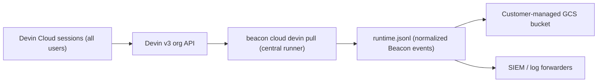

## Integration Overview

Use this integration to capture telemetry from **autonomous Devin Cloud agents**
(sessions at [app.devin.ai](https://app.devin.ai)) for every user in your
organization, using the Beacon CLI. Unlike the [Devin CLI](/runtimes/devin) and
[Devin Desktop](/runtimes/devin-desktop) integrations — which capture telemetry
through local hooks — the autonomous Devin Cloud agent does not run the Devin
hook engine. Beacon instead pulls session activity from the Devin
**organization API** with a single command you run centrally.

<Info>
  If you're interested in leveraging this telemetry ingest across your
  enterprise, [Asymptote Managed](/asymptote-managed) is designed for
  production cloud-agent telemetry ingest at scale.
</Info>

## Overview

`beacon cloud devin pull` authenticates to the Devin v3 organization API with an
organization **service key** and enumerates every user's cloud sessions. It maps
each session and its messages into Beacon endpoint events, writes them to the
local runtime JSONL, and — when GCS is configured — uploads a per-session
snapshot to your bucket. Because the service key is organization-scoped, one
central runner captures all of your users' Devin Cloud sessions; there is
nothing to install per user, per repository, or per session.



Each session writes one readable JSONL object:

```text
gs://<bucket>/<prefix>/provider=devin_cloud/user_id=<devin_user_id>/run_id=<devin_session_id>/runtime.jsonl
```

Beacon uses the Devin session id as the `run_id` and the Devin user id as
`run.actor`, so cloud sessions are attributable per end-user.

<Note>
  Telemetry from the autonomous Devin Cloud agent is **message-level**: session
  lifecycle, submitted prompts, Devin's responses, status, pull requests, and
  ACU usage. The Devin API does not expose structured per-tool, per-command, or
  per-file events for autonomous sessions, so command- and file-level detail is
  not available through this path. For command and file telemetry, use the
  [Devin CLI](/runtimes/devin) or [Devin Desktop](/runtimes/devin-desktop) hook
  integrations.
</Note>

## Prerequisites

- Beacon CLI `v0.0.67` or later.
- A Devin **organization service key** (`cog_` prefix) and your **organization
  id** (`org-...`). Create a service user with session-read access under Devin
  **Settings → Service Users**. A Teams-tier plan is sufficient — an Enterprise
  plan is not required.
- A host (workstation, VM, or CI runner) to run the connector centrally, on a
  schedule or continuously.
- For GCS upload: `gcloud` installed and authenticated, and a Google Cloud
  project where you can create a bucket, service account, and IAM bindings. The
  runner must reach `oauth2.googleapis.com` and `storage.googleapis.com`.

Install or upgrade Beacon:

```bash
brew tap asymptote-labs/tap
brew install beacon
brew upgrade beacon
beacon version
```

## 1. Create the GCS Upload Path

Skip this step if you only want events in the local runtime log (for example to
forward to a SIEM from the runner). To archive per-session snapshots to your own
bucket, create the upload path with Beacon:

```bash
export GCP_PROJECT="your-gcp-project"
export BEACON_TEST_BUCKET="your-beacon-cloud-agent-traces"
export BEACON_CLOUD_GCS_PREFIX="agent-traces/customer=my-team"

beacon cloud gcs setup \
  --project "$GCP_PROJECT" \
  --bucket "$BEACON_TEST_BUCKET" \
  --location us-central1 \
  --prefix "$BEACON_CLOUD_GCS_PREFIX" \
  --service-account beacon-cloud-trace-uploader \
  --apply \
  --print-env
```

Copy the printed `BEACON_CLOUD_GCS_*` values. Treat
`BEACON_CLOUD_GCS_CREDENTIALS_B64` as a sensitive credential.

## 2. Provide Devin Credentials

On the central runner, export the organization service key and id:

```bash
export DEVIN_API_KEY="cog_…your_service_key…"
export DEVIN_ORG_ID="org-…your_organization…"
```

<Warning>
  The organization service key can read sessions across your whole org. Keep it
  on one controlled runner — never distribute it to individual user machines or
  agent sandboxes.
</Warning>

## 3. Pull Devin Cloud Telemetry

Preview the mapped events without writing or uploading anything:

```bash
beacon cloud devin pull --print | jq -c '{action: .event.action, run_id: .run.run_id, actor: .run.actor}'
```

Run a single sweep (writes the local runtime JSONL):

```bash
beacon cloud devin pull
```

Run continuously to capture sessions as users work:

```bash
beacon cloud devin pull --watch --interval 30s
```

When the `BEACON_CLOUD_GCS_*` variables from step 1 are exported, each changed
session's snapshot is also uploaded to your bucket. Re-runs are idempotent —
events are deduplicated by their Devin event id, and unchanged sessions are
skipped. Use `--full-resync` to re-fetch and re-upload every session (for a
backfill, or after enabling GCS on an existing runner).

<Tip>
  For unattended capture, run the `--watch` command under a process supervisor
  (systemd, launchd, or a container) or invoke `beacon cloud devin pull` from a
  cron job / scheduled CI workflow on the central runner.
</Tip>

## 4. Verify the Upload

```bash
gcloud storage ls --recursive "gs://${BEACON_TEST_BUCKET}/${BEACON_CLOUD_GCS_PREFIX}/provider=devin_cloud/"
```

You should see one object per session:

```text
provider=devin_cloud/user_id=<user_id>/run_id=<session_id>/runtime.jsonl
```

Inspect a session log:

```bash
gcloud storage cat "gs://${BEACON_TEST_BUCKET}/${BEACON_CLOUD_GCS_PREFIX}/provider=devin_cloud/user_id=<user_id>/run_id=<session_id>/runtime.jsonl" | jq -c '.event.action'
```

Expected fields include:

```text
vendor=beacon
product=endpoint-agent
schema_version=1.0
origin=cloud
harness.name=devin
run.provider=devin_cloud
```

## Forward to a SIEM

The connector writes Devin Cloud events into the same normalized runtime JSONL
as every other Beacon source, so existing forwarders work unchanged: install a
destination content pack on the runner and point it at the connector's runtime
log. Events carry `run.actor=<user_id>` for per-user attribution. See
[Google Cloud Storage forwarding](/siem-forwarding-gcs) and the other SIEM
forwarding guides for the available destinations.

## Security Note

This flow keeps your Devin organization service key and (optionally) a
GCS uploader credential on a single controlled runner. Beacon's use of the Devin
API is read-only. Retained prompt and message text is routed through Beacon's
redaction, truncation, and size controls before it is written or uploaded.
Review access before using this flow with sensitive telemetry.

## Troubleshooting

### No sessions or events

Confirm the service key and org id are correct and reach the API:

```bash
beacon cloud devin pull --print
```

A `403` indicates the key is not valid for `DEVIN_ORG_ID`; a `404` usually means
the organization id is wrong.

### Local events exist but the bucket is empty

Confirm the `BEACON_CLOUD_GCS_*` variables are exported on the runner and that
the host can reach `oauth2.googleapis.com` and `storage.googleapis.com`. If you
enabled GCS after an earlier local-only run, use `--full-resync` once to upload
the already-synced sessions.

### A session shows no `session.ended`

Devin suspends sessions on inactivity. `session.ended` is emitted once a session
reaches a terminal status (`suspended`, `finished`, or `expired`); an
in-progress session shows `session.started`, `prompt.submitted`, and
`agent.message` events until it suspends.

## Related

<Columns cols={2}>
  <Card title="Devin CLI runtime" icon="terminal" href="/runtimes/devin">
    Capture command- and file-level Devin telemetry through local CLI hooks.
  </Card>
  <Card title="Devin Desktop runtime" icon="display" href="/runtimes/devin-desktop">
    Capture Devin Desktop (Cascade) telemetry through local hooks.
  </Card>
  <Card title="Google Cloud Storage forwarding" icon="database" href="/siem-forwarding-gcs">
    Review local endpoint GCS forwarding for persistent deployments.
  </Card>
  <Card title="Asymptote Managed" icon="cloud" href="/asymptote-managed">
    Use managed secure ingest for production enterprise cloud-agent telemetry.
  </Card>
</Columns>
