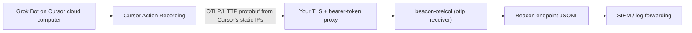

## Overview

Grok Bot is xAI's always-on agent product: each Bot runs on a Cursor-hosted
cloud computer with its own browser, filesystem, and terminal, and the desktop
app on a member's machine is a client to it. Grok Bot is a different product
from [Grok Build](/runtimes/grok-build), the xAI terminal coding agent Beacon
hooks locally under the `grok` harness. Beacon records Grok Bot under the
`grok_bot` harness and never merges the two.

Because the Bot executes in Cursor's cloud, there is nothing on the endpoint
for Beacon to hook. Grok Bot exposes no hook API, no plugin or extension
surface, no on-disk session store, and no local OpenTelemetry export. The one
telemetry channel is **Cursor Enterprise OpenTelemetry Export**: Cursor pushes
sanitized Bot action records from its own servers to a collector you run.
Beacon's collector distribution understands that export and files the records
under `grok_bot`.

<Info>
  This is a cloud-agent integration, not an endpoint integration. The Beacon
  endpoint agent on a laptop can detect that the Grok Bot desktop app is
  installed, but it cannot observe what the Bot does. [Asymptote
  Managed](/deployment/managed) is designed for production cloud-agent
  telemetry ingest at scale.
</Info>

## How it works



Cursor tags every Bot record with the resource attribute `cursor.surface=grok_bot`
and writes the event name in the log body. The `beaconjson` exporter selects
the `grok_bot` harness from that surface attribute alone, so the other surfaces
of the same export (`desktop`, `cli`, `cloud_agent`, `bugbot`) keep the
passthrough `cursor` name and are not affected.

## Prerequisites

- A Cursor **Enterprise** plan. Both Action Recording and OpenTelemetry Export
  are Enterprise-only features.
- **Action Recording** turned on for Grok Bot in Cursor Team Settings. It is off
  by default, and without it no Bot action records are produced.
- An **OpenTelemetry Export destination** in Cursor Team Settings pointing at an
  HTTPS base URL you control. Cursor appends `/v1/logs` and `/v1/metrics` to
  it, speaks OTLP/HTTP binary protobuf only, and sends a bearer token or API
  key header you configure.
- A collector built from this repository's `collector-builder`, reachable at
  that URL. The distribution ships the OTLP receiver and the `beaconjson`
  exporter but no TLS termination or header authentication, so put it behind a
  reverse proxy that terminates TLS, checks the header Cursor sends, and
  allowlists Cursor's published static egress addresses.

Beacon does not need to run on any member's machine for this path to work.

## Collector configuration

Run `beacon-otelcol` with a configuration that listens on a private interface
behind your proxy and writes Beacon JSONL:

```yaml title="grok-bot-collector.yaml"
receivers:
  otlp:
    protocols:
      http:
        endpoint: 127.0.0.1:4318

processors:
  memory_limiter:
    check_interval: 1s
    limit_mib: 256
  batch:
    timeout: 5s
    send_batch_size: 128

exporters:
  beaconjson:
    path: /var/log/beacon/grok-bot.jsonl
    max_event_bytes: 65536
    rotate_bytes: 10485760
    rotate_archives: 5
    redact_secrets: true

service:
  pipelines:
    logs:
      receivers: [otlp]
      processors: [memory_limiter, batch]
      exporters: [beaconjson]
    metrics:
      receivers: [otlp]
      processors: [memory_limiter, batch]
      exporters: [beaconjson]
```

Forward the JSONL with any [log forwarding](/log-forwarding) destination, or
run `beacon scan` over it locally.

## Discovery and status

`beacon endpoint discover` reports the Grok Bot desktop app when it finds the
app's per-user state directory at `~/.grokbot` (the local-execution helper logs
to `~/.grokbot/local-exec-daemon.log`), or the application bundle on macOS and
Windows. The harness is listed with capability `cloud_export` and telemetry
`missing`, because there is nothing local to enable. `beacon endpoint doctor`
treats a detected Grok Bot as informational rather than as a misconfiguration.

## Telemetry coverage

Every Grok Bot event carries `harness.name=grok_bot`,
`harness.collection_method=otlp`, and `session.id` from
`cursor.conversation.id`. The export's opaque team-scoped `cursor.user.id`
becomes `user.uid`. `origin` is `cloud`, except for a shell command Cursor
reports as targeting the member's own machine, which is `local`.

| Cursor event (log body) | Beacon action | Fields |
|------|------|------|
| `grok_bot_shell_command`, `shell.allowed=true` | `command.executed` | `command.command` and `tool.command` carry the secret-scrubbed command (Cursor caps it at 8 KiB); `origin` follows `shell.target` |
| `grok_bot_shell_command`, `shell.allowed=false` | `approval.denied` | `approval.decision=denied` with Cursor's `blocked_reason`; the command is retained on `command.command` so detections still see it |
| `grok_bot_mcp_tool_call`, status `success` | `mcp.tool_invoked` | `mcp.server`, `mcp.tool`, `gen_ai.tool.call.id` |
| `grok_bot_mcp_tool_call`, status `failure` | `tool.failed` | Same MCP fields, high severity |
| `grok_bot_browser_navigation` | `tool.invoked` (`tool.name=browser_navigation`) | Normalized URL in `message`, host on `server.address` |
| `grok_bot_computer_use_session` | `tool.invoked` (`tool.name=computer_use`) | Action, screenshot, and duration counts stay in `raw` |
| `api_request` | `session.activity` | `model` from `cursor.model.name`; input, output, cache-read, and cache-creation counts in `gen_ai.usage` |
| `api_error` | `session.error` | |
| `cursor.token.usage` metric | `token.usage` | `cursor.token.type` folded into `gen_ai.usage` |
| `cursor.cost.usage` metric | `cost.usage` | `gen_ai.usage.cost_usd` as Cursor's best-effort estimate |

Every classified action is `event.fidelity=observed`, because the mapping is an
exact match on Cursor's own event name. An event name Beacon does not know keeps
the inferred fallback classification. The full attribute set of every record,
including `cursor.event.id` (Cursor's dedupe key), `cursor.grok_bot.turn.id`,
and `cursor.grok_bot.box.id`, is retained under `raw`.

## What is not collected

These limits are Cursor's export contract, not Beacon choices:

- **No prompt or response text**, and no tool arguments or results. Grok Bot
  telemetry is an action log, not a transcript.
- **No file activity.** The export has no file read, create, or edit event, and
  no record of files moved between the Bot's computer and a member's machine.
- **No approval requests.** Only the shell policy's allow/deny outcome is
  exported; the member-facing "Allow once / Always allow / Deny" card is not.
- **No screenshots, coordinates, or typed text** from computer-use sessions.
  Counts and wall time only.
- **No local-execution detail** beyond the shell command itself. The desktop
  app's local-execution helper keeps an undocumented log under `~/.grokbot`
  that Beacon does not read.

## Deployment notes

Cursor delivers logs at-least-once with about seven days of retry and metrics
at-most-once, with no backfill before the destination is activated and no
ordering guarantee across retries. Dedupe downstream on `raw.attributes["cursor.event.id"]`
if your pipeline is sensitive to replays.

`cursor.cost.usage` is Cursor's estimate, not billing. Beacon records it as
runtime-reported cost and never derives cost from local pricing tables.

## Related

<Columns cols={2}>
  <Card title="Grok Build" icon="terminal" href="/runtimes/grok-build">
    The xAI terminal coding agent, hooked locally under the `grok` harness.
  </Card>
  <Card title="Cursor Cloud Agents" icon="cloud" href="/runtimes/cursor-cloud-agents">
    Cursor's other cloud surface, captured with in-sandbox hooks.
  </Card>
  <Card title="Log forwarding" icon="database" href="/log-forwarding">
    Forward the collector's JSONL to a SIEM or object storage.
  </Card>
  <Card title="Asymptote Managed" icon="cloud" href="/deployment/managed">
    Production cloud-agent telemetry ingest at scale.
  </Card>
</Columns>
