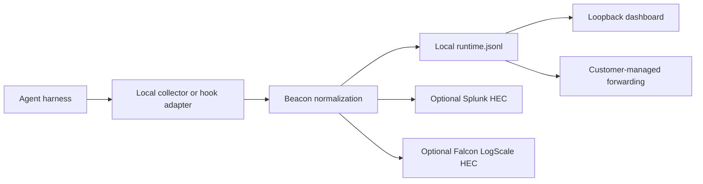

## Data Flow Overview

Beacon collects supported agent harness activity on the endpoint, normalizes it locally, and writes one JSON object per line to a local runtime log. Security teams can inspect that file locally, view it through the loopback dashboard, or forward it through customer-controlled security pipelines.

## Data Flow

| Step | Behavior | Boundary |
|------|----------|----------|
| Runtime emission | Supported runtimes emit OpenTelemetry payloads or invoke `beacon-hooks` | Runtime-owned process to Beacon-managed local component |
| Local collection | Beacon receives OTLP on `127.0.0.1:4317` and `127.0.0.1:4318`, or receives hook payloads from local runtime configuration | Local process boundary on the endpoint |
| Normalization | Beacon maps runtime-specific payloads into the endpoint event schema | Beacon-managed code path |
| Local storage | Beacon writes one JSON object per line to `runtime.jsonl` | Filesystem permissions and log ownership |
| Local inspection | The dashboard reads the runtime log over a loopback-only service | Local browser to local dashboard service |
| Optional forwarding | Wazuh, Elastic/Filebeat, Datadog Agent, Sumo Logic, Rapid7, Microsoft Sentinel, AWS S3, Google Cloud Storage, Splunk HEC, Falcon LogScale HEC, or customer-managed shippers read or receive events | Customer-managed network and SIEM boundary |

## Threat Model

| Risk | Design response |
|------|-----------------|
| Unintended hosted telemetry | Normal endpoint collection writes local JSONL and does not require a Beacon-hosted account, remote policy fetch, or external network dependency |
| Network exposure of collectors | Default OTLP receivers bind to `127.0.0.1` rather than an externally reachable interface |
| Over-collection of prompt or diff content | Scope supported runtimes and hook deployment deliberately before rollout, and review destination access for retained local telemetry |
| Secret leakage in retained content | Beacon applies redaction, sanitization, truncation, and event-size limits before writing supported content fields |
| SIEM credential exposure in endpoint config | File-based destinations tail local JSONL; Beacon does not store Elastic, Datadog, Sumo Logic, Rapid7, Microsoft Sentinel, AWS, or Google Cloud credentials. Splunk HEC and Falcon LogScale HEC tokens are stored in local collector configuration only when those optional destinations are enabled |
| Removal uncertainty | Endpoint uninstall removes managed service and configuration state, with explicit `--keep-logs` and `--keep-config` exceptions |

## Current Boundaries

Beacon focuses on supported agent harness telemetry and local endpoint configuration context. It does not provide kernel or process monitoring, shell history collection, cloud audit ingestion, browser or SaaS telemetry, credential-use attribution, Datadog API export from Beacon, Sumo Logic API export from Beacon, Rapid7 API export from Beacon, or automatic mutation of Factory Droid shell profiles.

## Related

<Columns cols={2}>
  <Card title="Open Source Architecture" icon="diagram-project" href="/architecture/architecture">
    Follow the collection, normalization, storage, and forwarding architecture.
  </Card>
  <Card title="Agent harness integrations" icon="list-check" href="/runtimes">
    Review supported runtimes, destinations, MDM support, and current boundaries.
  </Card>
</Columns>
