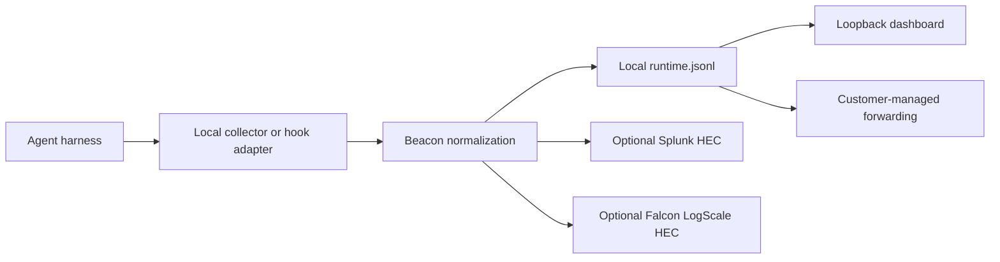

## Data flow overview

Beacon collects supported agent harness activity on the endpoint, normalizes it locally, and writes one JSON object per line to a local runtime log. Security teams can inspect that file locally, view it through the loopback dashboard, or forward it through customer-controlled security pipelines.

```mermaid
flowchart LR
  runtime["Agent harness"] --> localCollector["Local collector or hook adapter"]
  localCollector --> normalize["Beacon normalization"]
  normalize --> jsonl["Local runtime.jsonl"]
  jsonl --> dashboard["Loopback dashboard"]
  jsonl --> customerForwarder["Customer-managed forwarding"]
  normalize --> optionalSplunk["Optional Splunk HEC"]
  normalize --> optionalFalcon["Optional Falcon LogScale HEC"]
```

## Data flow

| Step | Behavior | Boundary |
|------|----------|----------|
| Runtime emission | Supported runtimes emit OpenTelemetry payloads or invoke `beacon-hooks` | Runtime-owned process to Beacon-managed local component |
| Local collection | Beacon receives OTLP on `127.0.0.1:4317` and `127.0.0.1:4318`, or receives hook payloads from local runtime configuration | Local process boundary on the endpoint |
| Normalization | Beacon maps runtime-specific payloads into the endpoint event schema | Beacon-managed code path |
| Local storage | Beacon writes one JSON object per line to `runtime.jsonl` | Filesystem permissions and log ownership |
| Local inspection | The dashboard reads the runtime log over a loopback-only service | Local browser to local dashboard service |
| Optional forwarding | Wazuh, Elastic/Filebeat, Datadog Agent, Sumo Logic, Rapid7, Microsoft Sentinel, AWS S3, Google Cloud Storage, Splunk HEC, Falcon LogScale HEC, or customer-managed shippers read or receive events | Customer-managed network and SIEM boundary |
| Asymptote Managed forwarding (opt-in) | A Vector forwarder posts runtime and inventory JSONL over HTTPS to Asymptote's ingest service with a per-device key issued after browser approval | Endpoint to Asymptote-run service; identity derived from the key, revocable from the dashboard |

## Threat model

| Risk | Design response |
|------|-----------------|
| Unintended hosted telemetry | Normal endpoint collection writes local JSONL and does not require a Beacon-hosted account, remote policy fetch, or external network dependency. Asymptote Managed forwarding starts only after a member of the organization approves the specific device in the browser, forwards only lines written after that approval, and stops within a minute of revocation |
| Network exposure of collectors | Default OTLP receivers bind to `127.0.0.1` rather than an externally reachable interface |
| Over-collection of prompt or diff content | Scope supported runtimes and hook deployment deliberately before rollout, and review destination access for retained local telemetry |
| Secret leakage in retained content | Beacon applies redaction, sanitization, truncation, and event-size limits before writing supported content fields |
| Destination credential exposure | Persistent endpoint file-based destinations tail local JSONL, so Beacon endpoint configuration does not store Elastic, Datadog, Sumo Logic, Rapid7, Microsoft Sentinel, AWS, or Google Cloud credentials. Optional Splunk and Falcon tokens live in collector configuration. The Asymptote Managed device key is a per-machine credential stored in a `0600` secrets file read through Vector's secret backend, never in `config.json`, `vector.toml`, or the process environment; it grants only the right to post events for one device and is revocable from the dashboard. Self-serve cloud-agent uploads are a separate proof-of-concept path: scoped GCS or AWS credentials are injected into the provider-managed sandbox as runtime secrets and must be rotated and access-reviewed. |
| Removal uncertainty | Endpoint uninstall removes managed service and configuration state, with explicit `--keep-logs` and `--keep-config` exceptions |

## Current boundaries

Beacon focuses on supported agent harness telemetry and local endpoint configuration context. It does not provide kernel or process monitoring, shell history collection, cloud audit ingestion, general browser or SaaS activity monitoring outside the supported chat surfaces, credential-use attribution, Datadog API export from Beacon, Sumo Logic API export from Beacon, Rapid7 API export from Beacon, or automatic mutation of Factory Droid shell profiles.

Browser chat telemetry is limited to the Claude.ai and ChatGPT conversation streams captured by the optional [Agent Beacon browser extension](/runtimes/browser-extension). Beacon does not observe other tabs, browsing history, or page content elsewhere. That extension retains full prompt and response text by default, which is the most sensitive default in the product; see [its retention modes](/runtimes/browser-extension).

Provider-managed cloud agents use a separate ephemeral boundary from the local
endpoint. Their hook adapter writes sandbox-local JSONL and can send compressed
snapshots directly to customer-managed object storage. Upload failures are
fail-open so telemetry delivery cannot block the agent task; verify the remote
object rather than treating a successful agent run as proof of delivery.

## Related

<Columns cols={2}>
  <Card title="Open Source Architecture" icon="diagram-project" href="/architecture/architecture">
    Follow the collection, normalization, storage, and forwarding architecture.
  </Card>
  <Card title="Agent harness integrations" icon="list-check" href="/runtimes">
    Review supported runtimes, destinations, MDM support, and current boundaries.
  </Card>
</Columns>
